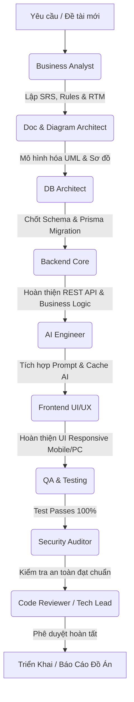

# HỆ THỐNG SUB-AGENTS CHUYÊN BIỆT — ETC ENGLISH CENTER

Tài liệu này định nghĩa hệ sinh thái các **Sub-Agents chuyên trách** cho dự án ETC English Center. Mỗi Sub-Agent được thiết kế như một chuyên gia chuyên sâu trong một lĩnh vực cụ thể, sở hữu Persona, phạm vi trách nhiệm, quy trình thực thi chuẩn (SOP), các Skill được ủy quyền và các chốt chặn an toàn (Guardrails) nghiêm ngặt tuân thủ theo `AGENTS.md` và `docs/design/EnglishCenterTOP.docx`.

---

## 1. Danh Mục Sub-Agents Chuyên Trách

| STT | Sub-Agent | Tên File Đặc Tả | Lĩnh Vực Chuyên Môn | Skill Liên Kết |
| :---: | :--- | :--- | :--- | :--- |
| **1** | **Business Analyst** | [`business-analyst-agent.md`](file:///d:/MyProjects/lms-ai/.agents/agents/business-analyst-agent.md) | Khảo sát hiện trạng, bộ 20 câu hỏi, lập SRS, đặc tả 14 Use Case, Business Rules & RTM | `context-builder`, `requirements-analysis` |
| **2** | **Doc & Diagram Architect** | [`doc-architect-agent.md`](file:///d:/MyProjects/lms-ai/.agents/agents/doc-architect-agent.md) | Quản lý báo cáo lớn 9 chương, vẽ sơ đồ UML/ERD (PlantUML/Mermaid), Cẩm nang sử dụng | `documentation`, `diagram-design` |
| **3** | **DB Architect** | [`db-architect-agent.md`](file:///d:/MyProjects/lms-ai/.agents/agents/db-architect-agent.md) | Kiến trúc CSDL, Schema Prisma 3NF, Migrations, Indexing & Tối ưu hóa dữ liệu quan hệ | `database-design` |
| **4** | **Backend Core** | [`backend-core-agent.md`](file:///d:/MyProjects/lms-ai/.agents/agents/backend-core-agent.md) | Lập trình Backend NestJS, Nghiệp vụ trung tâm, DTOs, Guards, RBAC & API Endpoints | `api-design`, `implementation` |
| **5** | **Frontend UI/UX** | [`frontend-ui-agent.md`](file:///d:/MyProjects/lms-ai/.agents/agents/frontend-ui-agent.md) | Giao diện Next.js App Router, Responsive Mobile/Desktop, In ấn A4 & Trải nghiệm tương tác | `implementation`, `figma-design`, `ui-mockup-designer`, `frontend-design`, `mobile-responsive` |
| **6** | **AI Engineer** | [`ai-engineer-agent.md`](file:///d:/MyProjects/lms-ai/.agents/agents/ai-engineer-agent.md) | Gemini API, Prompt Engineering, Chống ảo giác, Fallback Cache cộng đồng & Audit Log | `ai-design` |
| **7** | **QA & Testing** | [`qa-testing-agent.md`](file:///d:/MyProjects/lms-ai/.agents/agents/qa-testing-agent.md) | Thiết kế Test Matrix, Kiểm thử Unit/E2E Jest, Kiểm tra tính toán điểm số & học phí | `testing`, `software-testing` |
| **8** | **Security Auditor** | [`security-auditor-agent.md`](file:///d:/MyProjects/lms-ai/.agents/agents/security-auditor-agent.md) | Rà soát an toàn bảo mật, OWASP Top 10, Argon2 hashing, JWT RBAC & Bảo vệ API Secret | `security-review` |
| **9** | **Code Reviewer / Tech Lead** | [`code-reviewer-agent.md`](file:///d:/MyProjects/lms-ai/.agents/agents/code-reviewer-agent.md) | Rà soát Clean Code, KISS, DRY, TypeScript typesafety & Đối chiếu Design vs Code | `code-review` |

---

## 2. Mô Hình Phối Hợp & Dây Chuyền Tác Vụ (Workflow Pipeline)

Khi triển khai một tính năng mới hoặc nâng cấp hệ thống, các Sub-Agents phối hợp theo dây chuyền chuẩn mực:

---

## 3. Cách Kích Hoạt Sub-Agent Khi Làm Việc

Người dùng có thể yêu cầu kích hoạt bất kỳ Sub-Agent nào bằng cách nêu tên hoặc gọi theo cú pháp:
- *"Hãy dùng **Business Analyst Agent** để phân tích bộ 20 câu hỏi khảo sát và đặc tả Use Case UC006."*
- *"Dùng **Doc & Diagram Architect Agent** vẽ sơ đồ Sequence Diagram cho luồng thanh toán học phí."*
- *"Hãy dùng **DB Architect Agent** để kiểm tra lại schema bảng LichHoc và viết migration mới."*
- *"Ủy quyền cho **Frontend UI Agent** tối ưu responsive cho trang quản lý học phí trên mobile."*
- *"Kích hoạt **AI Engineer Agent** để tinh chỉnh prompt tư vấn khóa học và cơ chế chống ảo giác."*
- *"Nhờ **QA Testing Agent** viết kịch bản test toàn diện cho luồng điểm danh giáo viên."*
- *"Dùng **Security Auditor Agent** rà soát toàn bộ các route backend xem đã bọc Guard RBAC chưa."*
- *"Cho **Code Reviewer Agent** đánh giá chất lượng module thanh toán học phí."*
