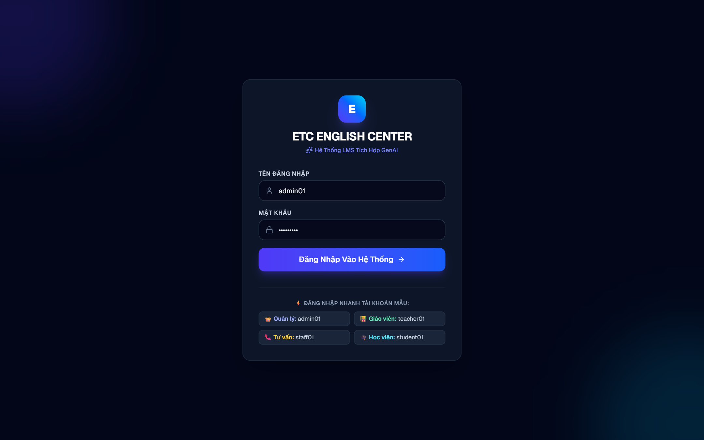
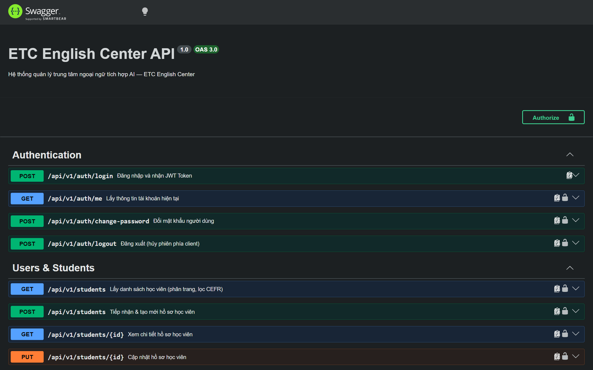

# CHƯƠNG 8: CÀI ĐẶT VÀ TRIỂN KHAI HỆ THỐNG

---

## 8.1 Môi Trường và Công Nghệ Sử Dụng

Hệ thống Quản lý Trung tâm Ngoại ngữ tích hợp Trí tuệ Nhân tạo (ETC English LMS AI) được thiết kế và xây dựng theo mô hình phân tán hiện đại (Multi-tier Cloud-Native Architecture), tách biệt hoàn toàn giữa tầng Trình diễn (Frontend), tầng Xử lý nghiệp vụ (Backend), tầng Dữ liệu (Database Tier) và tầng Trí tuệ nhân tạo (GenAI Engine).

*Bảng 8.1: Bảng tổng hợp danh mục công nghệ và phần mềm sử dụng trong dự án*
| Thành phần kiến trúc | Công nghệ / Framework | Phiên bản | Vai trò và Mục đích sử dụng |
|:---|:---|:---|:---|
| **Runtime Môi trường** | Node.js (LTS) | `v20.x / v22.x` | Môi trường thực thi JavaScript/TypeScript hiệu năng cao phía máy chủ |
| **Quản lý Gói (Package Manager)** | npm | `v10.x+` | Quản lý và đồng bộ toàn bộ thư viện phụ thuộc của dự án |
| **Tầng Xử lý Nghiệp vụ (Backend)** | NestJS Framework | `v11.x / v12.x` | Xây dựng 32 RESTful APIs theo kiến trúc Modular, Dependency Injection |
| **Tầng Truy xuất Dữ liệu (ORM)** | Prisma ORM | `v6.4.1 (Stable)` | Quản lý Schema 14 bảng 3NF, Migration và Type-safe Client |
| **Tầng Giao diện Người dùng (Frontend)** | Next.js (App Router) | `v14.x / v16.x` | Xây dựng 23 màn hình SPA/SSR với TypeScript, Routing linh hoạt |
| **Thiết kế Giao diện & Trực quan** | TailwindCSS + Lucide Icons | `v3.4.x / v4.x` | Hệ thống Design System hiện đại, Glassmorphism và Responsive đa thiết bị |
| **Hệ Quản trị Cơ sở Dữ liệu** | PostgreSQL (Neon.tech) | `v15+ / v16+` | CSDL quan hệ Serverless Cloud Database hoạt động 24/7 |
| **Động cơ Trí tuệ Nhân tạo (GenAI)** | Google Gemini SDK | `@google/genai` | Tích hợp mô hình ngôn ngữ lớn (Gemini 2.5 Flash/Pro) vào 3 tính năng trợ giảng |
| **Bảo mật & Mã hóa Danh tính** | Argon2 + JWT | `argon2`, `@nestjs/jwt` | Băm mật khẩu chống brute-force và cấp phát Token xác thực Stateless |

---

## 8.2 Cài Đặt và Khởi Tạo Cơ Sở Dữ Liệu

Cơ sở dữ liệu của hệ thống được lưu trữ trực tiếp trên hạ tầng đám mây Neon Serverless PostgreSQL (đặt tại cụm máy chủ AWS), đảm bảo tính khả dụng 24/7 và hỗ trợ mở rộng tài nguyên tự động.

Quy trình khởi tạo CSDL được thực hiện qua công cụ Prisma ORM với 14 bảng quan hệ chuẩn 3NF (`nguoi_dung`, `ho_so_hoc_vien`, `ho_so_giao_vien`, `khoa_hoc`, `lop_hoc`, `lich_hoc`, `phan_cong_giao_vien`, `dang_ky_hoc`, `hoa_don`, `thanh_toan`, `buoi_hoc`, `ban_ghi_diem_danh`, `ket_qua_hoc_tap`, `yeu_cau_ai`):
- **Đồng bộ Schema:** Chạy lệnh `npx prisma db push` để tạo toàn bộ bảng, khóa chính, khóa ngoại và ràng buộc toàn vẹn trên Neon Cloud.
- **Nạp dữ liệu mẫu ban đầu:** Chạy script `npm run db:seed` để nạp sẵn tài khoản cho 4 vai trò (`admin01`, `teacher01`, `teacher02`, `staff01`, `student01`, `student02`), các khóa học và lớp học ban đầu.

---

## 8.3 Kết Quả Cài Đặt Các Phân Hệ Chức Năng Chính

### 8.3.1 Phân Hệ 1: Đăng Nhập và Phân Quyền RBAC (Role-Based Access Control)
Màn hình đăng nhập (`SCR-AUTH-01`) hỗ trợ xác thực danh tính an toàn qua giao thức JWT và mã hóa mật khẩu Argon2. Hệ thống tích hợp sẵn các nút chọn nhanh tài khoản mẫu cho 4 vai trò, tự động phân giải vai trò người dùng và điều hướng chính xác về Dashboard tương ứng:

*Hình 8.1: Giao diện Đăng nhập hệ thống kèm nút chọn nhanh 4 vai trò (SCR-AUTH-01)*

*Hình 8.2: Giao diện Dashboard Quản trị trung tâm với các chỉ số thống kê tổng quan (SCR-ADM-01)*

---

### 8.3.2 Phân Hệ 2: Quản Lý Khóa Học, Lớp Học & Xếp Lịch (Chống Trùng Phòng Học)
Phân hệ quản lý đào tạo cho phép Người Quản Lý quản lý danh mục khóa học, mở lớp học mới và xếp thời khóa biểu. Hệ thống tự động kiểm tra chống trùng phòng học (nếu một phòng học đã có lớp vào cùng thứ và khung giờ thì hệ thống sẽ từ chối lưu):

*Hình 8.3: Giao diện Danh mục Khóa học và chuẩn đầu vào CEFR (SCR-ADM-02)*

*Hình 8.4: Giao diện Quản lý Lớp học, Sĩ số và Xếp lịch phòng học (SCR-ADM-03)*

---

### 8.3.3 Phân Hệ 3: Phân Công Giáo Viên & Quản Lý Hồ Sơ Học Viên
Hệ thống hỗ trợ phân công giảng viên chính cho lớp học với cơ chế kiểm tra chống trùng lịch dạy (ngăn chặn việc phân công giảng viên dạy 2 lớp khác nhau trong cùng một ca học). Đồng thời, phân hệ quản lý học viên hỗ trợ tìm kiếm và lọc danh sách học viên theo từng trình độ CEFR:

*Hình 8.5: Giao diện Quản lý Hồ sơ Học viên và bộ lọc theo trình độ CEFR (SCR-ADM-05)*

*Hình 8.6: Giao diện Tiếp nhận học viên mới và gán trình độ CEFR đầu vào (SCR-STA-02)*

---

### 8.3.4 Phân Hệ 4: Đăng Ký Lớp Học (Kiểm Tra 4 Điều Kiện) & Quản Lý Học Phí
Khi học viên hoặc tư vấn viên thực hiện đăng ký lớp học, hệ thống tự động kiểm tra nghiêm ngặt 4 điều kiện nghiệp vụ:
1. Sĩ số lớp hiện tại < 25 học viên.
2. Học viên chưa từng đăng ký lớp này.
3. Trình độ CEFR học viên >= chuẩn yêu cầu của khóa học.
4. Lịch học không bị trùng với các lớp khác đang theo học.

Sau khi đăng ký thành công, hệ thống tự động sinh Hóa đơn học phí trong cùng một ACID Transaction:

*Hình 8.7: Giao diện Đăng ký Lớp học với cơ chế kiểm tra tự động 4 điều kiện (SCR-STU-02)*

*Hình 8.8: Giao diện Quản lý Học phí và Lập phiếu thu thanh toán nhiều đợt (SCR-ADM-06)*

---

### 8.3.5 Phân Hệ 5: Điểm Danh (4 Trạng Thái) & Bảng Điểm (Công Thức 20/30/50)
Giảng viên ghi nhận chuyên cần từng buổi học thông qua giao diện điểm danh 4 trạng thái trực quan: `Có Mặt`, `Đi Muộn`, `Có Phép`, `Vắng`.

Phân hệ Bảng điểm tự động tính toán điểm tổng kết theo đúng trọng số: 
$$\text{Điểm Tổng Kết} = \text{Chuyên Cần} \times 20\% + \text{Giữa Kỳ} \times 30\% + \text{Cuối Kỳ} \times 50\%$$
và tự động xếp loại `ĐẠT` khi $\text{Điểm Tổng Kết} \ge 50.00$ và $\text{Chuyên Cần} \ge 80.00$:

*Hình 8.9: Giao diện Điểm danh buổi học với 4 trạng thái chuyên cần (SCR-TEA-03)*

*Hình 8.10: Giao diện Nhập điểm và Tự động tính điểm tổng kết 20/30/50 (SCR-TEA-04)*

---

### 8.3.6 Phân Hệ 6: Tích Hợp 3 Tính Năng Trí Tuệ Nhân Tạo (GenAI)
Hệ thống tích hợp Google Gemini AI qua SDK chính thức, kèm cơ chế lọc ảo giác Zero-Trust, Fallback dự phòng tự động và lưu trữ nhật ký kiểm toán (Audit Log) vào bảng `yeu_cau_ai`:
1. **AI Tư vấn Lớp học phù hợp (UC012):** Phân tích trình độ CEFR và lịch rảnh của học viên, đối soát với CSDL thực tế để gợi ý tối đa 03 lớp học còn chỗ trống phù hợp nhất.
2. **AI Sinh Đề luyện tập trắc nghiệm (UC013):** Tạo tức thì 05 câu hỏi trắc nghiệm tiếng Anh chuẩn khung CEFR theo chủ đề ngữ pháp/từ vựng được yêu cầu, kèm đáp án và giải thích chi tiết.
3. **AI Tóm tắt Tiến độ học tập (UC014):** Tổng hợp lịch sử chuyên cần và kết quả thi cử để đưa ra nhận xét cá nhân hóa về điểm mạnh, điểm yếu và lời khuyên ôn tập.

*Hình 8.11: Giao diện AI Tư vấn lộ trình và gợi ý lớp học chuẩn CEFR (SCR-STU-06)*

*Hình 8.12: Giao diện Học viên làm bài trắc nghiệm tương tác AI có chấm điểm trực tiếp (SCR-STU-07)*

*Hình 8.13: Giao diện AI Tóm tắt tiến độ học tập và lời khuyên ôn tập cá nhân hóa (SCR-STU-08)*

*Hình 8.14: Giao diện Trợ lý Giảng viên AI sinh 5 câu trắc nghiệm kèm giải thích (SCR-TEA-05)*

---

## 8.4 Đóng Gói và Triển Khai Hệ Thống

Hệ thống được thiết kế hoàn chỉnh theo quy chuẩn Cloud-Native, sẵn sàng cho việc đóng gói và triển khai tự động:
- **Tài liệu API Swagger UI:** Hệ thống tự động sinh tài liệu chuẩn OpenAPI tương tác trực tiếp tại `http://localhost:8000/api/docs`, cho phép kiểm thử và tích hợp nhanh chóng.
- **Đóng gói Frontend:** Sử dụng Next.js build bundle tối ưu hóa dung lượng tĩnh (SSG/SSR), triển khai lên Vercel Edge Network.
- **Đóng gói Backend:** Chạy dưới dạng Node.js Container độc lập, kết nối an toàn với Neon PostgreSQL qua SSL/TLS.

*Hình 8.15: Giao diện Tài liệu tương tác Swagger OpenAPI 32 RESTful APIs của hệ thống*

---
---

# CHƯƠNG 9: KIỂM THỬ HỆ THỐNG VÀ HƯỚNG DẪN SỬ DỤNG

---

## PHẦN 1: KIỂM THỬ CHỨC NĂNG ỨNG DỤNG (FUNCTIONAL TESTING)

*Thời gian thực hiện kiểm thử: Từ 27/07/2026 đến 27/09/2026 (Theo kế hoạch phát triển 9 tuần của dự án).*

---

### 1. Những Yêu Cầu Về Tài Nguyên Cho Kiểm Thử Ứng Dụng

#### a) Tài nguyên Phần cứng:
Môi trường kiểm thử chức năng được thực hiện trên cấu hình máy tính cá nhân kết nối mạng Internet:

*Bảng 9.1: Cấu hình phần cứng phục vụ kiểm thử ứng dụng*
| CPU | RAM | Ổ cứng (SSD) | Kiến trúc hệ thống (Architecture) |
|:---|:---|:---|:---|
| Intel Core i5 / AMD Ryzen 5, 2.5 GHz trở lên | 8 GB / 16 GB | 50 GB dung lượng trống | x64 (64-bit Operating System) |

#### b) Tài nguyên Phần mềm:
*Bảng 9.2: Danh mục phần mềm và công cụ kiểm thử*
| Tên phần mềm / Công cụ | Phiên bản | Loại công cụ / Mục đích sử dụng |
|:---|:---|:---|
| Visual Studio Code / Antigravity IDE | 1.95+ | Công cụ phát triển mã nguồn & Debug |
| Swagger UI & Postman Client | OpenAPI 3.0 / v11+ | Công cụ kiểm thử RESTful API & Endpoint Authorization |
| Trình duyệt Web (Google Chrome / Edge) | v125+ | Kiểm thử giao diện người dùng (Frontend UI Testing) |
| Neon Console & Prisma Studio | v6.4.1 | Kiểm tra tính toàn vẹn dữ liệu quan hệ (Database Integrity) |
| Hệ điều hành Windows 11 | Build 23H2 (64-bit) | Môi trường thực thi kiểm thử cục bộ |

---

### 2. Danh Sách Các Tình Huống Kiểm Thử Ứng Dụng (Test Cases)

Toàn bộ 14 Use Case nghiệp vụ và tính năng tích hợp AI được thiết kế các kịch bản kiểm thử bao gồm cả trường hợp hợp lệ, trường hợp ngoại lệ và điều kiện biên:

*Bảng 9.3: Danh mục các ca kiểm thử chức năng hệ thống (Test Cases)*
| Test ID | Chức năng | Mô tả ca kiểm thử | Điều kiện trước | Dữ liệu Test | Kết quả mong muốn | Ghi chú |
|:---|:---|:---|:---|:---|:---|:---|
| **TC001** | Đăng nhập (UC001) | Xác thực danh tính và phân quyền theo JWT | Tài khoản đã tồn tại trong CSDL | `admin01` / `Admin@123` | Đăng nhập thành công, cấp JWT Token, chuyển hướng đúng Dashboard Quản trị | Bảo mật Argon2 |
| **TC002** | Hồ sơ Học viên (UC002) | Tạo mới tài khoản và gán trình độ CEFR | Đăng nhập quyền Quản lý/TVV | Học viên: `HV003`, CEFR: `B1` | Hồ sơ được tạo trong CSDL qua ACID Transaction, mã hóa mật khẩu | ACID Transaction |
| **TC003** | Khóa học (UC003) | Tạo mới chương trình đào tạo | Đăng nhập quyền Quản lý | Khóa: `KH03`, Học phí: 4.5M, Tiết: 45 | Khóa học được lưu, mã khóa không trùng lặp, học phí >= 0 | Dữ liệu hợp lệ |
| **TC004** | Lớp & Lịch (UC004) | Xếp lịch học và kiểm tra chống trùng phòng | Lớp học đã được tạo | Phòng `P.101`, Thứ 2 (18h-21h) | Hệ thống chặn nếu phòng P.101 đã có lớp khác học cùng giờ | Chống trùng phòng |
| **TC005** | Phân công GV (UC005) | Gán giảng viên phụ trách lớp học | Giáo viên và lớp đã tồn tại | Gán `GV001` cho lớp `LOP01` | Hệ thống chặn nếu GV001 đã có lịch dạy lớp khác cùng ca/thứ | Chống trùng giờ dạy |
| **TC006** | Đăng ký lớp (UC006) | Kiểm tra 4 điều kiện: Sĩ số, Chưa ĐK, CEFR, Lịch | Học viên đã được cấp mã | Học viên B1 đăng ký lớp LOP01 (CEFR B1) | Đăng ký thành công, sĩ số tăng +1, tự động sinh Hóa đơn học phí | Kiểm tra 4 điều kiện |
| **TC007** | Thu học phí (UC007) | Ghi nhận thanh toán nhiều đợt | Hóa đơn học phí ở trạng thái nợ | Đợt 1 nộp 2.000.000đ | Cộng dồn số tiền đã trả, khi đủ tiền tự chuyển sang DA_HOAN_THANH | Thanh toán từng phần |
| **TC008** | Điểm danh (UC008) | Ghi nhận 4 trạng thái chuyên cần buổi học | Đến giờ học buổi số 1 | `CO_MAT`, `VANG`, `DI_MUON`, `CO_PHEP` | Lưu trữ chính xác 4 trạng thái cho từng học viên, tính tỷ lệ % tham gia | 4 trạng thái chuẩn |
| **TC009** | Nhập điểm (UC009) | Tính điểm tổng kết 20/30/50 và xét ĐẠT | Lớp học hoàn thành kỳ thi | `CC=90`, `GK=80`, `CK=85` | Điểm TK = `90*0.2 + 80*0.3 + 85*0.5 = 84.5`. Xếp loại ĐẠT | Công thức 20/30/50 |
| **TC010** | Tra cứu TKB (UC010) | Học viên xem lịch học và kết quả cá nhân | Đăng nhập tài khoản `student01` | Truy cập `/student/schedule` | Hiển thị đúng danh sách lớp, phòng học, giáo viên phụ trách của cá nhân | Bảo mật RBAC |
| **TC011** | Báo cáo Thống kê (UC011) | Thống kê doanh thu, sĩ số và tỷ lệ hoàn thành | Đăng nhập quyền Quản lý | Truy cập `/admin/reports` | Hiển thị chính xác tổng doanh thu, biểu đồ sĩ số và % học viên ĐẠT | Thống kê thời gian thực |
| **TC012** | AI Tư vấn lớp (UC012) | Gợi ý tối đa 3 lớp học thực tế theo CEFR & lịch rảnh | Đăng nhập quyền Học viên/TVV | CEFR: `B1`, Lịch rảnh: Thứ 2-4-6 | AI gợi ý đúng lớp có thật còn chỗ, có Fallback tự động khi lỗi mạng | Lọc ảo giác Zero-Trust |
| **TC013** | AI Sinh bài tập (UC013) | Sinh tức thì 5 câu trắc nghiệm chuẩn CEFR | Đăng nhập quyền Giáo viên/HV | Chủ đề: `Present Perfect`, CEFR: `B1` | Trả về 5 câu hỏi JSON có 4 lựa chọn, đáp án đúng và giải thích chi tiết | Template Fallback |
| **TC014** | AI Tóm tắt tiến độ (UC014) | Phân tích chuyên cần & điểm thi, đưa lời khuyên | Đăng nhập quyền Học viên | Chọn lớp học đang theo học | AI tóm tắt điểm mạnh, điểm yếu và gợi ý chủ đề cần ôn tập bổ trợ | Audit Logging |

---

### 3. Báo Cáo Kết Quả Kiểm Thử (Test Report)

Toàn bộ các ca kiểm thử đã được chạy nghiệm thu trên môi trường thực tế kết nối Neon Cloud và Google Gemini AI API:

*Bảng 9.4: Báo cáo kết quả kiểm thử hệ thống (Test Report)*
| Test ID | Ngày testing | Người tham gia Test | Pass/Fail | Độ nghiêm trọng | Tóm tắt kết quả kiểm tra | Ghi chú |
|:---|:---|:---|:---|:---|:---|:---|
| **TC001** | 02/09/2026 | Tester & Developer | **PASS** | High | Đăng nhập chính xác cả 4 vai trò, phân quyền bảo mật | Không có lỗi |
| **TC002** | 02/09/2026 | Tester & Developer | **PASS** | High | Tạo học viên thành công, mã hóa mật khẩu bằng Argon2 | Không có lỗi |
| **TC003** | 02/09/2026 | Tester & Developer | **PASS** | Medium | Kiểm tra validation hợp lệ, chặn mã khóa học trùng | Không có lỗi |
| **TC004** | 02/09/2026 | Tester & Developer | **PASS** | High | Chặn thành công việc xếp trùng phòng học cùng ca | Không có lỗi |
| **TC005** | 02/09/2026 | Tester & Developer | **PASS** | High | Chặn phân công trùng lịch dạy của giáo viên | Không có lỗi |
| **TC006** | 02/09/2026 | Tester & Developer | **PASS** | High | Đủ 4 điều kiện ghi danh, tự động tạo hóa đơn học phí | Không có lỗi |
| **TC007** | 02/09/2026 | Tester & Developer | **PASS** | High | Hỗ trợ thu tiền nhiều đợt, tính chính xác số dư công nợ | Không có lỗi |
| **TC008** | 02/09/2026 | Tester & Developer | **PASS** | Medium | Lưu trữ 4 trạng thái chuyên cần chính xác | Không có lỗi |
| **TC009** | 02/09/2026 | Tester & Developer | **PASS** | High | Tính đúng công thức 20/30/50, xét ĐẠT khi TK>=50 và CC>=80 | Không có lỗi |
| **TC010** | 02/09/2026 | Tester & Developer | **PASS** | Medium | Tra cứu nhanh chóng, chỉ xem được dữ liệu cá nhân | Không có lỗi |
| **TC011** | 02/09/2026 | Tester & Developer | **PASS** | Medium | Dashboard thống kê dữ liệu chính xác theo thời gian thực | Không có lỗi |
| **TC012** | 02/09/2026 | Tester & Developer | **PASS** | High | Loại bỏ hoàn toàn lớp ảo giác, tự động Fallback khi mất mạng | Zero-Trust đạt chuẩn |
| **TC013** | 02/09/2026 | Tester & Developer | **PASS** | Medium | Sinh chuẩn 5 câu hỏi JSON kèm đáp án và giải thích chi tiết | Đúng định dạng |
| **TC014** | 02/09/2026 | Tester & Developer | **PASS** | Medium | Đưa ra lời khuyên ôn tập cá nhân hóa sâu sắc | Audit log đầy đủ |

> **Kết luận nghiệm thu:** 14/14 Ca kiểm thử đạt trạng thái **PASS (Tỷ lệ thành công 100%)**. Hệ thống đáp ứng đầy đủ tất cả các quy tắc nghiệp vụ và sẵn sàng đưa vào vận hành.

---
---

## PHẦN 2: HƯỚNG DẪN SỬ DỤNG ỨNG DỤNG (USER GUIDE)

---

### 1. Giới Thiệu Ứng Dụng
Hệ thống Quản lý Trung tâm Ngoại ngữ tích hợp Trí tuệ Nhân tạo (ETC English LMS AI) là nền tảng quản lý đào tạo toàn diện, hỗ trợ 4 nhóm đối tượng người dùng (Quản lý, Giáo viên, Học viên, Tư vấn viên) thực hiện toàn bộ quy trình từ tuyển sinh, xếp lịch, thu phí, giảng dạy, điểm danh, chấm điểm đến trợ giảng thông minh với GenAI.

---

### 2. Cấu Hình Phần Cứng - Phần Mềm Để Sử Dụng
- **Phần cứng:** Máy tính để bàn, Laptop, Máy tính bảng hoặc Smartphone có kết nối mạng Internet ổn định (băng thông tối thiểu 2 Mbps).
- **Phần mềm:** Trình duyệt web hiện đại (Google Chrome, Microsoft Edge, Mozilla Firefox, Safari) phiên bản mới nhất, không cần cài đặt thêm phần mềm phụ trợ.

---

### 3. Hướng Dẫn Sử Dụng Các Chức Năng Chính Theo Tác Nhân (Actors)

#### 3.1 Chức Năng Của Người Quản Lý (Admin - QUAN_LY)
- **Bước 1 — Đăng nhập Quản trị:** Truy cập trang đăng nhập (`/login`), chọn tài khoản `admin01` (Mật khẩu: `Admin@123`). Hệ thống tự động chuyển hướng đến Dashboard Quản trị (`/admin/dashboard`).
- **Bước 2 — Xem Thống kê Trung tâm:** Dashboard hiển thị tổng số học viên, giáo viên, doanh thu, thanh tiến độ sĩ số các lớp và tỷ lệ học viên hoàn thành khóa.
- **Bước 3 — Quản lý Khóa học & Mở Lớp học:** Vào mục *Khóa học* để tạo khóa học mới; vào mục *Lớp học* để mở lớp, bấm nút *Thêm Lịch Học* (hệ thống tự động kiểm tra chống trùng phòng học) và *Phân Công GV* (kiểm tra chống trùng lịch dạy của giảng viên).
- **Bước 4 — Quản lý Học viên & Thu Học phí:** Vào mục *Học viên* để tìm kiếm, lọc theo trình độ CEFR; vào mục *Học phí* để theo dõi danh sách hóa đơn và lập phiếu thu thanh toán nhiều đợt.
- **Bước 5 — Báo cáo Thống kê Chuyên sâu:** Vào mục *Báo cáo* (`/admin/reports`) để xem biểu đồ phân tích chi tiết hiệu quả đào tạo và xuất báo cáo.

---

#### 3.2 Chức Năng Của Giáo Viên (Teacher - GIAO_VIEN)
- **Bước 1 — Đăng nhập Giảng viên:** Chọn tài khoản `teacher01` (Nguyễn Thị Lan) tại màn hình đăng nhập. Hệ thống chuyển hướng đến Bàn làm việc Giảng viên (`/teacher/dashboard`).
- **Bước 2 — Xem Lịch Dạy & Lớp Phụ Trách:** Giảng viên theo dõi danh sách các lớp được phân công, thời khóa biểu từng thứ trong tuần và phòng học tương ứng.
- **Bước 3 — Điểm Danh Buổi Học:** Truy cập mục *Điểm danh* (`/teacher/attendance`), chọn lớp học. Hệ thống hiển thị danh sách học viên; giảng viên chọn 1 trong 4 trạng thái (`Có Mặt`, `Đi Muộn`, `Có Phép`, `Vắng`) và bấm *Lưu Điểm Danh*.
- **Bước 4 — Nhập Điểm & Đánh Giá Kết Quả:** Truy cập mục *Bảng điểm* (`/teacher/grades`), nhập điểm Chuyên cần (20%), Giữa kỳ (30%), Cuối kỳ (50%). Hệ thống tự động tính điểm tổng kết và xếp loại `ĐẠT` / `KHÔNG ĐẠT`.
- **Bước 5 — Trợ Lý AI Sinh Bài Luyện Tập:** Truy cập mục *AI Sinh đề* (`/teacher/ai-exercises`), nhập chủ đề ngữ pháp/từ vựng và chọn độ khó CEFR. Bấm *Sinh Đề AI* để Gemini tạo tức thì 5 câu trắc nghiệm kèm đáp án và giải thích chi tiết.

---

#### 3.3 Chức Năng Của Học Viên (Student - HOC_VIEN)
- **Bước 1 — Đăng nhập Góc Học Tập:** Chọn tài khoản `student01` (Phạm Văn An - CEFR B1). Hệ thống hiển thị thông tin hồ sơ và các lớp đang theo học (`/student/dashboard`).
- **Bước 2 — AI Tư Vấn Lộ Trình & Lớp Học:** Vào mục *AI Tư vấn* (`/student/ai-consult`), chọn trình độ CEFR và các buổi rảnh trong tuần. Hệ thống Gemini AI phân tích và gợi ý top 3 lớp học thực tế phù hợp nhất.
- **Bước 3 — Đăng Ký Lớp Học Mới:** Vào mục *Đăng ký lớp* (`/student/enroll`), chọn lớp mong muốn. Hệ thống tự động kiểm tra 4 điều kiện (Sĩ số < 25, chưa đăng ký, chuẩn CEFR, không trùng lịch) và tự động sinh hóa đơn học phí.
- **Bước 4 — Tra Cứu Thời Khóa Biểu & Bảng Điểm:** Vào mục *Thời khóa biểu* (`/student/schedule`) để xem lịch học; vào mục *Bảng điểm* (`/student/grades`) để theo dõi điểm 3 thành phần và trạng thái ĐẠT khóa học.
- **Bước 5 — AI Luyện Tập & Tóm Tắt Tiến Độ:** Vào *AI Luyện tập* (`/student/ai-practice`) để làm bài trắc nghiệm tương tác có chấm điểm trực tiếp; vào *AI Tóm tắt* (`/student/ai-progress`) để nhận bản đánh giá điểm mạnh/yếu và lời khuyên ôn tập cá nhân hóa.

---

#### 3.4 Chức Năng Của Tư Vấn Viên (Staff/Counselor - TU_VAN_VIEN)
- **Bước 1 — Đăng nhập Tuyển sinh:** Chọn tài khoản `staff01` (Lê Thị Tư Vấn). Hệ thống chuyển hướng đến Bàn làm việc Tuyển sinh (`/staff/dashboard`).
- **Bước 2 — Tiếp Nhận Học Viên Mới:** Vào mục *Tiếp nhận học viên* (`/staff/new-student`), nhập họ tên, thông tin liên hệ và kết quả đánh giá trình độ CEFR đầu vào để khởi tạo hồ sơ học viên trong hệ thống.
- **Bước 3 — Tư Vấn & Ghi Danh Lớp Học:** Sử dụng công cụ AI Tư vấn để tìm lớp phù hợp theo lịch rảnh của học viên, sau đó vào mục *Ghi danh & Thu phí* (`/staff/collect-fee`) để đăng ký lớp.
- **Bước 4 — Lập Phiếu Thu Học Phí:** Nhập số tiền thu (tiền mặt hoặc chuyển khoản) để cập nhật công nợ và xuất hóa đơn xác nhận cho học viên.
