**TRƯỜNG ĐẠI HỌC CÔNG NGHỆ THÔNG TIN VÀ TRUYỀN THÔNG**
**KHOA CÔNG NGHỆ THÔNG TIN**
**BỘ MÔN ****ỨNG DỤNG TRÍ TUỆ NHÂN TẠO**

**BÁO CÁO BÀI TẬP LỚN**
**HỌC PHẦN: ****ỨNG DỤNG TRÍ TUỆ NHÂN TẠO**
***Đề tài******:****** *****HỆ THỐNG QUẢN LÝ TRUNG TÂM NGOẠI NGỮ CÓ TÍCH HỢP AI**
**              Sinh viên thực hiện: ****	****Lê Hồng Phong****                      ****                                                 ****   **
**              (N****hóm ****42****) ****	 ****Lưu Thanh Nguyên**
**              Lớp : ****	****KTPM K2****3C**
**              Giảng viên hướng dẫn: ****	****Nguyễn Đình Dũng**

# MỤC LỤC

**DANH MỤC BẢNG**
**DANH MỤC HÌNH ẢNH**
**Tên ứng dụng: **Hệ thống quản lý trung tâm ngoại ngữ ETC English
**Thời gian thực hiện: **Từ 27/07/2026 đến 27/09/2026 (9 tuần)

# KẾ HOẠCH CHI TIẾT

| Thời gian | Công việc | Thành viên thực hiện | Ghi chú/Đầu ra |
| :--- | :--- | :--- | :--- |
| Tuần 01 27/07 - 02/08 | Khảo sát bài toán; đọc đề tài; xác định phạm vi, tác nhân và dữ liệu chính. | Lê Hồng Phong, Lưu Thanh Nguyên | Tài liệu phạm vi đề tài & danh sách câu hỏi làm rõ yêu cầu. |
| Tuần 01 27/07 - 02/08 | Lập danh sách câu hỏi thu thập/làm rõ yêu cầu; phân loại yêu cầu chức năng và phi chức năng. | Lưu Thanh Nguyên,Lê Hồng Phong | Phân tích nội dung, mục tiêu và phạm vi của đề tài. |
| Tuần 01 27/07 - 02/08 | Xác định ba chức năng AI, dữ liệu đầu vào/đầu ra và rủi ro AI. | Lê Hồng Phong | Xác định cơ chế kiểm tra đầu ra, xử lý lỗi và phương án dự phòng cho các chức năng AI. |
| Tuần 02 03/08 - 09/08 | Hoàn thiện yêu cầu, business rule sơ bộ, use case và ma trận truy vết yêu cầu. | Lưu Thanh Nguyên | Hoàn thiện và đánh giá kết quả khảo sát, phân tích yêu cầu. |
| Tuần 02 03/08 - 09/08 | Chốt và duyệt requirement, business rule, use case và ma trận truy vết. | Lê Hồng Phong | Biên bản chốt yêu cầu (SRS) & Ma trận truy vết (RTM) đã được duyệt. |
| Tuần 03 10/08 - 16/08 | Thiết kế Use Case Diagram, Activity Diagram và Sequence Diagram cho luồng cốt lõi. | Lưu Thanh Nguyên,Lê Hồng Phong | Tập sơ đồ luồng nghiệp vụ (Use Case, Activity, Sequence Diagram). |
| Tuần 03 10/08 - 16/08 | Thiết kế Class Diagram, ERD và lược đồ dữ liệu học viên/khóa/lớp/lịch/học phí/điểm danh/kết quả. | Lưu Thanh Nguyên | Sơ đồ Class Diagram, ERD và thiết kế CSDL chi tiết. |
| Tuần 04 17/08 - 23/08 | Thiết kế API, phân quyền và kiến trúc tích hợp AI; xác định prompt, validation, fallback. | Lưu Thanh Nguyên | Tài liệu thiết kế API, sơ đồ phân quyền & đặc tả module AI. |
| Tuần 04 17/08 - 23/08 | Chuẩn bị môi trường, cấu trúc repository, migration và dữ liệu mẫu theo tài liệu thiết kế | Lê Hồng Phong | Khởi tạo Repository, hoàn tất migration và dữ liệu Seed mẫu. |
| Tuần 05 24/08 - 30/08 | Phát triển đăng nhập, phân quyền; quản lý học viên và hồ sơ trình độ. | Lưu Thanh Nguyên | Module Đăng nhập, Phân quyền & Quản lý học viên hoàn chỉnh kèm Unit Test. |
| Tuần 05 24/08 - 30/08 | Phát triển quản lý khóa học, lớp học, lịch học, giáo viên và phân công lớp. | Lê Hồng Phong | Kiểm tra trùng lớp, phòng và giáo viên theo thời gian. |
| Tuần 06 31/08 - 06/09 | Phát triển đăng ký lớp, học phí, tra cứu lịch/lớp/học phí. | Lưu Thanh Nguyên | Bắt buộc test đăng ký lớp và học phí. |
| Tuần 06 31/08 - 06/09 | Phát triển điểm danh, kết quả học tập và thống kê cơ bản. | Lưu Thanh Nguyên | Bắt buộc test điểm danh. |
| Tuần 07 07/09 - 13/09 | Tích hợp AI tư vấn lớp theo trình độ, lịch rảnh và danh sách lớp hiện có. | Lê Hồng Phong | Kiểm tra lớp gợi ý tồn tại; có fallback. |
| Tuần 07 07/09 - 13/09 | Tích hợp AI sinh bài luyện tập và tóm tắt tiến độ; chuẩn hóa output. | Lê Hồng Phong | Validation nội dung và test AI. |
| Tuần 08 14/09 - 20/09 | Hoàn thiện giao diện, tích hợp frontend-backend, xử lý lỗi và phân quyền xuyên suốt. | Lưu Thanh Nguyên, Lê Hồng Phong | Kiểm thử chức năng theo vai trò. |
| Tuần 08 14/09 - 20/09 | Thực hiện unit/integration/API/functional/edge-case test; sửa lỗi hồi quy. | Lưu Thanh Nguyên | Báo cáo kiểm thử tổng hợp (Unit, Integration, API, Functional). |
| Tuần 09 21/09 - 27/09 | Kiểm thử nghiệm thu, đánh giá chất lượng AI, hoàn thiện báo cáo và hướng dẫn sử dụng. | Lê Hồng Phong | Đối chiếu ma trận truy vết. |
| Tuần 09 21/09 - 27/09 | Hoàn thiện báo cáo,đóng gói mã nguồn,chuẩn bị slide, demo. | Lê Hồng Phong,Lưu Thanh Nguyên | Chỉ công bố các chức năng đã kiểm chứng. |

Bảng 1 Kế hoạch chi tiết

# LỜI GIỚI THIỆU

Ngày nay, nhu cầu học ngoại ngữ ngày càng tăng nhằm phục vụ học tập, công việc và giao tiếp trong môi trường hội nhập. Cùng với sự gia tăng về số lượng học viên, khóa học và lớp học, các trung tâm ngoại ngữ cần quản lý một khối lượng lớn thông tin liên quan đến học viên, giáo viên, lịch học, học phí, điểm danh và kết quả học tập. Vì vậy, việc ứng dụng công nghệ thông tin vào hoạt động quản lý là cần thiết nhằm nâng cao hiệu quả xử lý công việc, hạn chế sai sót và hỗ trợ tra cứu thông tin nhanh chóng.
Xuất phát từ nhu cầu thực tế đó, nhóm chúng em thực hiện đề tài “Hệ thống quản lý trung tâm ngoại ngữ có tích hợp AI”. Hệ thống hướng tới việc quản lý tập trung các nghiệp vụ của trung tâm như quản lý học viên và hồ sơ trình độ, khóa học, lớp học, giáo viên, lịch học, đăng ký học, học phí, điểm danh, kết quả học tập và thống kê. Bên cạnh các chức năng quản lý, hệ thống còn tích hợp trí tuệ nhân tạo để tư vấn lớp học phù hợp theo trình độ và lịch rảnh, sinh bài luyện tập ngắn theo chủ đề, đồng thời tóm tắt tiến độ học tập của học viên.
Việc xây dựng hệ thống không chỉ giúp đơn giản hóa quá trình quản lý mà còn hỗ trợ người quản lý, giáo viên, học viên và tư vấn viên tiếp cận thông tin thuận tiện hơn. Thông qua đề tài, nhóm có cơ hội vận dụng kiến thức về khảo sát và phân tích yêu cầu, thiết kế hệ thống, xây dựng cơ sở dữ liệu, phát triển phần mềm, kiểm thử và ứng dụng trí tuệ nhân tạo vào một bài toán thực tế.
Nhóm chúng em xin chân thành cảm ơn thầy Nguyễn Đình Dũng đã tận tình giảng dạy, cung cấp những kiến thức cần thiết và hỗ trợ nhóm trong quá trình xây dựng hệ thống. Do kiến thức và kinh nghiệm thực tế còn hạn chế, báo cáo khó tránh khỏi những thiếu sót. Nhóm rất mong nhận được những ý kiến đóng góp của giảng viên và các bạn để đề tài được hoàn thiện hơn.
Chúng em xin chân thành cảm ơn!

# CHƯƠNG 1: KHẢO SÁT HIỆN TRẠNG VÀ PHÂN TÍCH YÊU CẦU

## 1.1 Khảo sát hiện trạng đơn vị

### 1.1.1 Giới thiệu về đơn vị khảo sát và cơ cấu nhân sự vận hành

- Tên cơ sở khảo sát: Trung Tâm Ngoại Ngữ ETC Native
- Địa chỉ: Số 308B, đường Bắc Sơn, tổ 54, phường Phan Đình Phùng, thành phố Thái Nguyên.
- Lĩnh vực hoạt động: Đào tạo ngoại ngữ, tổ chức các khóa luyện thi chứng chỉ quốc tế (IELTS, TOEIC, CEFR A1-C2) và bồi dưỡng kỹ năng giao tiếp tiếng Anh.
Trung tâm Ngoại ngữ ETC Native được thành lập nhằm đáp ứng nhu cầu học ngoại ngữ ngày càng tăng của người học. Trong quá trình vận hành, hoạt động quản trị và đào tạo tại trung tâm được phân công trách nhiệm cho 3 nhóm nhân sự nội bộ chuyên trách:
- Ban Quản lý trung tâm (Người quản lý - Admin/Manager): Đảm nhiệm vai trò quản trị toàn diện hoạt động của trung tâm; ban hành danh mục khóa học; lập kế hoạch mở lớp học; sắp xếp thời khóa biểu (lịch học); phân công giáo viên giảng dạy; đồng thời theo dõi các báo cáo thống kê doanh thu, sĩ số và tỷ lệ hoàn thành khóa học.
- Bộ phận Tuyển sinh & Tư vấn (Tư vấn viên - Counselor/Front-desk): Chịu trách nhiệm tiếp đón người học; hướng dẫn học viên làm bài kiểm tra đầu vào; tư vấn lộ trình và lớp học phù hợp; tiếp nhận hồ sơ đăng ký lớp; thực hiện thu học phí, lập phiếu thu/biên lai và theo dõi công nợ học phí của học viên.
- Đội ngũ Giáo viên (Giáo viên - Teacher/Instructor): Trực tiếp thực hiện công tác giảng dạy theo đề cương; điểm danh chuyên cần của học viên theo từng buổi học; tổ chức kiểm tra, chấm điểm và nhập kết quả học tập (Giữa kỳ, Cuối kỳ); đồng thời biên soạn bài tập ôn luyện bổ trợ cho học viên.

### 1.1.2 Hiện trạng hoạt động và quy trình nghiệp vụ

Hoạt động quản trị hiện tại của trung tâm bao gồm quản lý hồ sơ học viên, quản lý trình độ CEFR, tổ chức khóa học và lớp học, phân công giáo viên, sắp xếp lịch học, tiếp nhận đăng ký, theo dõi học phí, điểm danh và ghi nhận kết quả học tập.
Toàn bộ các quy trình trên đang được thực hiện theo phương thức bán thủ công (ghi chép sổ sách giấy tờ kết hợp file Excel cá nhân và trao đổi qua nhóm Zalo). Tư vấn viên ghi nhận thông tin học viên vào sổ tay, đối chiếu thủ công danh sách lớp để tư vấn. Người quản lý kẻ bảng Thời khóa biểu và phân công giáo viên trên Excel. Giáo viên nhận sổ điểm danh giấy đầu buổi học và chấm bài thi thủ công. Các nghiệp vụ phát sinh nhiều dữ liệu liên quan mật thiết với nhau nhưng đang bị phân tán, gây khó khăn cho việc cập nhật, tra cứu và tổng hợp số liệu báo cáo.

### 1.1.3 Những bất cập tồn tại và sự cần thiết xây dựng hệ thống mới

Qua quá trình khảo sát thực tế tại Trung tâm Ngoại ngữ ETC Native, nhóm nghiên cứu đã xác định các điểm nghẽn và bất cập lớn cần giải quyết:
- Dữ liệu phân tán và khó tra cứu: Thông tin học viên, lớp học, học phí, điểm danh và kết quả học tập lưu rải rác trên nhiều file Excel và sổ sách khác nhau, thiếu tính đồng bộ và mất nhiều thời gian tra cứu.
- Dễ xảy ra xung đột lịch và phòng học: Việc sắp xếp lớp, lịch học và phân công giáo viên làm thủ công trên Excel dễ xảy ra xung đột trùng phòng học hoặc trùng giờ dạy của giáo viên.
- Khó khăn trong kiểm soát công nợ: Theo dõi các trường hợp học viên đóng học phí nhiều đợt dựa trên sổ tay dễ bị bỏ sót công nợ và khó kiểm soát doanh thu thời gian thực.
- Điểm danh và tính điểm thủ công: Điểm danh bằng sổ giấy và tính điểm chuyên cần, điểm tổng kết cuối kỳ bằng tay tốn nhiều công sức hành chính và tiềm ẩn sai sót.
- Thiếu công cụ hỗ trợ thông minh: Tư vấn viên mất nhiều thời gian tra cứu đối chiếu lớp phù hợp; giáo viên mất nhiều giờ biên soạn bài tập ôn luyện ngữ pháp/từ vựng bổ trợ cho học viên.
Từ những bất cập trên, việc xây dựng *Hệ thống quản lý trung tâm ngoại ngữ ETC ENGLIS**H l*à hết sức cần thiết nhằm quản lý tập trung dữ liệu, phân quyền bảo mật chặt chẽ và tự động hóa các luồng nghiệp vụ.

### 1.1.4 Hình thức thu thập yêu cầu & Bảng câu hỏi khảo sát quy trình nghiệp vụ

Để thu thập và làm rõ đầy đủ các quy trình nghiệp vụ thực tế, nhóm nghiên cứu đã xây dựng phiếu khảo sát nghiệp vụ trực tuyến thông qua công cụ Google Forms kết hợp phỏng vấn trực tiếp 3 nhóm nhân sự nội bộ tại Trung tâm Ngoại ngữ ETC Native (gồm Người quản lý, Tư vấn viên và Giáo viên).
***Đường dẫn phiếu khảo sát Google Forms******:****** ***
Dưới đây là Bảng tổng hợp chi tiết danh sách 20 câu hỏi khảo sát hiện trạng quy trình nghiệp vụ và kết quả thu thập được tại đơn vị:

| STT | Câu hỏi (Questions) | Trả lời (Answers) | Ghi chú |
| :--- | :--- | :--- | :--- |
| 1. | Cơ cấu tổ chức và sự phân công trách nhiệm quản lý giữa các bộ phận tại Trung tâm ETC Native hiện diễn ra như thế nào? | Trung tâm vận hành với 3 nhóm nhân sự nội bộ: Người quản lý (quản lý chung, khóa học, mở lớp, xếp lịch, phân công giáo viên, xem thống kê), Tư vấn viên (tiếp nhận hồ sơ học viên, tư vấn xếp lớp, thu học phí, theo dõi công nợ) và Giáo viên (giảng dạy, điểm danh, chấm điểm). Dữ liệu được lưu trữ trên sổ sách giấy và các file Excel rời. | Khảo sát cơ cấu và phân quyền 3 vai trò nội bộ. |
| 2. | Khi có một học viên mới đến trung tâm, Tư vấn viên thực hiện quy trình tiếp nhận và ghi nhận hồ sơ học viên theo các bước nào? | Bước 1: Tư vấn viên phát phiếu tiếp nhận giấy cho học viên điền thông tin cá nhân (họ tên, ngày sinh, SĐT, email); Bước 2: Nhập lại thông tin vào file Excel 'Danh_sach_hoc_vien_2026.xlsx'; Bước 3: Ghi nhận khung thời gian rảnh trong tuần của học viên để chuẩn bị xếp lớp. | Nghiệp vụ của Tư vấn viên (Tiếp nhận học viên). |
| 3. | Quy trình tổ chức kiểm tra năng lực và xác định trình độ tiếng Anh chuẩn CEFR đầu vào của học viên mới diễn ra như thế nào? | Tư vấn viên hướng dẫn học viên làm bài kiểm tra Placement Test trên giấy (ngữ pháp, từ vựng, đọc hiểu) -> Giáo viên trực chấm bài và xác định bậc trình độ theo khung CEFR (A1 đến C2) -> Ghi kết quả vào phiếu tiếp nhận để Tư vấn viên tư vấn lớp học. | Nghiệp vụ phối hợp giữa Tư vấn viên và Giáo viên. |
| 4. | Người quản lý thực hiện quy trình xây dựng và ban hành một chương trình Khóa học chuẩn tại trung tâm như thế nào? | Người quản lý xây dựng đề cương khóa học chuẩn (mã khóa, tên khóa học, trình độ CEFR yêu cầu, thời lượng số tiết học, mục tiêu đào tạo và mức học phí niêm yết) -> Ban hành Khung chương trình đào tạo áp dụng chung cho toàn trung tâm. | Nghiệp vụ của Người quản lý (Quản lý Khóa học). |
| 5. | Quy trình lập kế hoạch và quyết định mở một Lớp học cụ thể của Người quản lý diễn ra theo các bước nào? | Dựa trên nhu cầu đăng ký học viên, Người quản lý lập kế hoạch mở lớp trên Excel: chọn khóa học tương ứng, đặt tên lớp, gán mã lớp, ấn định ngày bắt đầu, ngày kết thúc và bố trí phòng học phù hợp. | Nghiệp vụ của Người quản lý (Kế hoạch Mở lớp học). |
| 6. | Trung tâm quy định về sĩ số lớp học ra sao và cách thức kiểm soát việc đủ/thừa sĩ số được thực hiện thế nào? | Người quản lý quy định sĩ số lớp dao động từ 15 đến tối đa 25 học viên để đảm bảo chất lượng. Tư vấn viên theo dõi danh sách ghi danh trên Excel; khi lớp đạt đủ 25 học viên thì dừng tiếp nhận và chuyển học viên sang lớp tiếp theo. | Quy tắc nghiệp vụ khống chế Sĩ số (1..25). |
| 7. | Người quản lý thực hiện quy trình xếp Thời khóa biểu (Lịch học) định kỳ trong tuần cho các lớp như thế nào để tránh trùng phòng? | Người quản lý kẻ bảng Thời khóa biểu tổng thể trên Excel theo các ca học (18h00-19h30, 19h30-21h00 các ngày trong tuần hoặc cuối tuần), gán từng phòng học cho từng lớp. Việc kiểm tra trùng phòng hoàn toàn bằng mắt thường nên dễ phát sinh nhầm lẫn khi số lớp tăng. | Nghiệp vụ của Người quản lý (Xếp lịch học). |
| 8. | Quy trình phân công giáo viên phụ trách giảng dạy cho một lớp học được Người quản lý thực hiện theo những tiêu chí và bước nào? | Người quản lý rà soát danh sách giáo viên có chuyên môn phù hợp (IELTS/TOEIC) -> Liên hệ trao đổi qua Zalo để nắm lịch rảnh -> Đối chiếu với lịch học của lớp để đảm bảo không trùng giờ dạy lớp khác -> Gán phân công giáo viên phụ trách lớp. | Nghiệp vụ của Người quản lý (Phân công giảng dạy). |
| 9. | Khi giáo viên có việc bận đột xuất không thể lên lớp, quy trình xử lý điều chuyển hoặc phân công dạy thay được giải quyết ra sao? | Giáo viên phải báo trước tối thiểu 24 giờ cho Người quản lý -> Người quản lý tìm giáo viên có cùng trình độ chuyên môn đang có giờ rảnh trong ca học đó để nhờ dạy thay -> Ghi chú sự thay đổi vào Sổ theo dõi giảng dạy của trung tâm. | Nghiệp vụ của Người quản lý & Giáo viên. |
| 10. | Tư vấn viên thực hiện quy trình tiếp nhận đơn đăng ký học và hoàn thiện danh sách học viên chính thức của một lớp học như thế nào? | Học viên chọn lớp phù hợp -> Tư vấn viên lập Phiếu đăng ký học -> Kiểm tra lớp còn chỗ trống (< 25 học viên) -> Điền tên học viên vào danh sách lớp tạm thời -> Sau khi học viên hoàn thành nộp học phí thì chuyển sang danh sách lớp chính thức. | Nghiệp vụ của Tư vấn viên (Đăng ký lớp học). |
| 11. | Quy trình thu học phí tại quầy và cấp phát chứng từ tài chính cho học viên được Tư vấn viên thực hiện qua các bước nào? | Bước 1: Tư vấn viên đối chiếu số tiền học phí theo quy định của khóa học; Bước 2: Nhận tiền mặt hoặc kiểm tra thông báo chuyển khoản ngân hàng; Bước 3: Viết Phiếu thu học phí bằng giấy gồm 2 liên (liên 1 giao học viên, liên 2 lưu cuống sổ); Bước 4: Nhập số tiền thu vào Sổ quỹ tiền mặt. | Nghiệp vụ của Tư vấn viên (Thu học phí & Xuất phiếu). |
| 12. | Đối với trường hợp học viên xin đóng học phí thành nhiều đợt, Tư vấn viên theo dõi và đôn đốc công nợ theo quy trình nào? | Tư vấn viên ghi chú số tiền đã nộp, số tiền còn thiếu và ngày hẹn đóng đợt tiếp theo vào sổ theo dõi công nợ -> Đến ngày hẹn, Tư vấn viên chủ động gọi điện thoại hoặc nhắn tin Zalo nhắc học viên nộp nốt số tiền còn lại. | Nghiệp vụ của Tư vấn viên (Theo dõi công nợ). |
| 13. | Quy trình theo dõi tiến độ đào tạo và quản lý các buổi học thực tế của một lớp học được thực hiện như thế nào? | Mỗi lớp học có một Đề cương tiến độ (gồm 20-30 buổi). Sau mỗi buổi dạy, Giáo viên ghi nhận ngày học, giờ học thực tế và chủ đề bài đã dạy vào Sổ đầu bài của lớp để Người quản lý kiểm soát tiến độ chương trình. | Nghiệp vụ của Giáo viên & Người quản lý. |
| 14. | Giáo viên thực hiện quy trình điểm danh học viên trên lớp như thế nào và ghi nhận những trạng thái nào? | Đầu mỗi buổi học, Giáo viên dùng Sổ điểm danh giấy gọi tên từng học viên -> Đánh dấu các ký hiệu: Có mặt, Vắng không phép, Đi muộn, Vắng có phép -> Cuối buổi học Giáo viên ký xác nhận vào sổ. | Nghiệp vụ của Giáo viên (Điểm danh chuyên cần). |
| 15. | Quy chế về tỷ lệ chuyên cần tối thiểu để học viên được công nhận hoàn thành khóa học được quy định ra sao? | Học viên phải tham gia tối thiểu 80% tổng số buổi học của khóa. Nếu học viên vắng quá 20% số buổi (nghỉ từ 5-6 buổi trở lên), Giáo viên báo cáo Người quản lý để lập danh sách cảnh báo và không cho phép tham gia kỳ thi cuối khóa. | Quy chế Chuyên cần (tối thiểu 80% số buổi). |
| 16. | Quy trình tổ chức các bài kiểm tra định kỳ và tổng hợp bảng điểm kết quả học tập của lớp do Giáo viên thực hiện diễn ra thế nào? | Giáo viên tổ chức bài thi Giữa kỳ và Cuối kỳ trên giấy -> Giáo viên chấm bài, ghi điểm vào Bảng điểm giấy cá nhân -> Tính điểm chuyên cần -> Nộp bảng điểm tổng hợp về cho Người quản lý vào cuối khóa học. | Nghiệp vụ của Giáo viên (Tổ chức thi & Nhập điểm). |
| 17. | Công thức tính điểm tổng kết khóa học và tiêu chuẩn xếp loại Đạt/Không đạt của trung tâm được quy định thế nào? | Điểm tính theo thang điểm 100 với 3 đầu điểm: 20% Điểm chuyên cần + 30% Điểm thi giữa kỳ + 50% Điểm thi cuối kỳ. Điều kiện để được cấp chứng nhận ĐẠT: Điểm tổng kết >= 50.00 điểm và Điểm chuyên cần >= 80.00 điểm. | Công thức tính điểm tổng kết và xét duyệt ĐẠT. |
| 18. | Giáo viên thực hiện quy trình hỗ trợ học viên ôn luyện và biên soạn bài tập bổ trợ ngoài giờ học như thế nào? | Giáo viên tự tìm kiếm tài liệu từ sách báo hoặc trên mạng -> Tự soạn các bài tập ngữ pháp, từ vựng ngắn phù hợp với chủ đề buổi học -> In ấn ra giấy hoặc gửi file PDF qua nhóm Zalo lớp để học viên tự làm. | Nghiệp vụ của Giáo viên (Biên soạn bài tập). |
| 19. | Quy trình tổng hợp số liệu báo cáo doanh thu, sĩ số và kết quả đào tạo của Người quản lý diễn ra định kỳ ra sao? | Cuối mỗi tháng hoặc quý, Người quản lý tổng hợp từ sổ quỹ của Tư vấn viên để xem tổng doanh thu; đếm tổng số học viên đang học và tỷ lệ học viên Đạt/Không đạt từ bảng điểm của Giáo viên -> Lập báo cáo tổng hợp bằng Excel. | Nghiệp vụ của Người quản lý (Báo cáo Thống kê). |
| 20. | Những khó khăn, bất cập lớn nhất mà Người quản lý, Tư vấn viên và Giáo viên đang gặp phải trong vận hành thủ công là gì? | Dữ liệu phân tán trên nhiều sổ sách/Excel dễ thất lạc; Người quản lý xếp lịch và phân công giáo viên dễ bị trùng; Tư vấn viên theo dõi nợ học phí thủ công dễ sót; Giáo viên tính điểm và chuyên cần bằng tay tốn thời gian; tư vấn lớp và soạn bài tập ôn luyện tốn nhiều nhân lực. | Bất cập hiện trạng & Động lực xây dựng hệ thống mới. |

Bảng 2 Danh sách các câu hỏi khảo sát hiện trạng quy trình nghiệp vụ

## 1.2 Phát biểu bài toán

Trung tâm Ngoại ngữ ETC Native phát sinh nhiều dữ liệu liên quan đến hoạt động đào tạo và hỗ trợ học viên. Các dữ liệu này có mối quan hệ với nhau và cần được quản lý tập trung, thống nhất, chính xác và thuận tiện cho việc cập nhật, tra cứu, thống kê.
Bên cạnh các nghiệp vụ quản lý, trung tâm có nhu cầu hỗ trợ học viên trong quá trình lựa chọn lớp và học tập. Việc tư vấn lớp cần xem xét đồng thời trình độ, lịch rảnh của học viên và thông tin các lớp hiện có. Ngoài ra, học viên có nhu cầu được hỗ trợ luyện tập theo chủ đề và trình độ, đồng thời theo dõi tiến độ học tập dựa trên kết quả học tập và điểm danh.
Từ thực tế trên, việc xây dựng Hệ thống quản lý trung tâm ngoại ngữ ETC ENGLISH có tích hợp AI, nhằm hỗ trợ quản lý tập trung các hoạt động của trung tâm, nâng cao hiệu quả khai thác dữ liệu và cung cấp các chức năng hỗ trợ tư vấn, học tập.
Hệ thống cần đáp ứng các nhóm yêu cầu chính sau:
- Quản lý tập trung thông tin và dữ liệu phục vụ hoạt động đào tạo của trung tâm.
- Hỗ trợ tổ chức và quản lý khóa học, lớp học, giáo viên, lịch học và học viên.
- Hỗ trợ quản lý đăng ký học, học phí, điểm danh và kết quả học tập.
- Hỗ trợ tra cứu và thống kê thông tin theo quyền của từng nhóm người dùng.
- Hỗ trợ người quản lý theo dõi tình hình hoạt động của trung tâm.
- Hỗ trợ phân quyền sử dụng hệ thống theo các nhóm người dùng gồm người quản lý, giáo viên, học viên và tư vấn viên.
- Tích hợp AI để hỗ trợ tư vấn lớp học phù hợp với nhu cầu và điều kiện của học viên.
- Tích hợp AI để hỗ trợ học viên trong việc luyện tập và theo dõi tiến độ học tập.

## 1.3 Yêu cầu chức năng

| ID | Tên yêu cầu | Mô tả |
| :--- | :--- | :--- |
| FR-001 | Đăng nhập và phân quyền | Cho phép người quản lý, giáo viên, học viên và tư vấn viên đăng nhập; sau khi xác thực, hệ thống chỉ hiển thị và cho phép thực hiện các chức năng phù hợp với vai trò. |
| FR-002 | Quản lý học viên và hồ sơ trình độ | Lưu trữ, cập nhật và tra cứu thông tin học viên cùng hồ sơ trình độ phục vụ quản lý, tư vấn và theo dõi quá trình học. |
| FR-003 | Quản lý khóa học | Tạo, cập nhật và tra cứu danh mục khóa học làm cơ sở tổ chức các lớp đào tạo. |
| FR-004 | Quản lý lớp học và lịch học | Tạo, cập nhật và tra cứu lớp học, lịch học và các thông tin tổ chức lớp gắn với khóa học tương ứng. |
| FR-005 | Quản lý giáo viên và phân công lớp | Lưu trữ, cập nhật và tra cứu thông tin giáo viên; ghi nhận việc phân công giáo viên phụ trách lớp. |
| FR-006 | Quản lý đăng ký học | Ghi nhận, cập nhật và tra cứu việc học viên đăng ký vào từng lớp học. |
| FR-007 | Quản lý học phí | Ghi nhận, cập nhật và tra cứu thông tin học phí của học viên theo đăng ký học. |
| FR-008 | Điểm danh | Ghi nhận và tra cứu tình trạng tham gia học của học viên theo từng buổi học. |
| FR-009 | Quản lý kết quả học tập | Ghi nhận, cập nhật và tra cứu kết quả học tập của học viên trong quá trình tham gia khóa học. |
| FR-010 | Tra cứu thông tin học tập | Cho phép người dùng tra cứu lịch học, thông tin lớp học và tình trạng học phí theo quyền được cấp. |
| FR-011 | Thống kê hoạt động trung tâm | Tổng hợp và hiển thị số liệu về sĩ số lớp, doanh thu và tỷ lệ hoàn thành khóa học. |
| FR-AI-001 | AI tư vấn lớp phù hợp | Sử dụng trình độ, lịch rảnh và danh sách lớp hiện có để gợi ý lớp phù hợp; không gợi ý lớp ngoài dữ liệu của hệ thống và không cam kết kết quả học tập. |
| FR-AI-002 | AI sinh bài luyện tập ngắn | Sinh bài luyện tập ngắn theo chủ đề và trình độ do người dùng lựa chọn. |
| FR-AI-003 | AI tóm tắt tiến độ học tập | Tóm tắt tiến độ học tập dựa trên dữ liệu điểm danh và kết quả học tập đã được ghi nhận của học viên. |

Bảng 3 Yêu cầu chức năng

## 1.4 Yêu cầu phi chức năng

| ID | Nhóm yêu cầu | Mô tả |
| :--- | :--- | :--- |
| NFR-001 | Bảo mật và phân quyền | Mật khẩu phải được lưu ở dạng băm an toàn. Mọi chức năng nghiệp vụ phải kiểm tra trạng thái đăng nhập và quyền của người dùng ở phía máy chủ; yêu cầu không đủ quyền phải bị từ chối. |
| NFR-002 | Tính toàn vẹn dữ liệu | Hệ thống phải kiểm tra trường bắt buộc, định dạng và các ràng buộc trước khi lưu. Dữ liệu học viên, lớp học, đăng ký, học phí, điểm danh và kết quả học tập phải nhất quán; các thao tác cập nhật liên quan không được tạo dữ liệu dở dang. |
| NFR-003 | Độ tin cậy và an toàn AI | Đầu vào và đầu ra AI phải được kiểm tra trước khi sử dụng. AI chỉ được gợi ý lớp có trong dữ liệu hệ thống và không cam kết kết quả học tập. Khi kết quả lỗi hoặc không hợp lệ, hệ thống thử lại tối đa một lần, sau đó sử dụng phương án dự phòng hoặc thông báo rõ ràng cho người dùng. |
| NFR-004 | Khả năng kiểm thử | Tối thiểu phải có kiểm thử cho đăng ký lớp, học phí, điểm danh và ba chức năng AI. Việc kiểm thử đồng thời phải bao gồm phân quyền, kiểm tra dữ liệu đầu vào, xử lý lỗi và các trường hợp biên quan trọng. |
| NFR-005 | Khả năng sử dụng và tương thích thiết bị | Giao diện web sử dụng tiếng Việt, điều hướng theo vai trò và hiển thị thông báo rõ ràng. Các chức năng chính phải sử dụng thuận tiện trên điện thoại thông minh, máy tính bảng và máy tính. |
| NFR-006 | Hiệu năng | Trong môi trường kiểm thử với dữ liệu mẫu, các thao tác đăng nhập, tra cứu, lưu dữ liệu và thống kê cơ bản không sử dụng AI phải phản hồi trong tối đa 3 giây. Tác vụ AI phải hiển thị trạng thái đang xử lý và sử dụng thời gian chờ có thể cấu hình. |
| NFR-007 | Độ tin cậy, sao lưu và khôi phục | Hệ thống phải xử lý các thao tác cập nhật liên quan theo nguyên tắc hoàn thành toàn bộ hoặc hủy toàn bộ khi xảy ra lỗi. Dữ liệu phải được sao lưu định kỳ; quy trình khôi phục phải được kiểm tra trước khi triển khai. Lỗi phát sinh phải được ghi nhận và thông báo rõ ràng. |
| NFR-008 | Khả năng bảo trì | Mã nguồn phải được tổ chức theo các module nghiệp vụ, đặt tên rõ ràng và tách cấu hình môi trường khỏi mã nguồn. Tài liệu yêu cầu, thiết kế và hướng dẫn sử dụng phải được cập nhật khi hệ thống thay đổi để việc sửa lỗi hoặc nâng cấp hạn chế ảnh hưởng đến các module khác. |
| NFR-009 | Khả năng mở rộng | Kiến trúc và cơ sở dữ liệu phải cho phép số lượng học viên, lớp học, lịch học, đăng ký, học phí, điểm danh và kết quả học tập tăng lên mà không phải thay đổi các luồng nghiệp vụ cốt lõi. Danh sách dữ liệu lớn phải hỗ trợ tìm kiếm, lọc và phân trang. |

Bảng 4 Yêu cầu phi chức năng

## 1.5 Sơ đồ phân cấp chức năng của hệ thống

*Nhằm khái quát hóa toàn diện các nghiệp vụ của hệ thống trung tâm ngoại ngữ ETC English, các chức năng được phân cấp thành 5 nhóm chính: Truy cập, Đào tạo, Học tập & Học phí, Thống kê và Tích hợp AI. Sơ đồ phân cấp chi tiết được mô tả trực quan trong** **sơ** **đồ**:*

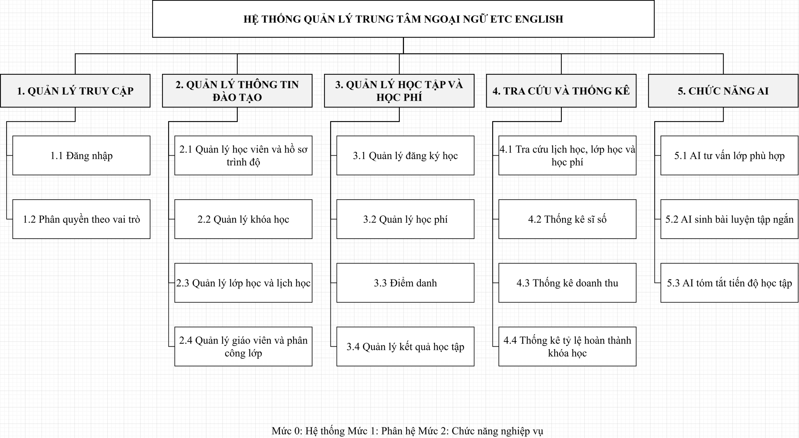

Hình 1 Sơ đồ phân cấp chức năng của ứng dụng

# CHƯƠNG 2 THIẾT KẾ HỆ THỐNG

## 2.1 Mục đích

Tài liệu này đặc tả các yêu cầu chức năng, phi chức năng, tác nhân, use case, dữ liệu và ràng buộc của Hệ thống quản lý trung tâm ngoại ngữ có tích hợp AI. Tài liệu là cơ sở cho việc đánh giá yêu cầu, thiết kế hệ thống, phát triển và kiểm thử; các thành phần ở giai đoạn sau được truy vết từ những yêu cầu đã xác định trong tài liệu.

## 2.2 Phạm vi

Hệ thống hỗ trợ quản lý học viên, hồ sơ trình độ, khóa học, lớp học, giáo viên, phân công lớp, lịch học, đăng ký học, học phí, điểm danh, kết quả học tập, tra cứu và thống kê. Hệ thống tích hợp ba chức năng AI: tư vấn lớp phù hợp, sinh bài luyện tập ngắn và tóm tắt tiến độ học tập.
Đối tượng sử dụng tài liệu gồm nhóm phát triển, giảng viên, người kiểm thử và các bên liên quan. Tài liệu trình bày phạm vi hệ thống, yêu cầu nghiệp vụ, dữ liệu, giao diện tích hợp và các chức năng AI được xác định từ nội dung đề tài.

### 2.3 Các định nghĩa, thuật ngữ, từ viết tắt

| STT | Thuật ngữ, từ viết tắt | Giải thích | Ghi chú |
| :--- | :--- | :--- | :--- |
| 1 | AI | Artificial Intelligence - Trí tuệ nhân tạo. | Tích hợp gemini API hỗ trợ tư vấn, sinh bài tập và tóm tắt |
| 2 | SRS | Software Requirements Specification - Đặc tả yêu cầu phần mềm. | Tài liệu đặc tả kỹ thuật chuẩn của hệ thống |
| 3 | SDLC | Software Development Life Cycle - Vòng đời phát triển phần mềm. | Áp dụng mô hình Agile kết hợp công cụ GenAI |
| 4 | UC | Use Case - Ca sử dụng mô tả tương tác giữa tác nhân và hệ thống. | Bao gồm 14 Use Case chính (UC001 – UC014) |
| 5 | FR | Functional Requirement - Yêu cầu chức năng của hệ thống. | 14 nhóm chức năng nghiệp vụ của trung tâm |
| 6 | NFR | Non-Functional Requirement - Yêu cầu phi chức năng của hệ thống. | Tiêu chuẩn về bảo mật, hiệu năng và độ trễ AI |
| 7 | CEFR | Common European Framework of Reference for Languages - Khung tham chiếu trình độ ngôn ngữ chung Châu Âu (A1, A2, B1, B2, C1, C2). | Thang chuẩn 6 bậc phân loại trình độ học viên |
| 8 | RBAC | Role-Based Access Control - Mô hình phân quyền truy cập dựa trên vai trò người dùng. | Áp dụng cho 4 vai trò: Quản lý, GV, HV, TVV |
| 9 | JWT | JSON Web Token - Chuỗi mã hóa xác thực phiên làm việc an toàn. | Cơ chế xác thực và bảo mật phiên đăng nhập |
| 10 | Hồ sơ trình độ | Thông tin phản ánh trình độ ngoại ngữ của học viên theo chuẩn đánh giá. | Căn cứ đầu vào để AI gợi ý lớp học phù hợp |
| 11 | Khóa học | Chương trình/nội dung đào tạo làm cơ sở tổ chức các lớp học. | Danh mục đào tạo chuẩn do Quản lý thiết lập |
| 12 | Lớp học | Đợt tổ chức cụ thể của khóa học, có lịch học, phòng học và giáo viên phụ trách. | Đơn vị quản lý sĩ số (tối đa 25 HV), điểm danh |
| 13 | Fallback | Phương án xử lý thay thế bằng quy tắc cố định khi AI lỗi hoặc timeout. | Đảm bảo hệ thống vận hành liên tục khi AI gặp sự cố |

Bảng 5 Các định nghĩa, thuật ngữ, từ viết tắt

## 2.4 Tài liệu tham khảo

| STT | Tên tài liệu | Ghi chú |
| :--- | :--- | :--- |
| 1 | de_tai_42.md | Nguồn yêu cầu, tham khảo, ý tưởng chính của dự án. |
| 2 | 01_GenAI_SoftwareDevelopment_project-plan.docx | Biểu mẫu kế hoạch thực hiện. |
| 3 | 02_GenAI_SoftwareDevelopment_requirements-qa.docx | Biểu mẫu thu thập, làm rõ yêu cầu. |
| 4 | 03_GenAI_SoftwareDevelopment_requirements-specification.docx | Biểu mẫu cấu trúc SRS. |
| 5 | 04_GenAI_SoftwareDevelopment_object-oriented-design | Biểu mẫu thiết kế hướng đối tượng, thiết kế lớp và các thành phần liên quan. |
| 6 | 05_GenAI_SoftwareDevelopment_functional-testing | Biểu mẫu kiểm thử chức năng, danh sách tình huống kiểm thử và báo cáo kết quả test. |
| 7 | 06_GenAI_SoftwareDevelopment_screenflow_db | Biểu mẫu thiết kế Screen Flow và cơ sở dữ liệu, gồm CSDL quan hệ và các ràng buộc toàn vẹn. |
| 8 | 07_GenAI_SoftwareDevelopment_user-guide | Biểu mẫu xây dựng tài liệu hướng dẫn sử dụng, gồm giới thiệu, cấu hình và hướng dẫn các chức năng theo tác nhân. |

Bảng 6 Tài liệu tham khảo

## 2.5 MÔ TẢ TỔNG QUAN ỨNG DỤNG

### 2.5.1 Danh sách các tác nhân và mô tả

| Tác nhân | Mô tả tác nhân | Ghi chú |
| :--- | :--- | :--- |
| Quản lý (Admin) | Quản trị tài khoản, học viên, khóa/lớp/lịch, giáo viên, đăng ký, học phí, báo cáo và điều chỉnh dữ liệu nhạy cảm. | Toàn quyền nghiệp vụ |
| Giáo viên | Xem lớp được phân công, lịch dạy, danh sách học viên; điểm danh và ghi nhận kết quả. | Chỉ lớp được phân công |
| Học viên | Xem hồ sơ, tra cứu/tự đăng ký lớp, xem học phí/lịch/kết quả và sử dụng ba chức năng AI. | Chỉ dữ liệu của mình |
| Tư vấn viên | Quản lý hồ sơ học viên, hỗ trợ đăng ký lớp, ghi nhận học phí và dùng AI tư vấn lớp. | Không sửa điểm/kết quả |

Bảng 7: Tác nhân và mô tả

### 2.5.2 Danh sách Use case và mô tả

| ID | Tên Use case | Mô tả ngắn gọn | Chức năng | Tác nhân chính | Ghi chú |
| :--- | :--- | :--- | :--- | :--- | :--- |
| UC001 | Đăng nhập và phân quyền | Xác thực người dùng, xác định vai trò và giới hạn chức năng. | FR-001 | Quản lý/Giáo viên/Học viên/Tư vấn viên | Bắt buộc/Cốt lõi: Xác thực bảo mật, mã hóa mật khẩu |
| UC002 | Quản lý học viên và hồ sơ trình độ | Tạo, cập nhật, tra cứu thông tin học viên và trình độ. | FR-002 | Quản lý/Tư vấn viên | Quản lý hồ sơ CEFR (A1–C2) và lịch rảnh học viên |
| UC003 | Quản lý khóa học | Quản lý danh mục khóa học của trung tâm. | FR-003 | Quản lý | Thiết lập chuẩn đầu vào, thời lượng và mức học phí |
| UC004 | Quản lý lớp và lịch học | Tổ chức lớp học và lịch học cụ thể. | FR-004 | Quản lý | Kiểm soát sĩ số (tối đa 25 HV), phòng học và ca học |

| UC005 | Quản lý giáo viên và phân công lớp | Quản lý giáo viên và ghi nhận phân công phụ trách lớp. | FR-005 | Quản lý | Kiểm tra chuyên môn và kiểm tra chống trùng lịch dạy |
| :--- | :--- | :--- | :--- | :--- | :--- |
| UC006 | Đăng ký lớp | Ghi nhận học viên đăng ký một lớp phù hợp. | FR-006 | Tư vấn viên/Học viên | Kiểm tra lớp còn chỗ, đúng trình độ CEFR và không trùng lịch |
| UC007 | Quản lý học phí | Ghi nhận và tra cứu nghĩa vụ/trạng thái học phí. | FR-007 | Quản lý/Tư vấn viên/Học viên | Tự động tạo hóa đơn, hỗ trợ tiền mặt và chuyển khoản |
| UC008 | Điểm danh | Ghi nhận tình trạng tham gia của học viên theo buổi. | FR-008 | Giáo viên | Ghi nhận 4 trạng thái: Có mặt, Vắng, Đi muộn, Có phép |
| UC009 | Ghi nhận kết quả học tập | Lưu kết quả học tập của học viên trong lớp/khóa. | FR-009 | Giáo viên | Trọng số: Chuyên cần 20%, Giữa kỳ 30%, Cuối kỳ 50% |
| UC010 | Tra cứu lịch, lớp và học phí | Tra cứu thông tin theo quyền của người dùng. | FR-010 | Quản lý/Giáo viên/Học viên/Tư vấn viên | Phân quyền hiển thị dữ liệu theo vai trò người dùng |
| UC011 | Xem thống kê | Tổng hợp sĩ số, doanh thu và tỷ lệ hoàn thành khóa. | FR-011 | Quản lý | Báo cáo doanh thu, sĩ số lớp và tỷ lệ đạt chuẩn |
| UC012 | AI tư vấn lớp phù hợp | Gợi ý lớp dựa trên trình độ, lịch rảnh và lớp hiện có. | FR-AI-001 | Tư vấn viên/Học viên | Tích hợp Gemini API, có Fallback lọc lớp CSDL |
| UC013 | AI sinh bài luyện tập ngắn | Sinh bài luyện tập theo chủ đề và trình độ. | FR-AI-002 | Học viên/Giáo viên | Sinh các câu trắc nghiệm CEFR kèm đáp án và giải thích |
| UC014 | AI tóm tắt tiến độ học tập | Tạo bản tóm tắt từ dữ liệu kết quả học tập. | FR-AI-003 | Học viên/Giáo viên/Quản lý | Phân tích điểm mạnh, điểm yếu và định hướng ôn tập |

Bảng 8: Danh sách Use case và mô tả

### 2.5.3 Biểu đồ use case Tổng quát

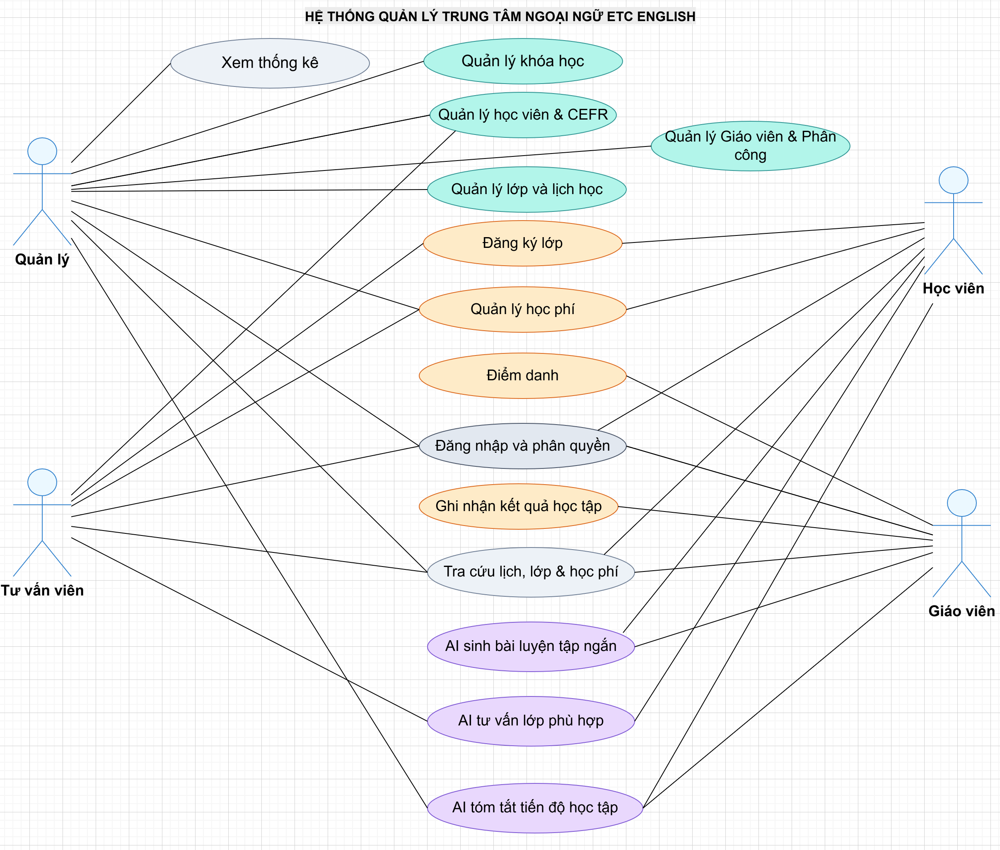

Hình 2: Biểu đồ use case Tổng Quát

### 2.5.4 Biểu đồ Use Case phân rã cho tác nhân Người Quản lý

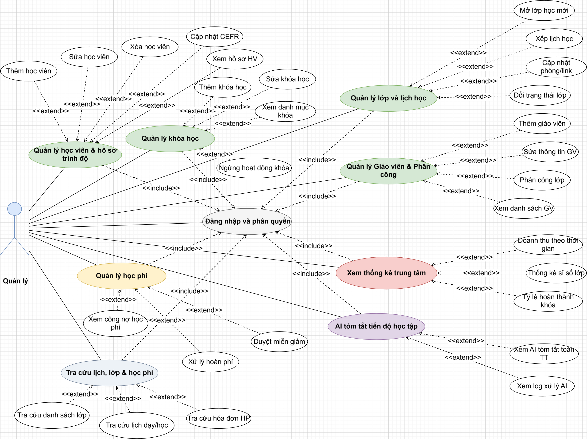

Hình 3: Biểu đồ use case phân rã tác nhân quản lý

### 2.5.5 Biểu đồ Use Case phân rã cho tác nhân Giáo Viên

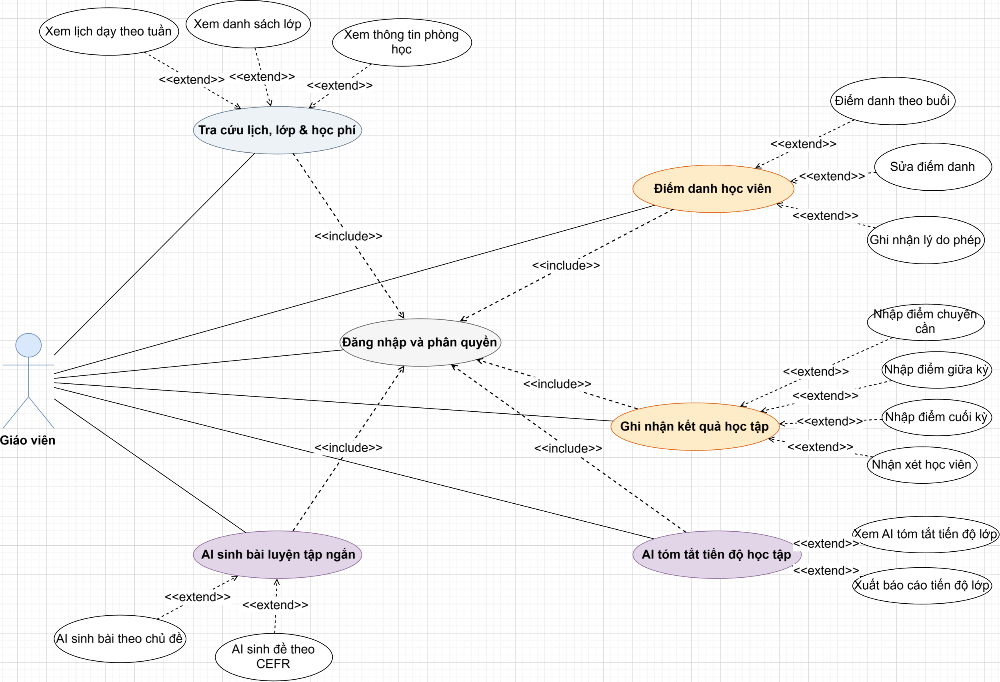

Hình 4: Biểu đồ Use Case phân rã cho tác nhân Giáo Viên

### 2.5.6 Biểu đồ Use Case phân rã cho tác nhân Học viên

**   **

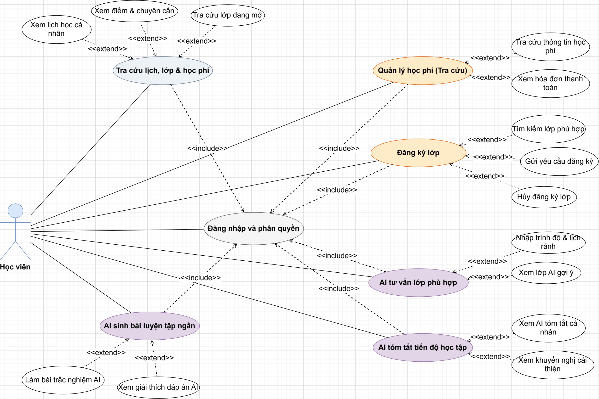

Hình 5: Biểu đồ Use Case phân rã cho tác nhân Học viên

### 2.5.7 Biểu đồ Use Case phân rã cho tác nhân Tư vấn viên

**       **

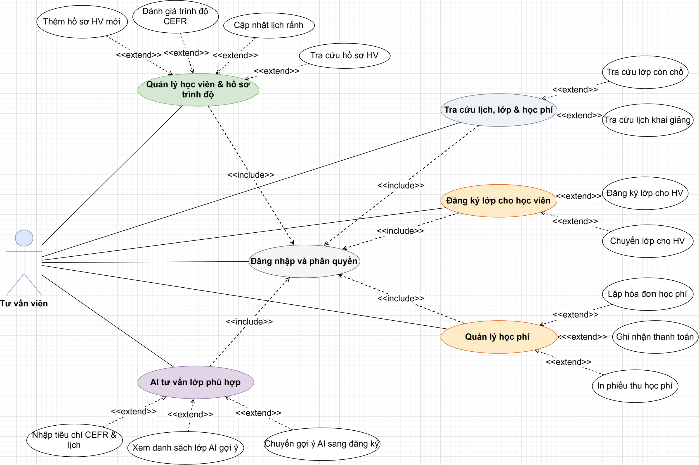

Hình 6: Biểu đồ Use Case phân rã cho tác nhân Tư vấn viên

### 2.5.8 Các điều kiện phụ thuộc

- **Nền tảng kỹ thuật:** Trong phạm vi dự án, backend có thể sử dụng **NestJS, FastAPI hoặc Flask**; frontend có thể sử dụng **Next.js (React/TypeScript), React hoặc Vue**; cơ sở dữ liệu có thể sử dụng **PostgreSQL, MySQL hoặc SQLite**. **Định hướng triển khai hiện tại là Next.js cho frontend, NestJS cho backend và PostgreSQL cho cơ sở dữ liệu.** Việc thay đổi công nghệ chỉ được thực hiện khi có quyết định thống nhất trong quá trình phát triển.
- **Dịch vụ AI:** Hệ thống có thể tích hợp một trong các dịch vụ/model AI như **OpenAI, Gemini, Claude, Hugging Face hoặc Ollama**. Việc lựa chọn nhà cung cấp, model, giới hạn chi phí và chính sách dữ liệu phải được xác định trước khi triển khai chức năng AI.
- **Dữ liệu nghiệp vụ:** Hệ thống cần dữ liệu về **học viên, khóa học, lớp học, giáo viên, lịch học, đăng ký, học phí, điểm danh và kết quả học tập** để vận hành các chức năng quản lý và cung cấp dữ liệu đầu vào cho các chức năng AI.
- **Phụ thuộc vào AI:** Các chức năng AI phụ thuộc vào dịch vụ/model được lựa chọn. Hệ thống phải thực hiện **validation đầu vào/đầu ra, xử lý lỗi và có phương án fallback** khi dịch vụ AI không khả dụng hoặc trả về kết quả không hợp lệ. Không được mặc định xem kết quả do AI sinh ra là dữ liệu chính xác tuyệt đối.
- **Môi trường vận hành:** Hệ thống phụ thuộc vào **môi trường triển khai, cấu hình phần cứng, kết nối mạng, số lượng người dùng đồng thời, cơ chế sao lưu và giám sát**. Các yếu tố này có thể ảnh hưởng đến hiệu năng và độ ổn định của hệ thống.

# CHƯƠNG 3 ĐẶC TẢ CÁC YÊU CẦU CHỨC NĂNG

## 3.1 UC001_Đăng nhập và phân quyền

### 3.1.1 Mô tả use case UC001

| Use case | UC001_Đăng nhập và phân quyền |
| :--- | :--- |
| Mục đích | Cho phép người dùng truy cập đúng chức năng theo vai trò. |
| Mô tả | Hệ thống xác thực thông tin đăng nhập, xác định vai trò quản lý/giáo viên/học viên/tư vấn viên và tạo phiên làm việc. |
| Tác nhân | Quản lý, Giáo viên, Học viên, Tư vấn viên. |
| Điều kiện trước | Người dùng có tài khoản đang hoạt động. |
| Điều kiện sau | Đăng nhập thành công và chỉ thấy chức năng được cấp; hoặc hệ thống từ chối mà không tạo phiên. |
| Luồng sự kiện chính (Basic flows) | 1. Người dùng mở màn hình đăng nhập. 2. Nhập thông tin xác thực. 3. Hệ thống kiểm tra thông tin. 4. Hệ thống xác định vai trò và quyền. 5. Hệ thống tạo phiên và chuyển đến màn hình phù hợp. |
| Luồng sự kiện phụ (Alternative flows) | A1. Thiếu/sai thông tin: Thông báo "Sai tài khoản hoặc mật khẩu", không tạo phiên. |

Bảng 9: Mô tả use case UC001

### 3.1.2  Biểu đồ Activity Diagram UC001

*  *

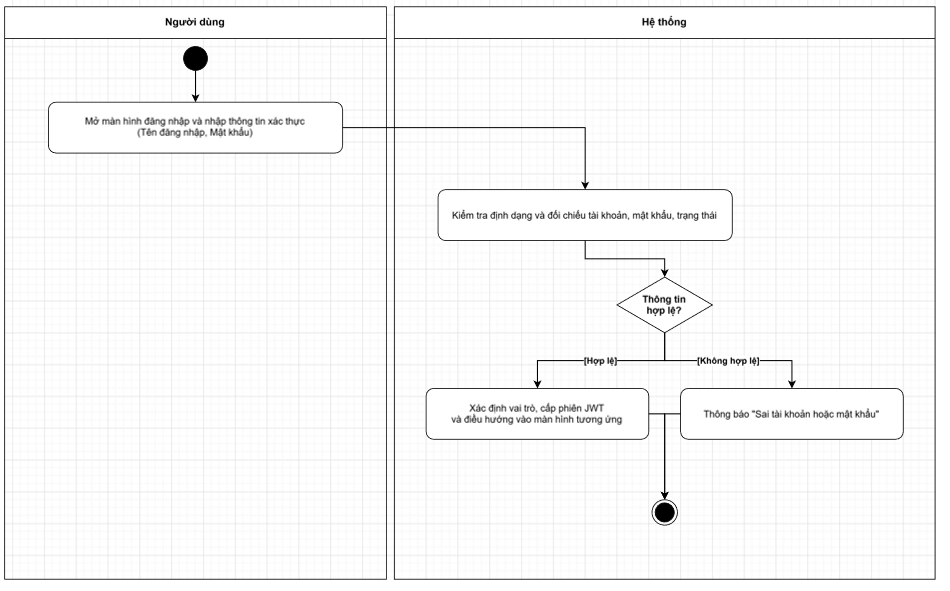

Hình 7: Biểu đồ Activity Diagram UC001- Đăng nhập và phân quyền

### 3.1.3 Biểu đồ trình tự UC001

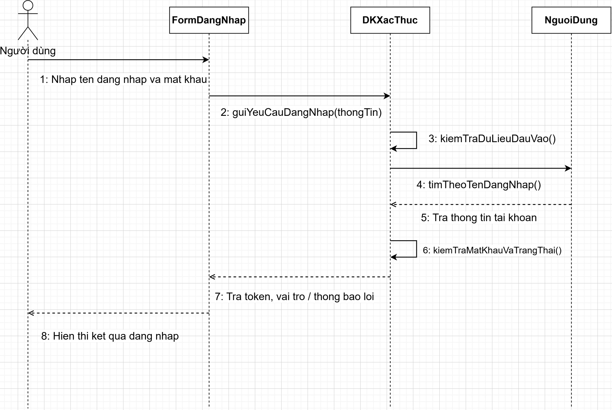

Hình 8 Biều đồ trình tự UC001- Đăng nhập và phân quyền

## 3.2 UC002_Quản lý học viên và hồ sơ trình độ

### 3.2.1 Mô tả use case UC002

| Use case | UC002_Quản lý học viên và hồ sơ trình độ |
| :--- | :--- |
| Mục đích | Quản lý tập trung học viên và thông tin trình độ phục vụ xếp lớp, đào tạo. |
| Mô tả | Quản lý mã học viên, họ tên, ngày sinh, giới tính, email, số điện thoại, địa chỉ, CEFR, lịch rảnh và trạng thái. |
| Tác nhân | Quản lý, Tư vấn viên. |
| Điều kiện trước | Đã đăng nhập và có quyền quản lý học viên. |
| Điều kiện sau | Dữ liệu hợp lệ được lưu; dữ liệu không hợp lệ bị từ chối. |
| Luồng sự kiện chính (Basic flows) | 1. Chọn chức năng quản lý học viên. 2. Tìm hoặc tạo hồ sơ. 3. Nhập/cập nhật thông tin và hồ sơ trình độ. 4. Hệ thống kiểm tra dữ liệu. 5. Hệ thống lưu và hiển thị kết quả. |
| Luồng sự kiện phụ (Alternative flows) | A1. Email/số điện thoại trùng: từ chối. A2. Không đủ quyền: từ chối thao tác. |

Bảng 10:Mô tả Use case UC002

### 3.2.2 Biểu đồ Activity Diagram UC002

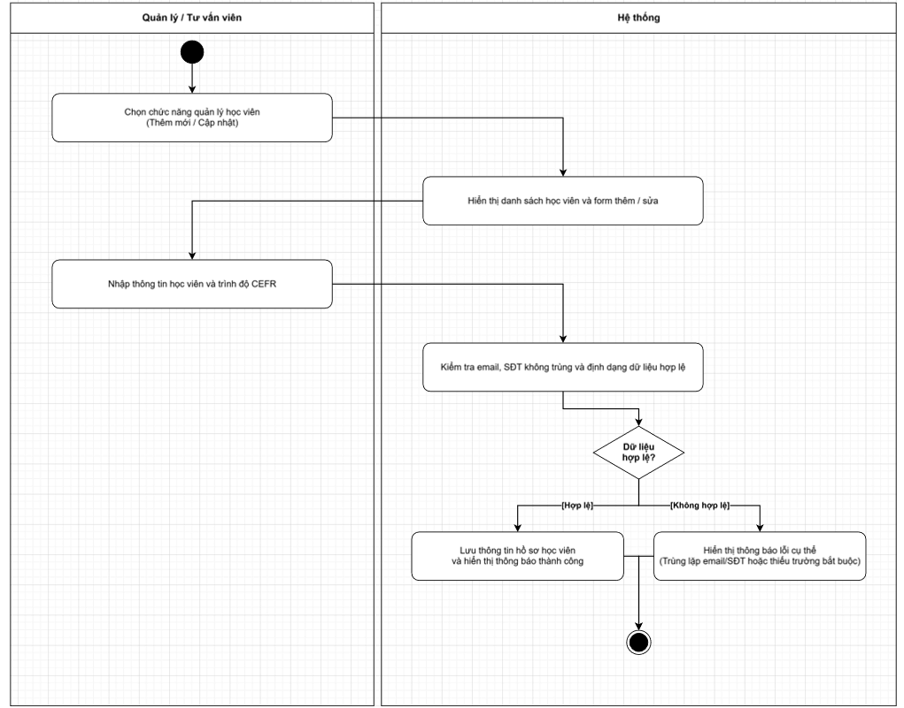

Hình 9: Biểu đồ Activity Diagram UC002 – Quản lý học viên và hồ sơ trình độ

### 3.2.3 Biểu đồ trình tự UC002

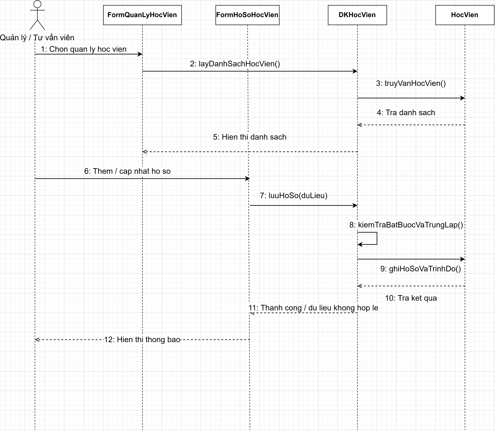

Hình 10: Biểu đồ trình tự UC002 - Quản lý học viên và hồ sơ trình độ

## 3.3 UC003_Quản lý khóa học

### 3.3.1 Mô tả use case UC003

| Use case | UC003_Quản lý khóa học |
| :--- | :--- |
| Mục đích | Duy trì danh mục khóa học làm cơ sở mở lớp. |
| Mô tả | Quản lý mã, tên, ngôn ngữ, CEFR, thời lượng, học phí và trạng thái khóa học. |
| Tác nhân | Quản lý. |
| Điều kiện trước | Đã đăng nhập và có quyền quản lý khóa học. |
| Điều kiện sau | Khóa học hợp lệ được tạo/cập nhật và có thể dùng khi tổ chức lớp. |
| Luồng sự kiện chính (Basic flows) | 1. Mở danh mục khóa học. 2. Chọn thêm hoặc cập nhật. 3. Nhập thông tin khóa học. 4. Hệ thống kiểm tra dữ liệu. 5. Lưu và hiển thị danh sách. |
| Luồng sự kiện phụ (Alternative flows) | A1. Mã khóa trùng: từ chối. A2. Khóa đã phát sinh lớp: chỉ cho ngừng hoạt động, không xóa cứng. |

Bảng 11: Mô tả use case UC003

### 3.3.2 Biểu đồ Activity Diagram UC003

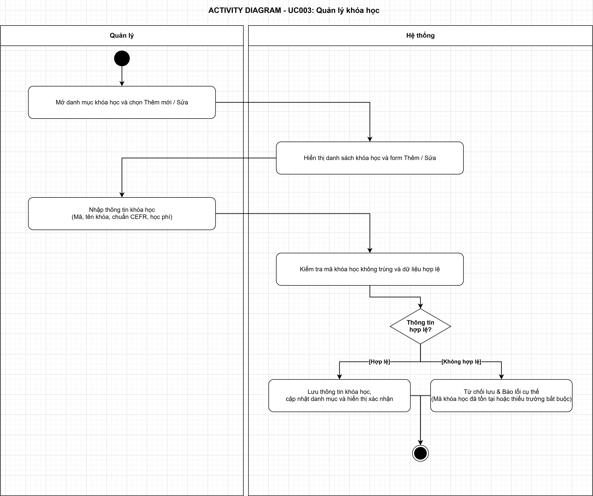

Hình 11: Biểu đồ Activity Diagram UC003 - Quản lý khóa học

### 3.3.3 Biểu đồ trình tự UC003

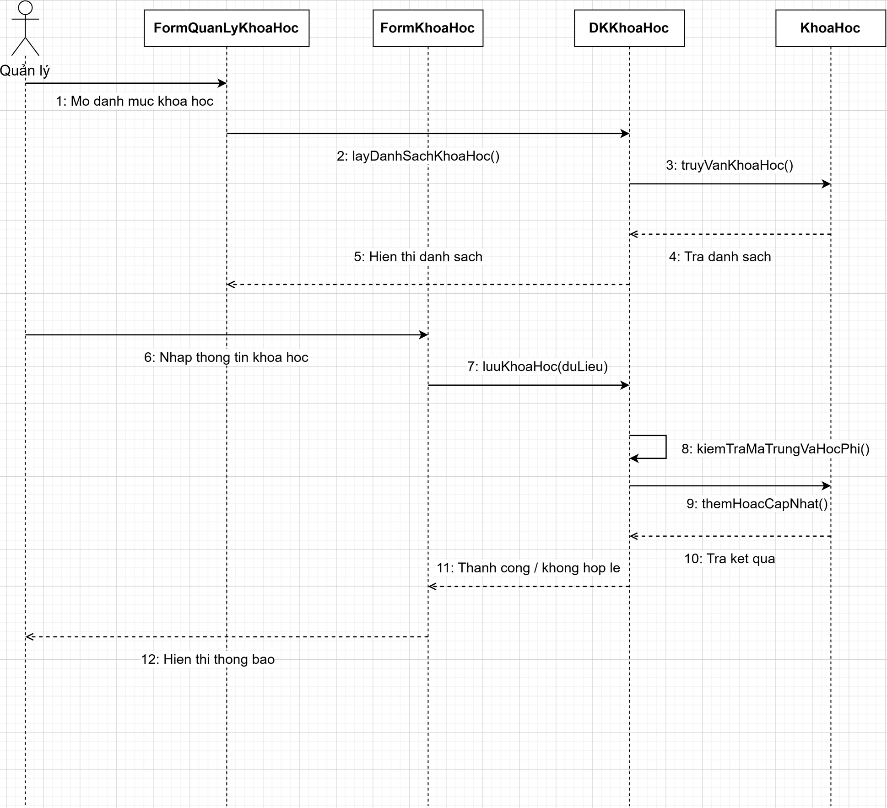

Hình 12: Biểu đồ trình tự UC003 - Quản lý khóa học

## 3.4 UC004_Quản lý lớp và lịch học

### 3.4.1 Mô tả use case UC004

| Use case | UC004_Quản lý lớp và lịch học |
| :--- | :--- |
| Mục đích | Tổ chức lớp học và lịch học từ khóa học đã có. |
| Mô tả | Quản lý lớp tối đa 25 học viên, ngày bắt đầu/kết thúc, phòng hoặc liên kết online và lịch học. |
| Tác nhân | Quản lý. |
| Điều kiện trước | Khóa học phù hợp đã tồn tại. |
| Điều kiện sau | Lớp và lịch hợp lệ được lưu để đăng ký, phân công và tra cứu. |
| Luồng sự kiện chính (Basic flows) | 1. Chọn khóa học. 2. Tạo/cập nhật lớp. 3. Nhập lịch học và thông tin tổ chức. 4. Hệ thống kiểm tra dữ liệu. 5. Lưu lớp và lịch. |
| Luồng sự kiện phụ (Alternative flows) | A1. Trùng lớp, phòng hoặc giáo viên theo thời gian: từ chối. A2. Sĩ số ngoài 1-25: từ chối. |

Bảng 12: Mô tả use case UC004

### 3.4.2 Biểu đồ Activity Diagram UC004

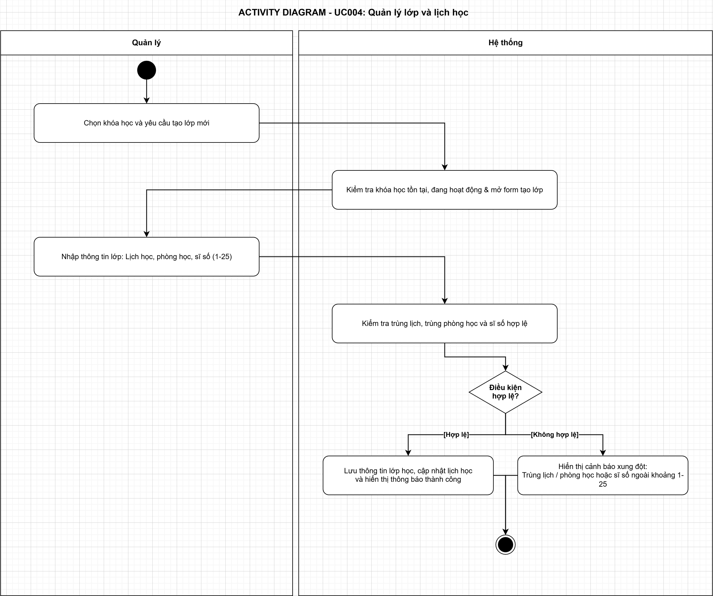

Hình 13; Biểu đồ Activity Diagram UC004 - Quản lý lớp và lịch học

### 3.4.3 Biểu đồ trình tự UC004

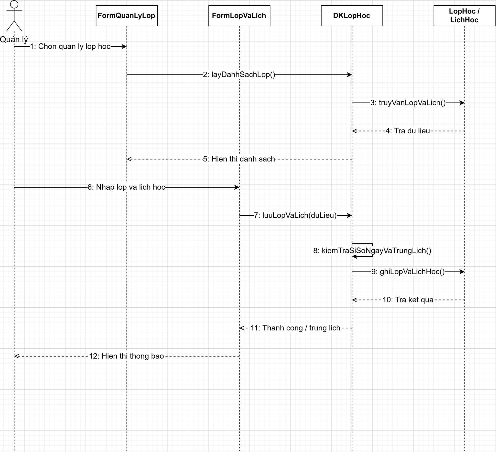

Hình 14: Biểu đồ trình tự UC004 - Quản lý lớp và lịch học

## 3.5 UC005_Quản lý giáo viên và phân công lớp

### 3.5.1 Mô tả use case UC005

| Use case | UC005_Quản lý giáo viên và phân công lớp |
| :--- | :--- |
| Mục đích | Quản lý giáo viên và xác định người phụ trách lớp. |
| Mô tả | Quản lý hồ sơ giáo viên và phân công một giáo viên chính cho lớp dựa trên chuyên môn và lịch trống. |
| Tác nhân | Quản lý. |
| Điều kiện trước | Giáo viên và lớp tồn tại. |
| Điều kiện sau | Phân công hợp lệ được lưu và có thể tra cứu. |
| Luồng sự kiện chính (Basic flows) | 1. Mở danh sách giáo viên hoặc lớp. 2. Chọn giáo viên và lớp. 3. Nhập thông tin phân công. 4. Hệ thống kiểm tra. 5. Lưu phân công. |
| Luồng sự kiện phụ (Alternative flows) | A1. Giáo viên/lớp không hoạt động: từ chối. A2. Trùng lịch hoặc chuyên môn không phù hợp: từ chối. |

Bảng 13: Mô tả use case UC005

### 3.5.2 Biểu đồ Activity Diagram UC005

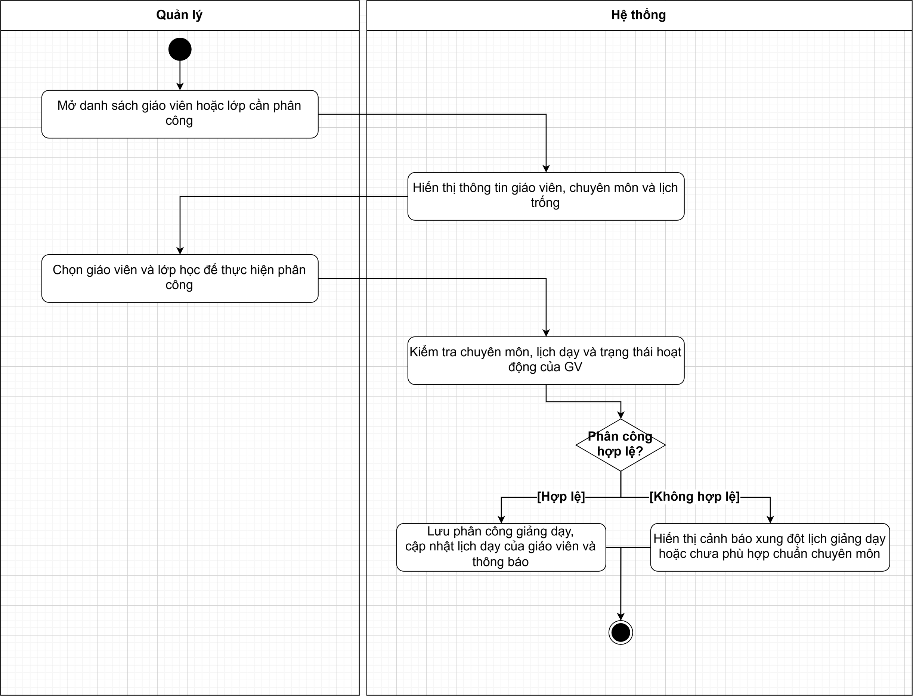

Hình 15: Biểu đồ Activity Diagram UC005 - Quản lý giáo viên và phân công lớp

### 3.5.3 Biểu đồ trình tự UC005

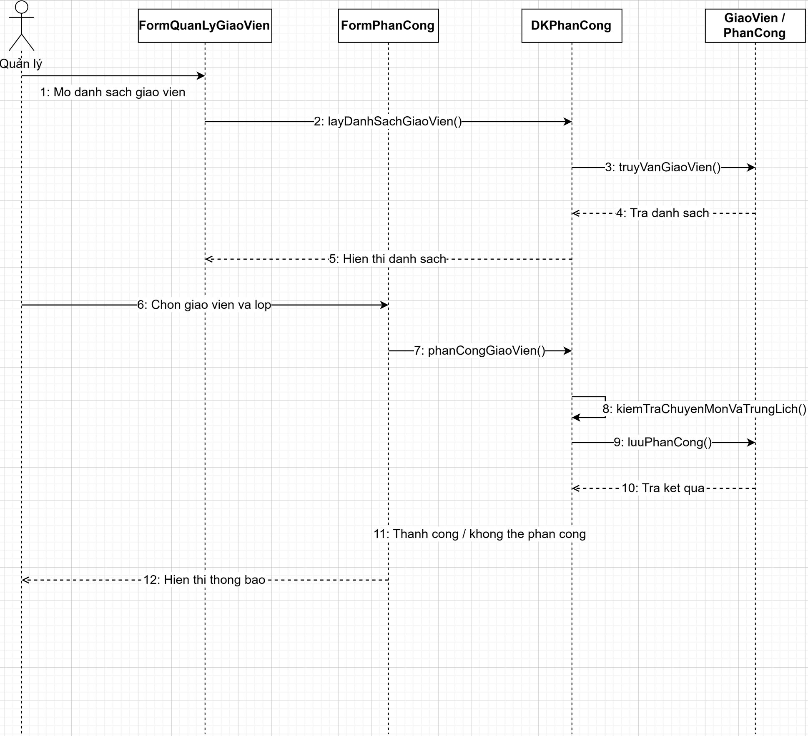

Hình 16: Biểu đồ trình tự UC005 - Quản lý giáo viên và phân công lớp

## 3.6 UC006_Đăng ký lớp

### 3.6.1 Mô tả use case UC006

| Use case | UC006_Đăng ký lớp |
| :--- | :--- |
| Mục đích | Ghi nhận học viên tham gia lớp. |
| Mô tả | Tạo đăng ký khi lớp mở, còn chỗ, phù hợp CEFR/lịch và học viên chưa đăng ký trùng. |
| Tác nhân | Tư vấn viên; Học viên tự đăng ký. |
| Điều kiện trước | Học viên và lớp tồn tại; lớp cho phép đăng ký. |
| Điều kiện sau | Đăng ký hợp lệ được lưu, liên kết học viên với lớp và sẵn sàng cho học phí/điểm danh. |
| Luồng sự kiện chính (Basic flows) | 1. Chọn học viên. 2. Tra cứu lớp phù hợp. 3. Chọn lớp và gửi đăng ký. 4. Hệ thống kiểm tra điều kiện đăng ký. 5. Hệ thống lưu và thông báo thành công. |
| Luồng sự kiện phụ (Alternative flows) | A1. Đã đăng ký lớp: từ chối trùng. A2. Lớp đủ 25 học viên hoặc không còn mở: từ chối. A3. Trình độ/lịch không phù hợp: cảnh báo và không lưu. |

Bảng 14: Mô tả use case UC006

### 3.6.2 Biểu đồ Activity Diagram UC006

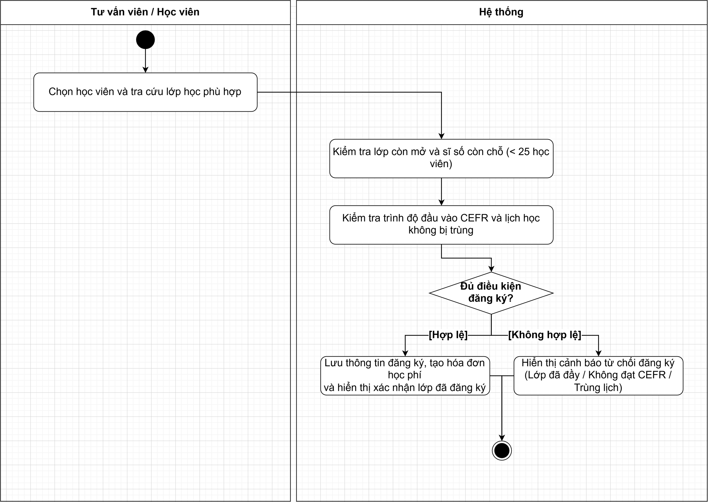

Hình 17: Biểu đồ Activity Diagram UC006 - Đăng ký lớp

### 3.6.3 Biểu đồ trình tự UC006

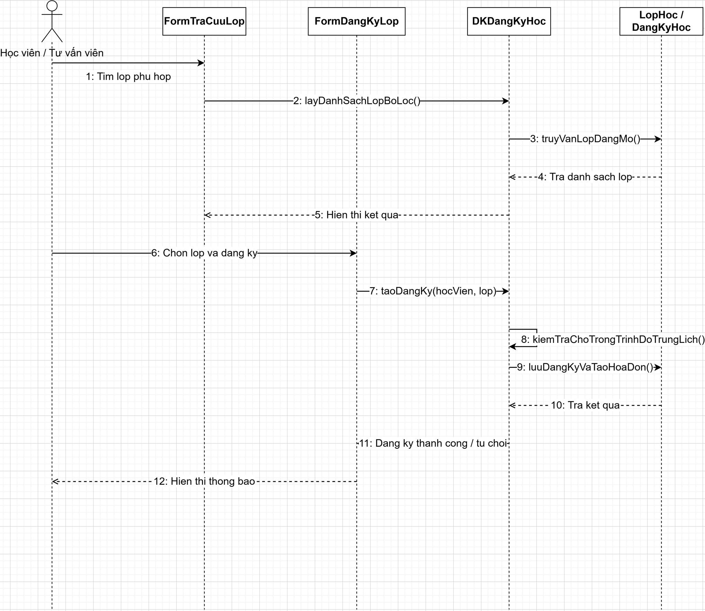

Hình 18: Biểu đồ trình tự UC006 - Đăng ký lớp

## 3.7 UC007_Quản lý học phí

### 3.7.1 Mô tả use case UC007

| Use case | UC007_Quản lý học phí |
| :--- | :--- |
| Mục đích | Theo dõi học phí liên quan đến đăng ký học. |
| Mô tả | Mỗi đăng ký tạo một hóa đơn; hỗ trợ nhiều giao dịch tiền mặt/chuyển khoản và trạng thái công nợ. |
| Tác nhân | Quản lý, Tư vấn viên, Học viên (tra cứu). |
| Điều kiện trước | Có học viên và dữ liệu đăng ký/khóa/lớp liên quan. |
| Điều kiện sau | Thông tin học phí hợp lệ được lưu và có thể tra cứu. |
| Luồng sự kiện chính (Basic flows) | 1. Chọn học viên/đăng ký. 2. Hệ thống hiển thị thông tin học phí hiện có. 3. Người có quyền nhập/cập nhật dữ liệu. 4. Hệ thống kiểm tra. 5. Lưu và hiển thị trạng thái. |
| Luồng sự kiện phụ (Alternative flows) | A1. Số tiền/trạng thái không hợp lệ: từ chối. A2. Người dùng chỉ có quyền xem: không cho sửa. |

Bảng 15: Mô tả use case UC007

### 3.7.2 Biểu đồ Activity Diagram UC007

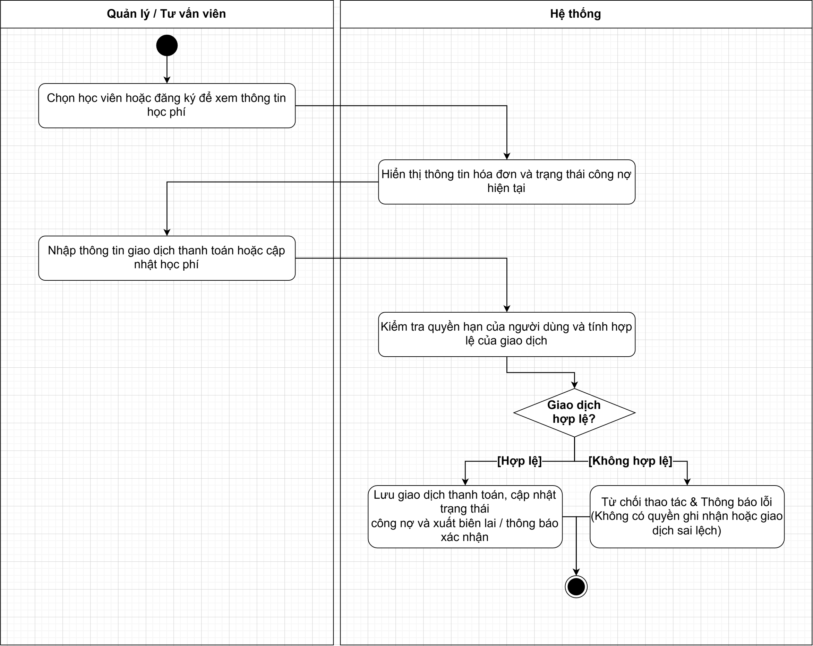

Hình 19: Biểu đồ Activity Diagram UC007 - Quản lý học phí

### 3.7.3 Biểu đồ trình tự UC007

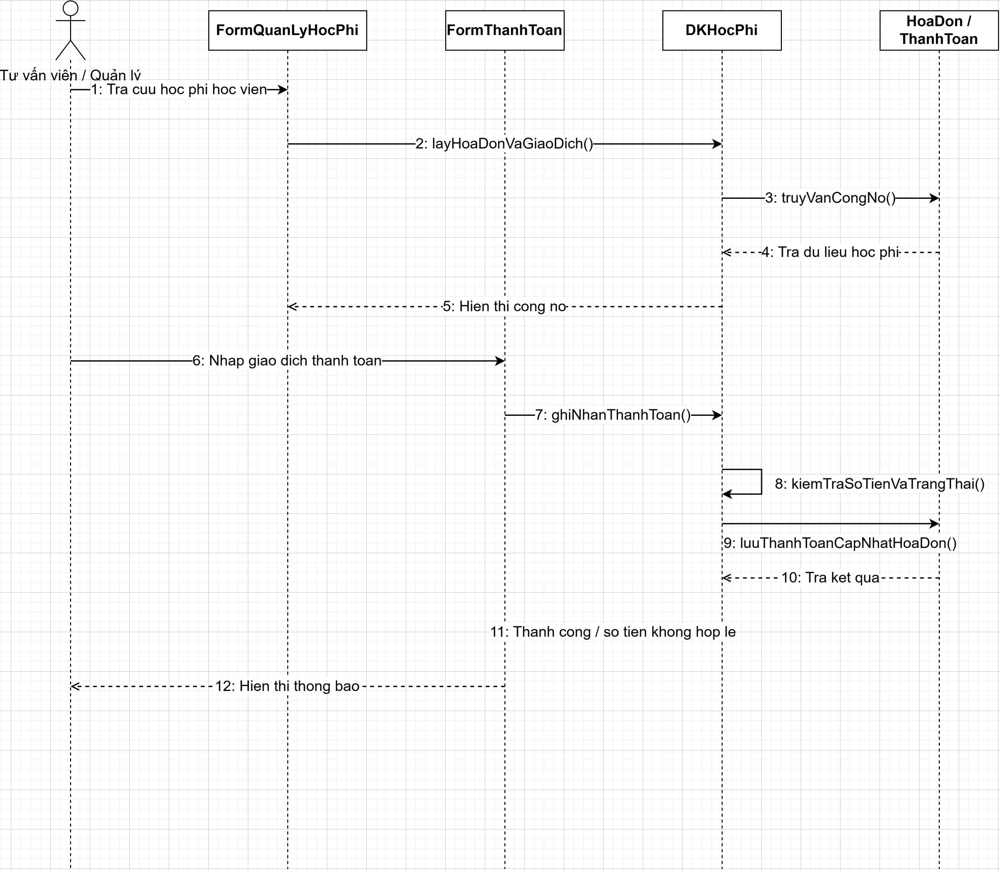

Hình 20: Biểu đồ trình tự UC007 - Quản lý học phí

## 3.8 UC008_Điểm danh

### 3.8.1 Mô tả use case UC008

| Use case | UC008_Điểm danh |
| :--- | :--- |
| Mục đích | Ghi nhận mức độ tham gia học của học viên theo buổi. |
| Mô tả | Giáo viên ghi nhận trạng thái Có mặt, Vắng, Đi muộn hoặc Có phép cho từng học viên và có thể điều chỉnh thông tin điểm danh khi cần thiết. |
| Tác nhân | Giáo viên. |
| Điều kiện trước | Giáo viên được phân công lớp; lớp có lịch/buổi học; học viên đã đăng ký. |
| Điều kiện sau | Dữ liệu điểm danh hợp lệ được lưu cho từng học viên và buổi học. |
| Luồng sự kiện chính (Basic flows) | 1. Giáo viên chọn lớp và buổi học. 2. Hệ thống hiển thị danh sách học viên. 3. Giáo viên chọn trạng thái từng học viên. 4. Hệ thống kiểm tra. 5. Lưu điểm danh. |
| Luồng sự kiện phụ (Alternative flows) | A1. Giáo viên không phụ trách lớp: từ chối. A2. Buổi học/học viên không hợp lệ: không lưu. |

Bảng 16: Mô tả use case UC008

### 3.8.2 Biểu đồ Activity Diagram UC008

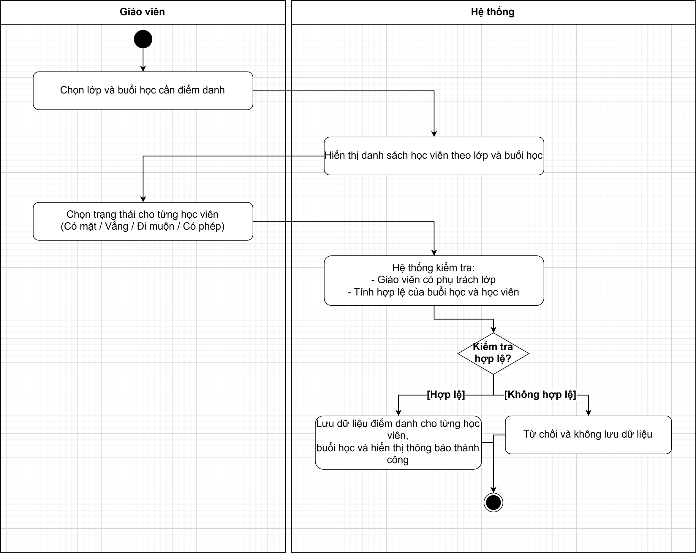

Hình 21: Biểu đồ Activity Diagram UC008 - Điểm danh

### 3.8.3 Biểu đồ trình tự UC008

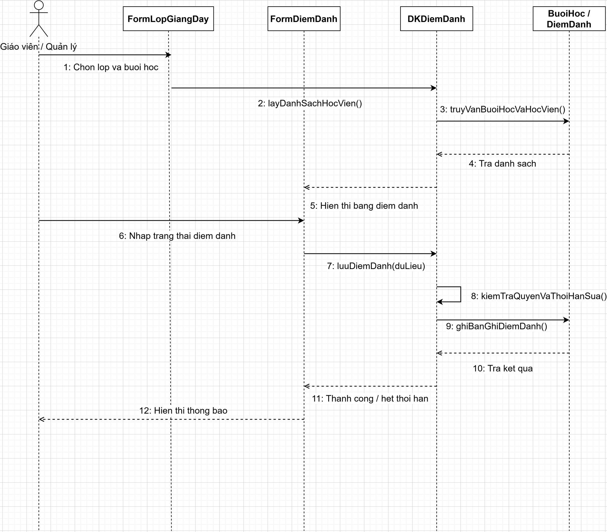

Hình 22: Biểu đồ trình tự UC008 - Điểm danh

## 3.9 UC009_Ghi nhận kết quả học tập

### 3.9.1 Mô tả use case UC009

| Use case | UC009_Ghi nhận kết quả học tập |
| :--- | :--- |
| Mục đích | Lưu kết quả học tập để theo dõi tiến độ và hoàn thành khóa. |
| Mô tả | Giáo viên nhập điểm 0-100 và nhận xét; tổng kết = chuyên cần 20% + giữa kỳ 30% + cuối kỳ 50%. |
| Tác nhân | Giáo viên. |
| Điều kiện trước | Giáo viên phụ trách lớp và học viên tham gia lớp. |
| Điều kiện sau | Kết quả hợp lệ được lưu và có thể dùng cho tra cứu, thống kê và AI tóm tắt. |
| Luồng sự kiện chính (Basic flows) | 1. Chọn lớp/học viên. 2. Chọn loại kết quả. 3. Nhập điểm hoặc nhận xét. 4. Hệ thống kiểm tra. 5. Lưu kết quả. |
| Luồng sự kiện phụ (Alternative flows) | A1. Điểm ngoài 0-100: từ chối. A2. Không đủ quyền: từ chối. |

Bảng 17: Mô tả use case UC009

### 3.9.2 Biểu đồ Activity Diagram UC009

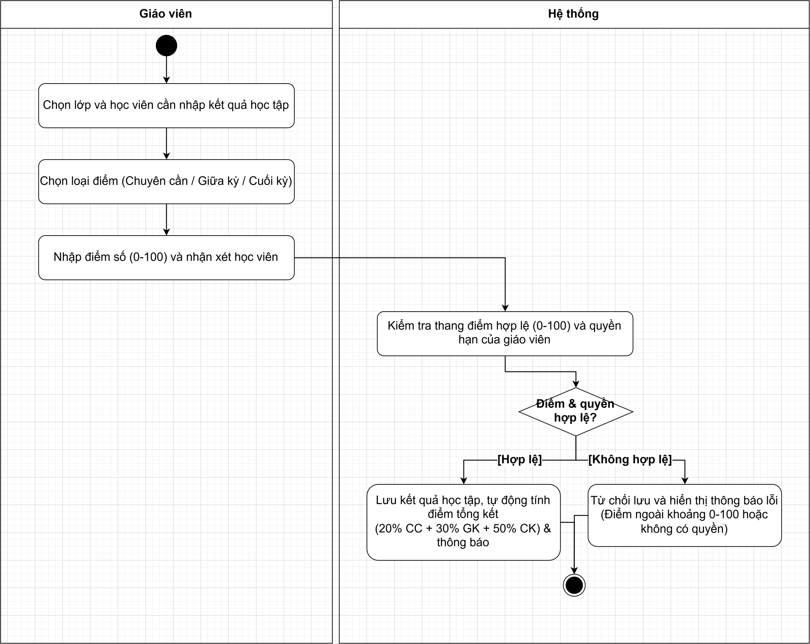

Hình 23: Biểu đồ Activity Diagram UC009 - Ghi nhận kết quả học tập

### 3.9.3 Biểu đồ trình tự UC009

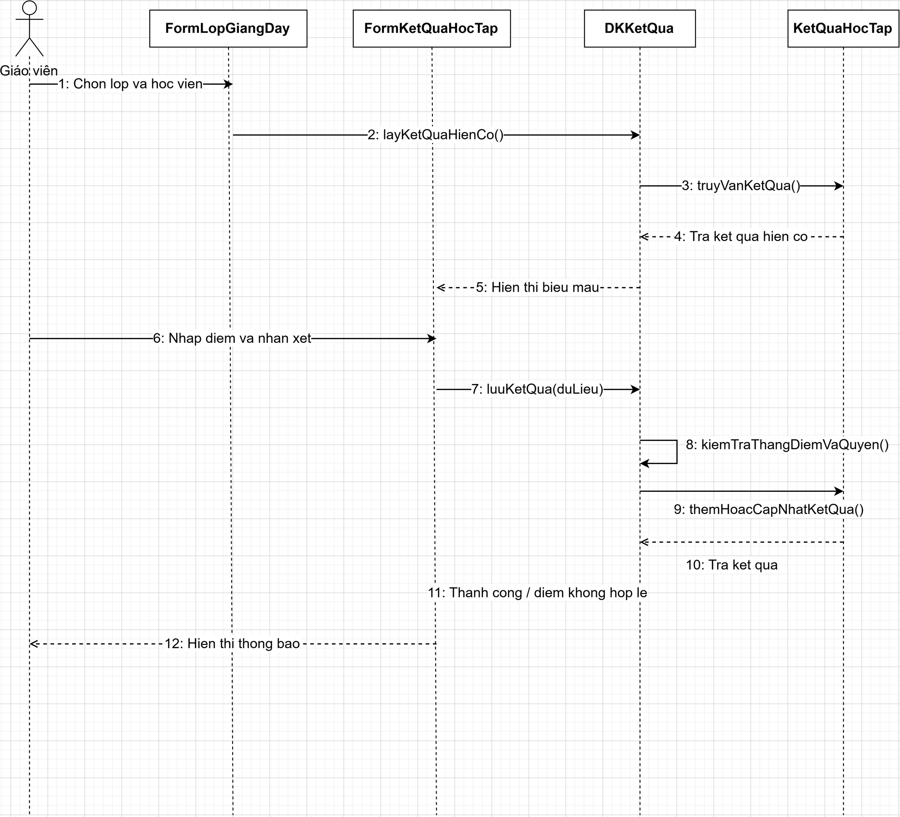

Hình 24: Biểu đồ trình tự UC009 - Ghi nhận kết quả học tập

## 3.10 UC010_Tra cứu lịch, lớp và học phí

### 3.10.1 Mô tả use case UC010

| Use case | UC010_Tra cứu lịch, lớp và học phí |
| :--- | :--- |
| Mục đích | Cho phép người dùng tìm và xem lịch học, lớp và học phí theo quyền. |
| Mô tả | Hệ thống cung cấp bộ lọc/tra cứu và chỉ trả dữ liệu người dùng được phép xem. |
| Tác nhân | Quản lý, Giáo viên, Học viên, Tư vấn viên. |
| Điều kiện trước | Người dùng đã đăng nhập. |
| Điều kiện sau | Danh sách/kết quả tra cứu phù hợp được hiển thị; không làm thay đổi dữ liệu. |
| Luồng sự kiện chính (Basic flows) | 1. Mở chức năng tra cứu. 2. Chọn loại và tiêu chí tìm kiếm. 3. Hệ thống kiểm tra quyền/phạm vi dữ liệu. 4. Hệ thống truy vấn. 5. Hiển thị kết quả. |
| Luồng sự kiện phụ (Alternative flows) | A1. Không có dữ liệu: hiển thị trạng thái rỗng. A2. Tiêu chí không hợp lệ: yêu cầu nhập lại. |

Bảng 18: Mô tả use case UC010

### 3.10.2 Biểu đồ Activity Diagram UC010

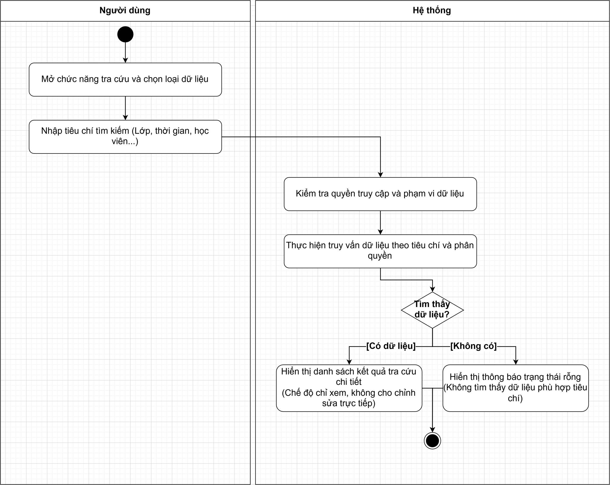

Hình 25: Biểu đồ Activity Diagram UC010 - Tra cứu lịch, lớp và học phí

### 3.10.3 Biểu đồ trình tự UC010

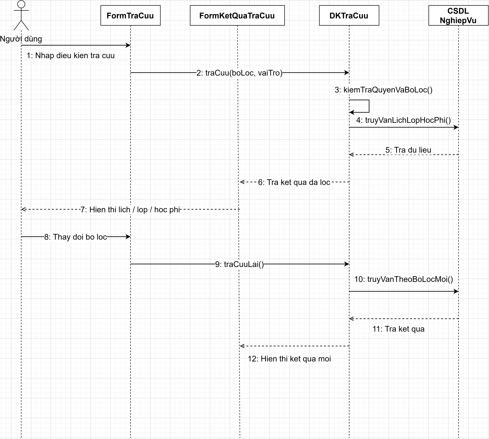

Hình 26: Biểu đồ trình tự UC010 - Tra cứu lịch, lớp và học phí

## 3.11 UC011_Xem thống kê

### 3.11.1 Mô tả use case UC011

| Use case | UC011_Xem thống kê |
| :--- | :--- |
| Mục đích | Cung cấp số liệu hỗ trợ quản lý trung tâm. |
| Mô tả | Tổng hợp sĩ số, doanh thu và tỷ lệ hoàn thành khóa theo phạm vi/thời gian được chọn. |
| Tác nhân | Quản lý. |
| Điều kiện trước | Có dữ liệu lớp, đăng ký, học phí và kết quả liên quan. |
| Điều kiện sau | Báo cáo được hiển thị, không thay đổi dữ liệu nguồn. |
| Luồng sự kiện chính (Basic flows) | 1. Chọn loại thống kê. 2. Chọn phạm vi/thời gian. 3. Hệ thống kiểm tra tiêu chí. 4. Tổng hợp dữ liệu. 5. Hiển thị kết quả. |
| Luồng sự kiện phụ (Alternative flows) | A1. Thiếu dữ liệu: hiển thị 0. A2. Doanh thu chỉ tính giao dịch thành công; hoàn thành khi tổng kết >=50 và chuyên cần >=80%. |

Bảng 19: Mô tả use case UC011

### 3.11.2 Biểu đồ Activity Diagram UC011

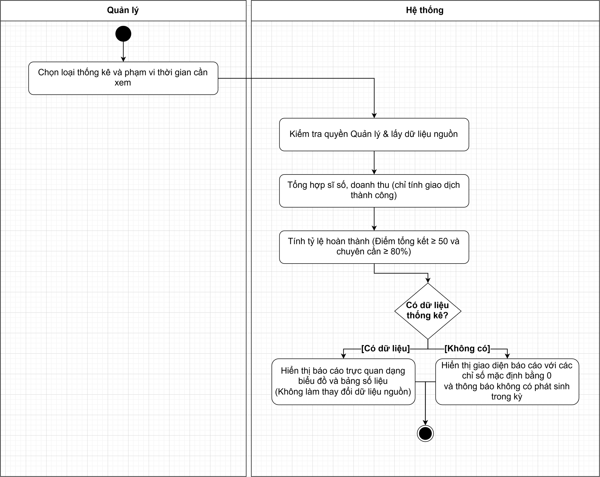

Hình 27: Biểu đồ Activity Diagram UC011 - Xem thống kê

### 3.11.3 Biểu đồ trình tự UC011

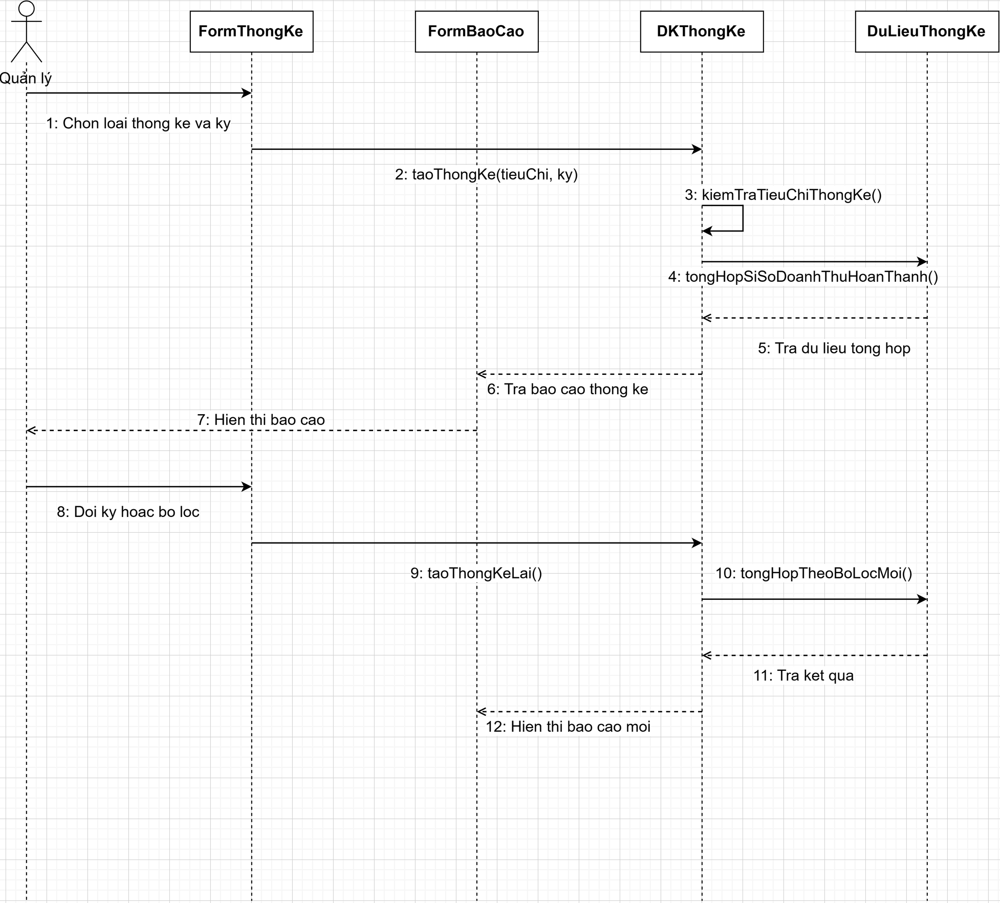

Hình 28: Biểu đồ trình tự UC011 - Xem thống kê

## 3.12 UC012_AI tư vấn lớp phù hợp

### 3.12.1 Mô tả use case UC012

| Use case | UC012_AI tư vấn lớp phù hợp |
| :--- | :--- |
| Mục đích | Hỗ trợ tìm lớp phù hợp nhưng không thay thế quyết định của người dùng. |
| Mô tả | Hệ thống gửi trình độ, lịch rảnh và danh sách lớp hiện có cho AI; kiểm tra đầu ra trước khi hiển thị. |
| Tác nhân | Tư vấn viên, Học viên. |
| Điều kiện trước | Có trình độ, lịch rảnh và dữ liệu lớp; dịch vụ AI khả dụng hoặc có fallback. |
| Điều kiện sau | Hiển thị gợi ý chỉ chứa lớp tồn tại, kèm lý do phù hợp; không cam kết kết quả học tập. |
| Luồng sự kiện chính (Basic flows) | 1. Người dùng yêu cầu tư vấn. 2. Hệ thống lấy trình độ, lịch rảnh và lớp hiện có. 3. Hệ thống tạo prompt theo mẫu đề tài. 4. AI trả kết quả. 5. Hệ thống kiểm tra lớp/định dạng/nội dung. 6. Hiển thị gợi ý hợp lệ. |
| Luồng sự kiện phụ (Alternative flows) | A1. Thiếu trình độ/lịch rảnh: yêu cầu bổ sung. A2. AI gợi ý lớp không tồn tại: loại bỏ. A3. AI lỗi/quá 15 giây: fallback xếp hạng theo CEFR, lịch và chỗ trống. |

Bảng 20: Mô tả use case UC012

### 3.12.2 Biểu đồ Activity Diagram UC012

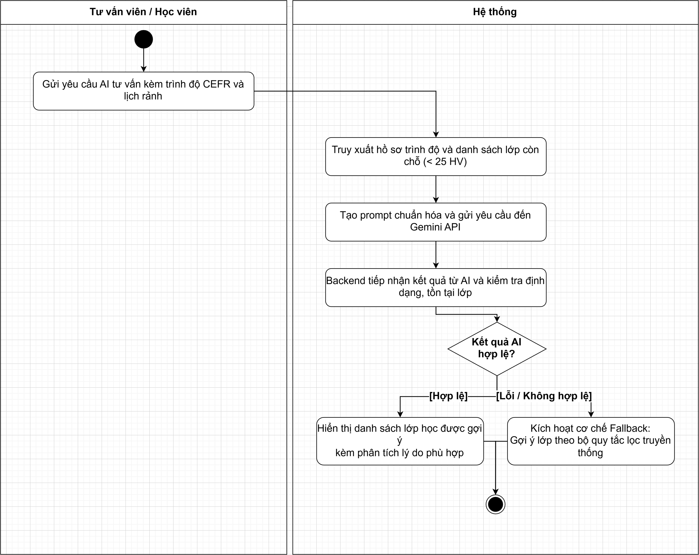

Hình 29: Biểu đồ Activity Diagram UC012 - AI tư vấn lớp phù hợp

### 3.12.3 Biểu đồ trình tự UC012

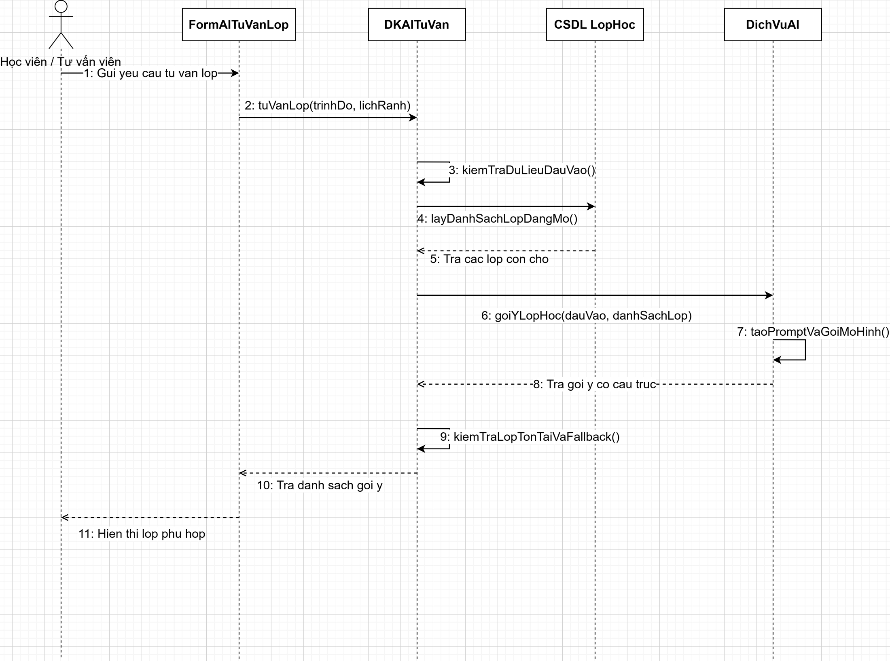

Hình 30: Biểu đồ trình tự UC012 - AI tư vấn lớp phù hợp

## 3.13 UC013_AI sinh bài luyện tập ngắn

### 3.13.1 Mô tả use case UC013

| Use case | UC013_AI sinh bài luyện tập ngắn |
| :--- | :--- |
| Mục đích | Cung cấp bài luyện tập ngắn phù hợp chủ đề và trình độ. |
| Mô tả | Hệ thống tạo prompt, nhận bài tập từ AI, kiểm tra cấu trúc/nội dung trước khi hiển thị. |
| Tác nhân | Học viên, Giáo viên. |
| Điều kiện trước | Có chủ đề và trình độ hợp lệ. |
| Điều kiện sau | Bài luyện tập hợp lệ được lưu và hiển thị kèm đáp án, giải thích. |
| Luồng sự kiện chính (Basic flows) | 1. Người dùng chọn chủ đề và trình độ. 2. Hệ thống kiểm tra đầu vào. 3. Hệ thống gửi prompt. 4. AI sinh bài luyện tập. 5. Hệ thống kiểm tra cấu trúc, độ dài và nội dung. 6. Hiển thị kết quả. |
| Luồng sự kiện phụ (Alternative flows) | A1. Trình độ không hợp lệ: yêu cầu chọn CEFR. A2. Output lỗi: thử lại một lần. A3. AI lỗi: trả bộ bài mẫu theo CEFR/chủ đề. |

Bảng 21: Mô tả use case UC013

### 3.13.2 Biểu đồ Activity Diagram UC013

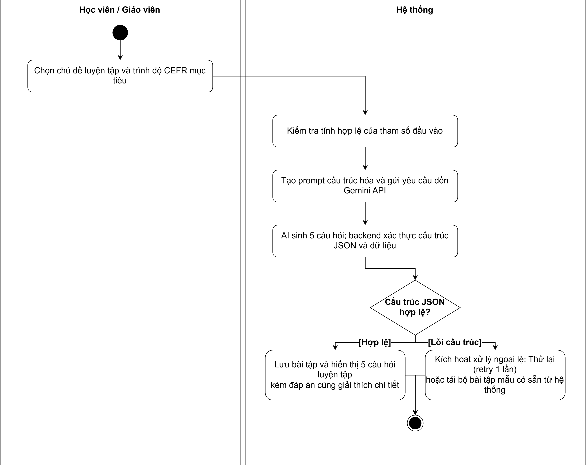

Hình 31: Biểu đồ Activity Diagram UC013 - AI sinh bài luyện tập ngắn

### 3.13.3 Biểu đồ trình tự UC013

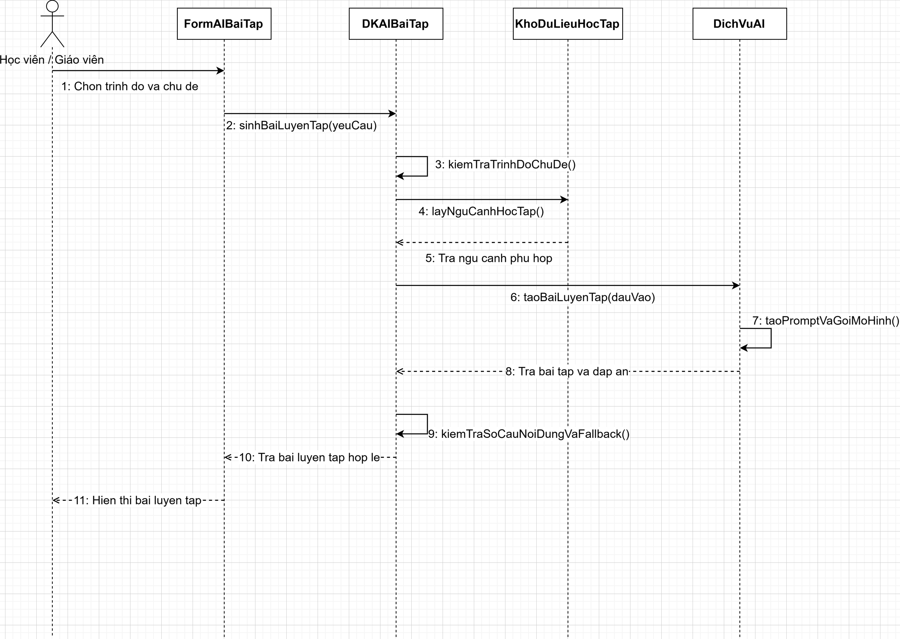

Hình 32: Biểu đồ trình tự UC013 - AI sinh bài luyện tập ngắn

## 3.14 UC014_AI tóm tắt tiến độ học tập

### 3.14.1 Mô tả use case UC014

| Use case | UC014_AI tóm tắt tiến độ học tập |
| :--- | :--- |
| Mục đích | Tóm tắt dữ liệu học tập thành thông tin tiến độ dễ hiểu. |
| Mô tả | Hệ thống tổng hợp kết quả học tập phù hợp, gửi AI và kiểm tra tóm tắt không thêm dữ kiện ngoài dữ liệu. |
| Tác nhân | Học viên, Giáo viên, Quản lý. |
| Điều kiện trước | Có dữ liệu kết quả học tập và người dùng có quyền xem. |
| Điều kiện sau | Tóm tắt tiến độ hợp lệ được hiển thị và phân biệt với dữ liệu gốc. |
| Luồng sự kiện chính (Basic flows) | 1. Người dùng chọn học viên/kỳ cần tóm tắt. 2. Hệ thống kiểm tra quyền. 3. Hệ thống lấy dữ liệu kết quả liên quan. 4. Gửi prompt và dữ liệu tối thiểu cho AI. 5. Kiểm tra tóm tắt với dữ liệu nguồn. 6. Hiển thị kết quả. |
| Luồng sự kiện phụ (Alternative flows) | A1. Không đủ dữ liệu: tạo tóm tắt quy tắc từ dữ liệu hiện có. A2. AI thêm dữ kiện: loại bỏ output. A3. AI lỗi: trả tóm tắt quy tắc. |

Bảng 22: Mô tả use case UC014

### 3.14.2 Biểu đồ Activity Diagram UC014

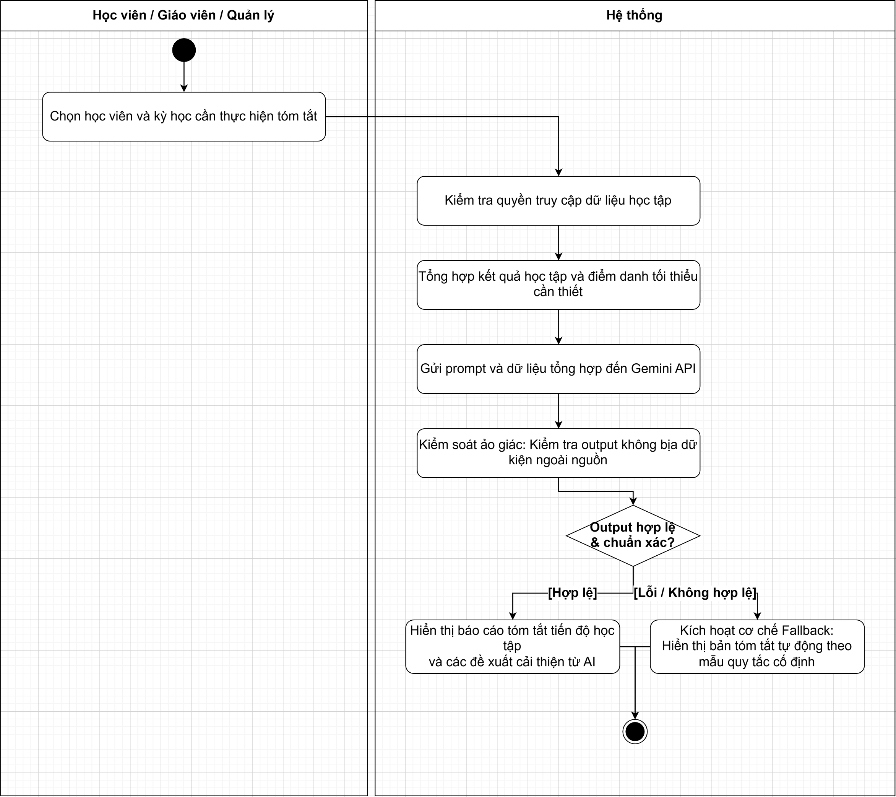

Hình 33: Biểu đồ Activity Diagram UC014 - AI tóm tắt tiến độ học tập

### 3.14.3 Biểu đồ trình tự UC014

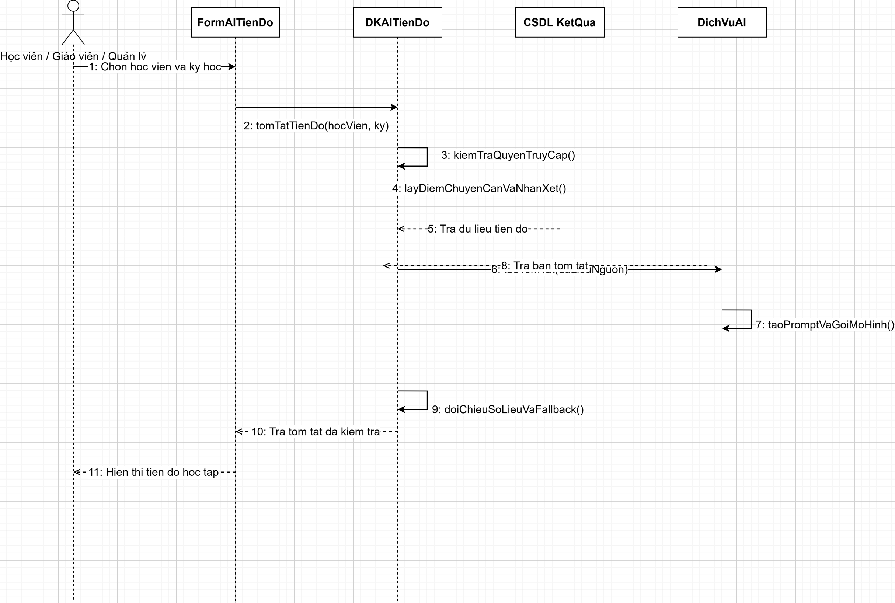

Biểu đồ trình tự UC014 - AI tóm tắt tiến độ học tập

# CHƯƠNG 4 CÁC THÔNG TIN HỖ TRỢ KHÁC

## 4.1 Dữ liệu đầu vào, đầu ra và dữ liệu hệ thống

| Nhóm dữ liệu | Nội dung |
| :--- | :--- |
| Dữ liệu hệ thống chính | Học viên, hồ sơ trình độ, khóa học, lớp, giáo viên, phân công lớp, lịch học, đăng ký học, học phí, điểm danh, kết quả. |
| Đầu vào AI tư vấn lớp | Trình độ, lịch rảnh, khóa học và danh sách lớp hiện có. |
| Đầu ra AI tư vấn lớp | Gợi ý lớp phù hợp; chỉ chứa lớp có trong dữ liệu và không cam kết kết quả học tập. |
| Đầu vào AI sinh bài | Chủ đề, trình độ; các tham số khác. |
| Đầu ra AI sinh bài | Bài luyện tập ngắn; định dạng, đáp án và cách lưu. |
| Đầu vào AI tóm tắt | Kết quả học tập và dữ liệu tiến độ liên quan. |
| Đầu ra AI tóm tắt | Tóm tắt tiến độ có căn cứ từ dữ liệu nguồn. |

Bảng 23: Dữ liệu đầu vào, đầu ra và dữ liệu hệ thống

## 4.2 Prompt mẫu AI tư vấn lớp

## a) AI tư vấn lớp phù hợp:

- System: Bạn là trợ lý tư vấn trung tâm ngoại ngữ. Chỉ gợi ý các lớp có trong danh sách được cung cấp. Tuyệt đối không gợi ý lớp ngoài dữ liệu và không cam kết kết quả học tập.
- User: Học viên có trình độ {{level}}, lịch rảnh {{availability}}. Danh sách các lớp hiện có: {{classes}}. Hãy phân tích và gợi ý tối đa 3 lớp học phù hợp nhất.

## b) AI sinh bài luyện tập ngắn:

- System: Bạn là giáo viên ngoại ngữ. Hãy sinh bài luyện tập trắc nghiệm ngắn gồm các hỏi theo chủ đề và trình độ yêu cầu. Bắt buộc kèm theo đáp án đúng và giải thích ngắn gọn cho mỗi câu.
- User: Tạo 01 bài luyện tập ngắn chủ đề "{{topic}}", trình độ CEFR "{{level}}".

## c) AI tóm tắt tiến độ học tập:

- System: Bạn là trợ lý học tập. Hãy tóm tắt tiến độ học tập dựa CHÍNH XÁC trên dữ liệu được cung cấp. Tuyệt đối không tự bịa đặt hoặc thêm bớt dữ kiện ngoài dữ liệu nguồn.
- User: Dữ liệu điểm danh: {{attendance_data}}, dữ liệu điểm số và nhận xét: {{grade_data}}. Hãy tóm tắt ngắn gọn điểm mạnh, điểm cần cải thiện và gợi ý hướng ôn tập.

## 4.3 Yêu cầu kiểm tra đầu vào, xử lý lỗi, phương án dự phòng và kiểm thử AI

- Kiểm tra đầy đủ và hợp lệ của đầu vào trước khi gọi AI.
- Giới hạn dữ liệu gửi cho AI theo nhu cầu tối thiểu và quyền truy cập; chính sách dữ liệu cá nhân.
- Yêu cầu đầu ra có cấu trúc; kiểm tra parse, trường bắt buộc, giá trị và quan hệ với dữ liệu nguồn.
- AI tư vấn không được trả lớp ngoài danh sách; AI tóm tắt không được thêm dữ kiện ngoài kết quả học tập.
- Xử lý timeout, lỗi nhà cung cấp, giới hạn lượt gọi, đầu ra rỗng/không hợp lệ; fallback cụ thể.
- Test trường hợp trình độ không rõ, lịch rảnh không khớp, không có lớp phù hợp, output sai định dạng, hallucination, timeout và dịch vụ AI không khả dụng.

# CHƯƠNG 5 TÀI LIỆU THIẾT KẾ HƯỚNG ĐỐI TƯỢNG (MÔ HÌNH LỚP)

## Mô hình lớp (Class Diagram)

### 5.1.1  Sơ đồ lớp

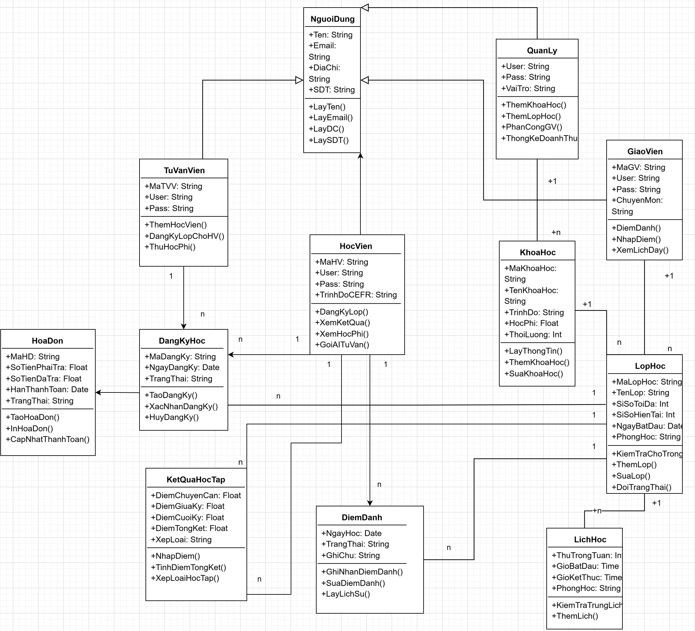

Hình 34: Biểu đồ lớp

## 5.2 Đặc tả chi tiết từng lớp

### 5.2.1 Lớp NguoiDung (Quản lý tài khoản & phân quyền)

- **Thuộc**** ****tính****:**
- id: Long, 8 bytes — Khóa chính định danh tài khoản.
- tenDangNhap: String, tối đa 50 ký tự — Tên đăng nhập duy nhất.
- matKhauMaHoa: String, 255 ký tự — Hash mật khẩu an toàn (Argon2/bcrypt).
- vaiTro: Enum (QUAN_LY, GIAO_VIEN, HOC_VIEN, TU_VAN_VIEN), 20 ký tự.
- email: String, tối đa 100 ký tự — Email liên hệ duy nhất.
- soDienThoai: String, tối đa 20 ký tự — Số điện thoại liên hệ.
- dangHoatDong: Boolean, 1 byte — Trạng thái tài khoản (True: mở, False: khóa).
- **Phương ****thức****:**
**xacThuc**:
- *Mô** **tả*: So khớp mật khẩu người dùng nhập với chuỗi mã hoá trong CSDL.
- *Tham **số** **đầu** **vào*: matKhau (String, tối đa 100 ký tự).
- *Kết** **quả** **đầu** **ra*: ketQua (Boolean, 1 byte).
- *Luồng** **xử** **lý*:
- Kiểm tra tài khoản có dangHoatDong == True.
- Dùng thư viện bcrypt/Argon2 băm matKhau và so với matKhauMaHoa.
- Nếu khớp: Trả về True và xác thực thành công.
- Nếu sai: Trả về False và hiển thị thông báo tài khoản hoặc mật khẩu không chính xác.
- *Điều** **kiện** **bắt** **đầu*: Đối tượng NguoiDung tồn tại trong hệ thống.
- Điều kiện kết thúc: Trả về kết quả xác thực danh tính người dùng.
**kiemTraQuyen**:
- *Mô** **tả*: Kiểm tra người dùng có quyền thực thi chức năng tương ứng vai trò.
- *Tham **số** **đầu** **vào*: maQuyen (String, tối đa 50 ký tự).
- *Kết** **quả** **đầu** **ra*: hopLe (Boolean, 1 byte).
- *Luồng** **xử** **lý*: Đối chiếu vaiTro với ma trận RBAC đã định nghĩa.
- *Điều** **kiện** **bắt** **đầu*: Người dùng đã xác thực phiên làm việc.
- *Điều** **kiện** **kết** **thúc*: Cho phép hoặc từ chối thực thi chức năng.

### 5.2.2 Lớp HoSoHocVien (Hồ sơ học viên & Trình độ)

**Thuộc**** ****tính****:**
- id: Long, 8 bytes — Khóa chính.
- nguoiDungId: Long, 8 bytes — Khóa ngoại liên kết NguoiDung (duy nhất).
- maHocVien: String, tối đa 20 ký tự — Mã học viên duy nhất (VD: HV0001).
- hoTen: String, tối đa 100 ký tự — Họ và tên đầy đủ.
- ngaySinh: Date, 4 bytes — Ngày tháng năm sinh.
- gioiTinh: String, tối đa 10 ký tự (Nam/Nu/Khac).
- diaChi: String, tối đa 255 ký tự — Địa chỉ cư trú.
- trinhDoCEFR: Enum (A1, A2, B1, B2, C1, C2), 2 ký tự — Trình độ ngoại ngữ hiện tại.
- nguonDanhGia: String, tối đa 100 ký tự — Nguồn kiểm tra (Đầu vào / Khóa trước).
- lichRanh: JSON, biến đổi — Danh sách khung giờ rảnh (dùng cho AI tư vấn).
- trangThai: Enum (DANG_HOC, DA_TOT_NGHIEP, BAO_LUU, NGHI_HOC), 20 ký tự.
**Phương ****thức****:**
**C****apNhatTrinhDo**:
- *Mô** **tả*: Cập nhật trình độ CEFR của học viên sau khi kiểm tra hoặc hoàn thành khóa.
- *Tham **số** **đầu** **vào*: cefr (CEFRLevel, 2 ký tự), nguon (String, 100 ký tự).
- *Kết** **quả** **đầu** **ra*: thanhCong (Boolean, 1 byte).
- *Luồng** **xử** **lý*: Kiểm tra giá trị CEFR hợp lệ thuộc [A1, A2, B1, B2, C1, C2], gán trinhDoCEFR = cefr, nguonDanhGia = nguon.
- *Điều** **kiện** **bắt** **đầu*: Học viên tồn tại, người thao tác có quyền Quản lý/Tư vấn viên.
- *Điều** **kiện** **kết** **thúc*: Hồ sơ cập nhật trình độ mới nhất.

### 5.2.3 Lớp HoSoGiaoVien (Hồ sơ giáo viên)

**Thuộc**** ****tính****:**
- id: Long, 8 bytes — Khóa chính.
- nguoiDungId: Long, 8 bytes — Khóa ngoại liên kết NguoiDung.
- maGiaoVien: String, tối đa 20 ký tự — Mã giáo viên duy nhất (VD: GV0001).
- hoTen: String, tối đa 100 ký tự — Họ và tên giáo viên.
- chuyenMon: String, tối đa 100 ký tự — Chuyên môn (VD: IELTS, TOEIC, Giao tiếp).
- bangCap: String, tối đa 150 ký tự — Bằng cấp, chứng chỉ (IELTS 8.0, TESOL...).
- trangThai: Enum (DANG_LAM_VIEC, TAM_NGHI, DA_NGHI_VIEC), 20 ký tự.
**Phương ****thức****:**
- kiemTraTrangThaiDay:
- *Mô** **tả*: Kiểm tra giáo viên có đang trong trạng thái sẵn sàng nhận lớp.
- *Tham **số** **đầu** **vào*: Không.
- *Kết** **quả** **đầu** **ra*: sanSang (Boolean, 1 byte).
- *Luồng** **xử** **lý*: Trả về True nếu trangThai == DANG_LAM_VIEC, ngược lại trả về False.
- *Điều** **kiện** **bắt** **đầu*: Gọi khi thực hiện phân công giáo viên vào lớp.
- *Điều** **kiện** **kết** **thúc*: Cho biết tính khả dụng của giáo viên.

### 5.2.4 Lớp KhoaHoc (Danh mục khóa học)

- **Thuộc**** ****tính****:**
- id: Long, 8 bytes — Khóa chính.
- maKhoaHoc: String, tối đa 20 ký tự — Mã khóa học duy nhất (VD: ENG-B1-01).
- tenKhoaHoc: String, tối đa 150 ký tự — Tên khóa học.
- ngonNgu: String, tối đa 50 ký tự — Ngôn ngữ đào tạo (Tiếng Anh...).
- trinhDoYeuCau: Enum (A1, A2, B1, B2, C1, C2), 2 ký tự — Chuẩn CEFR đầu vào.
- thoiLuongGio: Integer, 4 bytes — Tổng thời lượng (giờ).
- hocPhi: Decimal(12,2), 8 bytes — Mức học phí chuẩn của khóa (VNĐ).
- moTa: String, text — Mô tả chi tiết chương trình học.
- trangThai: Enum (HOAT_DONG, NGUNG_HOAT_DONG), 20 ký tự.
- **Phương ****thức****:**
- ngungHoatDong:
- *Mô** **tả*: Chuyển trạng thái khóa học sang ngừng hoạt động khi không còn mở lớp mới (không xóa cứng).
- *Tham **số** **đầu** **vào*: Không.
- *Kết** **quả** **đầu** **ra*: thanhCong (Boolean, 1 byte).
- *Luồng** **xử** **lý*: Gán trangThai = NGUNG_HOAT_DONG, bảo lưu toàn bộ lịch sử các lớp cũ.
- *Điều** **kiện** **bắt** **đầu*: Người dùng có quyền Quản lý.
- *Điều** **kiện** **kết** **thúc*: Khóa học không xuất hiện trong danh sách mở lớp mới.

### 5.2.5 Lớp LopHoc (Lớp học tổ chức)

- **Thuộc**** ****tính****:**
- id: Long, 8 bytes — Khóa chính.
- khoaHocId: Long, 8 bytes — Khóa ngoại liên kết KhoaHoc.
- maLopHoc: String, tối đa 20 ký tự — Mã lớp học duy nhất (VD: LH-2026-01).
- tenLopHoc: String, tối đa 150 ký tự — Tên hiển thị của lớp.
- siSoToiDa: Integer, 4 bytes — Sĩ số tối đa (Ràng buộc: 1 <= siSoToiDa <= 25).
- siSoHienTai: Integer, 4 bytes — Số học viên đã đăng ký hợp lệ.
- ngayBatDau: Date, 4 bytes — Ngày khai giảng.
- ngayKetThuc: Date, 4 bytes — Ngày kết thúc dự kiến (ngayKetThuc > ngayBatDau).
- phongHoc: String, tối đa 50 ký tự — Phòng học hoặc phòng chức năng.
- linkOnline: String, tối đa 255 ký tự — Đường dẫn lớp học trực tuyến (nếu có).
- trangThai: Enum (SAP_MO, DANG_MO_DANG_KY, DANG_HOC, DA_KET_THUC, DA_HUY), 20 ký tự.
- **Phương ****thức****:**
- ConChoTrong:
- *Mô** **tả*: Kiểm tra lớp còn nhận thêm học viên được không.
- *Tham **số** **đầu** **vào*: Không.
- *Kết** **quả** **đầu** **ra*: conCho (Boolean, 1 byte).
- *Luồng** **xử** **lý*: Trả về (siSoHienTai < siSoToiDa) && (trangThai == DANG_MO_DANG_KY).
- *Điều** **kiện** **bắt** **đầu*: Trước khi tạo bản ghi đăng ký lớp học mới.
- *Điều** **kiện** **kết** **thúc*: Đảm bảo không tuyển vượt quá 25 học viên.
- TangSiSo:
- *Mô** **tả*: Tăng biến đếm sĩ số khi có học viên đăng ký thành công.
- *Tham **số** **đầu** **vào*: Không.
- *Kết** **quả** **đầu** **ra*: thanhCong (Boolean, 1 byte).
- *Luồng** **xử** **lý*: Nếu conChoTrong() là True, siSoHienTai += 1. Nếu đạt siSoToiDa, cập nhật trạng thái lớp sang DANG_HOC hoặc đóng đăng ký.

### 5.2.6 Lớp LichHoc (Lịch học định kỳ trong tuần)

- **Thuộc**** ****tính****:**
- id: Long, 8 bytes — Khóa chính.
- lopHocId: Long, 8 bytes — Khóa ngoại liên kết LopHoc.
- thuTrongTuan: Integer, 4 bytes — Thứ trong tuần (2: Thứ Hai -> 8: Chủ Nhật).
- gioBatDau: Time, 4 bytes — Giờ bắt đầu ca học.
- gioKetThuc: Time, 4 bytes — Giờ kết thúc ca học (gioKetThuc > gioBatDau).
- phongHoc: String, tối đa 50 ký tự — Phòng học của ca.
- **Phương ****thức****:**
- KiemTraXungDot:
- *Mô** **tả*: Kiểm tra xung đột lịch học với một lịch học khác cùng phòng hoặc cùng giáo viên.
- *Tham **số** **đầu** **vào*: lichKhac (LichHoc).
- *Kết** **quả** **đầu** **ra*: biTrung (Boolean, 1 byte).
- *Luồng** **xử** **lý*: Trả về True nếu cùng thuTrongTuan, cùng phongHoc và khoảng thời gian [gioBatDau, gioKetThuc] giao thoa nhau.

### 5.2.7. Lớp PhanCongGiaoVien (Phân công giảng dạy)

- **Thuộc**** ****tính****:**
- id: Long, 8 bytes — Khóa chính.
- lopHocId: Long, 8 bytes — Khóa ngoại liên kết LopHoc (Mỗi lớp có 1 GV chính).
- giaoVienId: Long, 8 bytes — Khóa ngoại liên kết HoSoGiaoVien.
- vaiTroPhanCong: Enum (CHINH, TRO_GIANG), 20 ký tự.
- thoiGianPhanCong: DateTime, 8 bytes — Thời điểm phân công.
- trangThai: Enum (DANG_PHU_TRACH, DA_HUY), 20 ký tự.
- **Phương ****thức****:**
- XacNhanPhanCong:
- *Mô** **tả*: Ghi nhận giáo viên chính thức phụ trách lớp sau khi kiểm tra chuyên môn và không trùng lịch dạy lớp khác.

### 5.2.8 Lớp DangKyHoc (Giao dịch đăng ký lớp)

- **Thuộc**** ****tính****:**
- id: Long, 8 bytes — Khóa chính.
- lopHocId: Long, 8 bytes — Khóa ngoại liên kết LopHoc.
- hocVienId: Long, 8 bytes — Khóa ngoại liên kết HoSoHocVien.
- ngayDangKy: DateTime, 8 bytes — Thời điểm tạo yêu cầu đăng ký.
- trangThai: Enum (CHO_THANH_TOAN, DA_XAC_NHAN, DA_HUY, HOAN_THANH), 20 ký tự.
- **Phương ****thức****:**
- kiemTraDieuKienDangKy:
- *Mô** **tả*: Kiểm tra 4 điều kiện cốt lõi: Lớp còn chỗ (< 25), Học viên chưa đăng ký lớp này, Trình độ CEFR phù hợp, Lịch học không xung đột với các lớp học viên đang học.
- *Tham **số** **đầu** **vào*: Không.
- *Kết** **quả** **đầu** **ra*: hopLe (Boolean, 1 byte).
- *Luồng** **xử** **lý*: Truy vấn CSDL kiểm tra 4 điều kiện trên; trả về False và thông báo nếu vi phạm bất kỳ điều kiện nào.

### 5.2.9 Lớp HoaDon & ThanhToan (Quản lý học phí)

- **HoaDon ****Thuộc**** ****tính****:**
- id: Long, 8 bytes — Khóa chính.
- maHoaDon: String, tối đa 30 ký tự — Mã hóa đơn duy nhất (VD: HD-2026-0001).
- dangKyHocId: Long, 8 bytes — Khóa ngoại liên kết DangKyHoc (1-1).
- hocVienId: Long, 8 bytes — Khóa ngoại liên kết HoSoHocVien.
- soTienPhaiTra: Decimal(12,2), 8 bytes — Tổng tiền học phí cần đóng.
- soTienDaTra: Decimal(12,2), 8 bytes — Tổng tiền học viên đã thanh toán lũy kế.
- hanThanhToan: Date, 4 bytes — Hạn chót hoàn tất học phí.
- trangThai: Enum (CHUA_THANH_TOAN, THANH_TOAN_MOT_PHAN, DA_HOAN_THANH, QUA_HAN), 25 ký tự.
- **ThanhToan**** ****Thuộc**** ****tính****:**
- id: Long, 8 bytes; hoaDonId: Long, 8 bytes; maGiaoDich: String, 50 ký tự; soTien: Decimal(12,2); phuongThuc: Enum (TIEN_MAT, CHUYEN_KHOAN); thoiGianThanhToan: DateTime; nguoiThuId: Long; trangThai: Enum (THANH_CONG, THAT_BAI, HOAN_TRA); ghiChu: String.
- **Phương ****thức****:**
- CapNhatThanhToan:
- *Mô** **tả*: Ghi nhận tiền từ giao dịch thành công và tự động tính lại trạng thái công nợ hóa đơn.
- *Luồng** **xử** **lý*: soTienDaTra += soTienVuaTra. Nếu soTienDaTra >= soTienPhaiTra -> trangThai = DA_HOAN_THANH; nếu 0 < soTienDaTra < soTienPhaiTra -> trangThai = THANH_TOAN_MOT_PHAN.

### 5.2.10 Lớp BuoiHoc & BanGhiDiemDanh (Quản lý điểm danh)

- **BanGhiDiemDanh**** *****Thuộc****** ******tính******:***
- id: Long; buoiHocId: Long; hocVienId: Long;
- trangThai: Enum (CO_MAT, VANG, DI_MUON, CO_PHEP); ghiChu: String (255 ký tự);
- thoiGianDiemDanh: DateTime; giaoVienDiemDanhId: Long.
- **Phương ****thức**** **
*dieuChinhDiemDanh*: Cho phép giáo viên/quản lý cập nhật lại điểm danh kèm lý do điều chỉnh để lưu log lịch sử.

### 5.2.11 Lớp KetQuaHocTap (Ghi nhận điểm & đánh giá)

- **Thuộc**** ****tính****:**
- id: Long, 8 bytes — Khóa chính.
- lopHocId: Long, 8 bytes; hocVienId: Long, 8 bytes.
- diemChuyenCan: Decimal(5,2), 4 bytes — Điểm chuyên cần (thang 0-100).
- diemGiuaKy: Decimal(5,2), 4 bytes — Điểm bài kiểm tra giữa kỳ (thang 0-100).
- diemCuoiKy: Decimal(5,2), 4 bytes — Điểm bài kiểm tra cuối kỳ (thang 0-100).
- diemTongKet: Decimal(5,2), 4 bytes — Điểm trung bình có trọng số.
- nhanXet: String, text — Nhận xét chi tiết của giáo viên về học viên.
- trangThaiHoanThanh: Enum (DAT, KHONG_DAT, CHUA_XEP_LOAI), 20 ký tự.
- **Phương ****thức****:**
- TinhDiemTongKet:
- *Mô** **tả*: Tính điểm tổng kết theo đúng quy chế: 20% Chuyên cần + 30% Giữa kỳ + 50% Cuối kỳ.
- *Luồng** **xử** **lý*: diemTongKet = (diemChuyenCan * 0.2) + (diemGiuaKy * 0.3) + (diemCuoiKy * 0.5).
- *Đánh** **giá** **hoàn** **thành*: Nếu diemTongKet >= 50.0 và tỷ lệ chuyên cần >= 80% (tương đương diemChuyenCan >= 80) -> trangThaiHoanThanh = DAT, ngược lại KHONG_DAT.

### 5.2.12 Lớp DichVuAI & YeuCauAI (Tích hợp AI & Giám sát)

- **DichVuAI****:**
Chịu trách nhiệm đóng gói dữ liệu tối thiểu, tạo Prompt chuẩn theo tài liệu đề tài, gọi Gemini API.
Chứa bộ lọc ảo giác (validateVaLocAoGiac):
UC012: Chỉ chấp nhận các mã lớp có thật trong CSDL đang mở và còn chỗ. Tối đa 3 gợi ý.
UC013: Kiểm tra định dạng JSON chuẩn gồm các câu trắc nghiệm, có options, đáp án đúng và giải thích.
UC014: Kiểm tra tóm tắt không thêm thắt sự kiện ngoài dữ liệu điểm danh/điểm số được cung cấp.
Cơ chế Fallback (xuLyFallback): Timeout > 15s hoặc lỗi mạng -> tự động thử lại 1 lần; nếu vẫn lỗi thì chuyển sang thuật toán quy tắc (Rule-based) hoặc lấy ngân hàng bài tập mẫu CEFR có sẵn.
**YeuCauAI:** Lưu trữ toàn bộ Audit Log các lần gọi AI (thời gian, prompt, response, latency ms, token, trạng thái).

# CHƯƠNG 6 SCREEN FLOW & DATABASE

Screen Flow mô tả toàn bộ kiến trúc điều hướng màn hình giao diện người dùng (UI Flow), quy tắc định tuyến dựa trên vai trò (Role-Based Access Control - RBAC) và sự tương tác giữa các màn hình chức năng trong Hệ thống quản lý trung tâm ngoại ngữ có tích hợp AI.

## 6.1 Nguyên tắc phân luồng và kiểm soát truy cập (RBAC Routing)

- Mọi luồng bắt đầu từ Màn hình Đăng nhập (SCR-AUTH-01). Hệ thống xác thực danh tính qua JWT và phân giải vai trò người dùng.
- Sau khi đăng nhập thành công, người dùng được tự động điều hướng về Dashboard riêng biệt tương ứng vai trò (Quản lý, Giáo viên, Học viên, Tư vấn viên).
- Hệ thống áp dụng Route Guard ở cả Frontend (Next.js middleware) và Backend (NestJS Guards) để ngăn chặn truy cập trái phép vào các màn hình ngoài phạm vi quyền hạn.
- Xử lý ngoại lệ bảo mật: Thông báo lỗi khi tài khoản hoặc mật khẩu không chính xác và yêu cầu kiểm tra lại.
- Các tác vụ gọi AI (Tư vấn lớp, Sinh bài tập, Tóm tắt) luôn hiển thị trạng thái đang xử lý (Loading/Progress indicator), có nút hủy và thông báo kết quả/fallback rõ ràng.

## 6.2 Danh mục các màn hình giao diện chính trong hệ thống

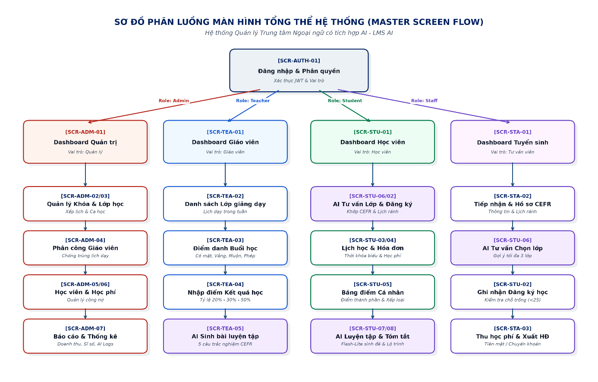

Hình 35: Sơ đồ phân luồng màn hình tổng thể

| Mã MH | Tên màn hình | Mục đích nghiệp vụ | Vai trò cho phép | Điều hướng tiếp theo |
| :--- | :--- | :--- | :--- | :--- |
| SCR-AUTH-01 | Đăng nhập | Xác thực tài khoản và phân quyền | Tất cả | Dashboard theo vai trò |
| SCR-AUTH-02 | Đổi mật khẩu | Cập nhật mật khẩu cá nhân | Tất cả | Trang cá nhân / Dashboard |
| SCR-ADM-01 | Dashboard Quản trị | Tổng quan trung tâm & thống kê | Quản lý | SCR-ADM-02..07 |
| SCR-ADM-02 | Quản lý Khóa học | Danh mục, thêm, sửa khóa học | Quản lý | Chi tiết khóa / Lớp học |
| SCR-ADM-03 | Quản lý Lớp & Lịch | Mở lớp, xếp lịch, phân phòng | Quản lý | Phân công GV / Điểm danh |
| SCR-ADM-04 | Phân công Giáo viên | Gán GV chính cho lớp học | Quản lý | Lịch dạy GV |
| SCR-ADM-05 | Quản lý Học viên | Quản lý hồ sơ, CEFR, lịch rảnh | Quản lý, TVV | Đăng ký lớp / Học phí |
| SCR-ADM-06 | Quản lý Học phí | Xem công nợ, duyệt hoàn phí | Quản lý, TVV | Lập phiếu thu / Hóa đơn |
| SCR-ADM-07 | Thống kê Báo cáo | Báo cáo doanh thu, sĩ số, tỷ lệ | Quản lý | Xuất file Excel / PDF |
| SCR-TEA-01 | Dashboard Giáo viên | Xem lịch dạy trong tuần | Giáo viên | SCR-TEA-02..05 |
| SCR-TEA-02 | Danh sách Lớp dạy | Xem danh sách lớp phụ trách | Giáo viên | SCR-TEA-03, 04 |
| SCR-TEA-03 | Điểm danh Buổi học | Ghi nhận chuyên cần từng buổi | Giáo viên | Lịch sử điểm danh |
| SCR-TEA-04 | Nhập điểm & Đánh giá | Nhập điểm 20/30/50, nhận xét | Giáo viên | Bảng điểm tổng kết |
| SCR-TEA-05 | AI Sinh Bài luyện tập | AI tạo 5/10/15 câu trắc nghiệm CEFR | Giáo viên, HV | Xem đáp án & lưu bài |
| SCR-STU-01 | Dashboard Học viên | Xem lớp đang học & tiến độ | Học viên | SCR-STU-02..08 |
| SCR-STU-02 | Tra cứu & Đăng ký lớp | Tìm kiếm lớp còn chỗ, đăng ký | Học viên, TVV | Xác nhận & Hóa đơn |
| SCR-STU-03 | Lịch học của tôi | Xem thời khóa biểu cá nhân | Học viên | Chi tiết buổi học |
| SCR-STU-04 | Học phí & Hóa đơn | Xem công nợ & lịch sử đóng | Học viên | Chi tiết hóa đơn |
| SCR-STU-05 | Bảng điểm cá nhân | Xem điểm chuyên cần, thi, KQ | Học viên | AI Tóm tắt tiến độ |
| SCR-STU-06 | AI Tư vấn Lớp phù hợp | AI gợi ý tối đa 3 lớp theo CEFR | Học viên, TVV | Chuyển sang Đăng ký |
| SCR-STU-07 | AI Luyện tập cá nhân | Làm bài trắc nghiệm AI sinh | Học viên | Xem giải thích chi tiết |
| SCR-STU-08 | AI Tóm tắt Tiến độ | AI tóm tắt điểm mạnh & ôn tập | Học viên, GV, QL | Bảng điểm / Lịch sử |
| SCR-STA-01 | Dashboard Tư vấn viên | Tổng quan tư vấn & tuyển sinh | Tư vấn viên | SCR-STA-02..05 |
| SCR-STA-02 | Tiếp nhận Học viên mới | Tạo hồ sơ HV & test CEFR | Tư vấn viên | SCR-STU-06, SCR-STU-02 |
| SCR-STA-03 | Thu Học phí trực tiếp | Tạo phiếu thu tiền mặt/CK | Tư vấn viên | In hóa đơn / Phiếu thu |

Bảng 24: Danh mục các màn hình giao diện chính trong hệ thống

## 6.3 Mô tả phân luồng màn hình chi tiết theo từng Tác nhân

**a) Phân luồng Tác nhân Người Quản Lý (Admin Flow):**

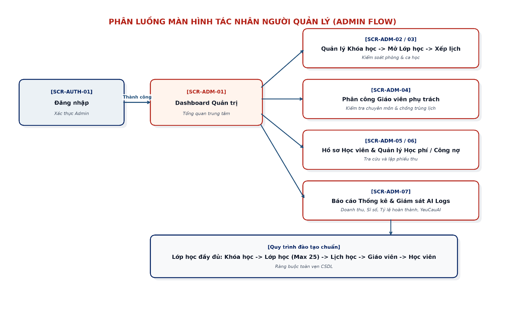

Hình 36: Sơ đồ phân luồng màn hình Admin
1. [SCR-AUTH-01] Đăng nhập -> Xác thực quyền Admin -> Chuyển đến [SCR-ADM-01] Dashboard Quản trị.
2. Từ Dashboard, Quản lý có thể điều hướng qua menu chính:
   • Quản lý đào tạo: [SCR-ADM-02] Quản lý Khóa học -> [SCR-ADM-03] Quản lý Lớp học & Xếp lịch -> [SCR-ADM-04] Phân công Giáo viên.
   • Quản lý học viên & tài chính: [SCR-ADM-05] Hồ sơ Học viên -> [SCR-ADM-06] Học phí & Công nợ -> [SCR-ADM-07] Thống kê Báo cáo (Doanh thu, Sĩ số, Tỷ lệ hoàn thành).
   • Giám sát hệ thống: Xem Log và chất lượng các lần gọi AI.
**b) Phân luồng Tác nhân Giáo Viên (Teacher Flow):**

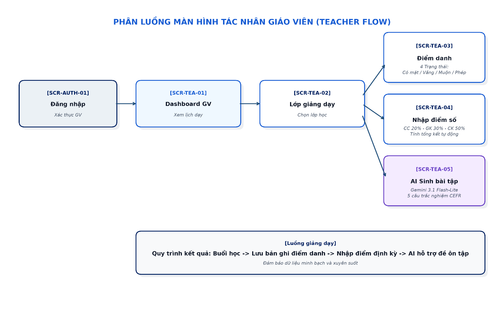

Hình 37: Sơ đồ phân luồng màn hình Giáo Viên
1. [SCR-AUTH-01] Đăng nhập -> Xác thực quyền Giáo viên -> Chuyển đến [SCR-TEA-01] Dashboard Giáo viên.
2. Xem thời khóa biểu dạy -> Chọn lớp tại [SCR-TEA-02] Danh sách Lớp giảng dạy.
3. Thực hiện nghiệp vụ lớp học:
   • Điểm danh: Chọn buổi học -> [SCR-TEA-03] Màn hình Điểm danh (Có mặt, Vắng, Đi muộn, Có phép) -> Lưu điểm danh.
   • Chấm điểm: Chọn học viên -> [SCR-TEA-04] Màn hình Nhập điểm (Chuyên cần 20%, Giữa kỳ 30%, Cuối kỳ 50%) -> Tự động tính điểm tổng kết.
   • Soạn bài luyện tập: Truy cập [SCR-TEA-05] AI Sinh bài tập -> Chọn chủ đề & CEFR -> AI sinh các câu trắc nghiệm kèm giải thích -> Lưu ngân hàng bài tập.
**c) Phân luồng Tác nhân Học Viên (Student Flow):**

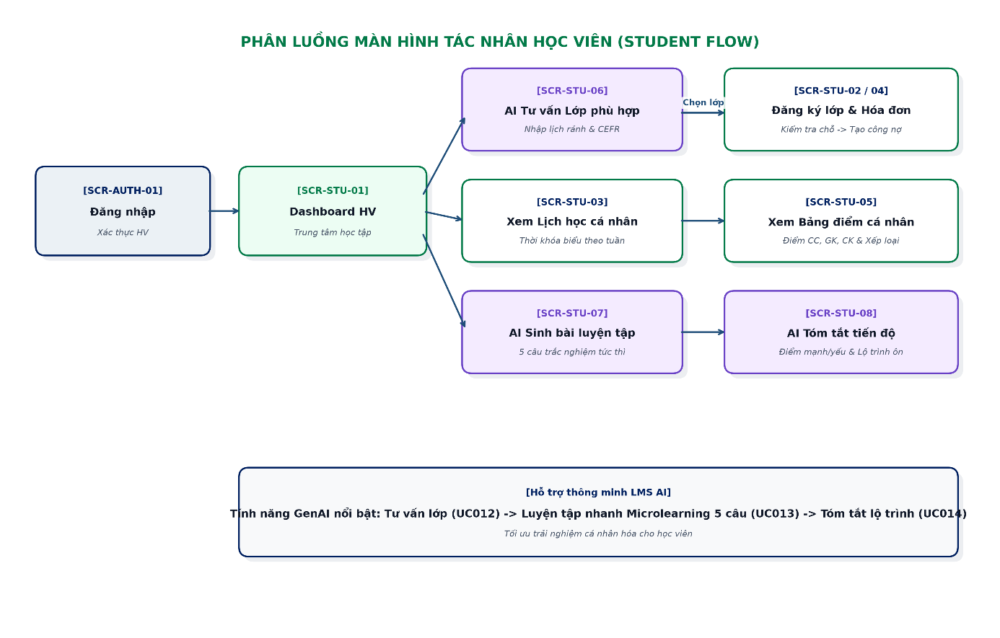

Hình 38: Sơ đồ phân luồng màn hình Học Viên
1. [SCR-AUTH-01] Đăng nhập -> Xác thực quyền Học viên -> Chuyển đến [SCR-STU-01] Dashboard Học viên.
2. Học viên thực hiện các luồng nghiệp vụ:
   • Đăng ký lớp: Vào [SCR-STU-06] AI Tư vấn lớp (nhập lịch rảnh, trình độ) -> AI gợi ý 3 lớp phù hợp -> Chọn lớp chuyển sang [SCR-STU-02] Đăng ký lớp -> Tự động tạo [SCR-STU-04] Hóa đơn học phí.
   • Quá trình học: Xem [SCR-STU-03] Lịch học cá nhân -> Xem [SCR-STU-05] Bảng điểm cá nhân.
   • Hỗ trợ AI: Vào [SCR-STU-07] AI Luyện tập ngắn (trắc nghiệm) -> Vào [SCR-STU-08] AI Tóm tắt tiến độ (nhận bản tóm tắt điểm mạnh và định hướng ôn tập).
**d) Phân luồng Tác nhân Tư Vấn Viên (Staff Flow):**

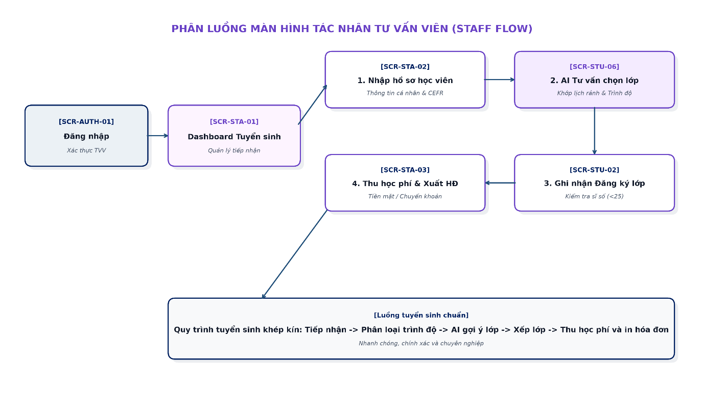

Hình 39: Sơ đồ phân luồng màn hình Tư Vấn Viên
1. [SCR-AUTH-01] Đăng nhập -> Xác thực quyền Tư vấn viên -> Chuyển đến [SCR-STA-01] Dashboard Tuyển sinh.
2. Tiếp nhận khách hàng/học viên mới -> [SCR-STA-02] Màn hình Nhập hồ sơ học viên & Trình độ CEFR.
3. Sử dụng [SCR-STU-06] AI Tư vấn lớp để chọn lớp tối ưu theo lịch rảnh của học viên.
4. Thực hiện [SCR-STU-02] Đăng ký lớp cho học viên -> Chuyển sang [SCR-STA-03] Thu học phí (Tiền mặt / Chuyển khoản) -> Xuất hóa đơn xác nhận.

## 6.4. Thiết Kế Giao Diện

( BỔ SUNG)

## 6.5 Cơ sở dữ liệu

### 6.5.1 Sơ đồ thực thể quan hệ (ERD)

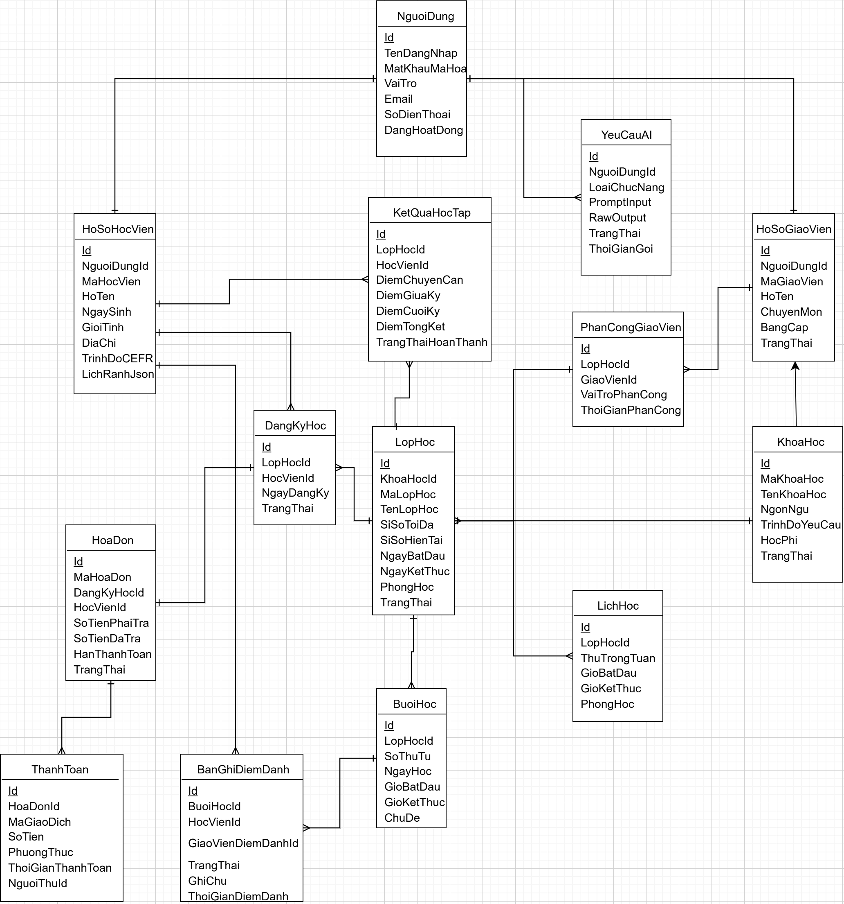

Hình 40: Biểu đồ ERD
Sơ đồ thực thể quan hệ (ERD) trên Hình 40 phản ánh toàn diện kiến trúc dữ liệu và mối quan hệ ràng buộc giữa 14 thực thể trong hệ thống quản lý trung tâm ngoại ngữ ETC English, được phân rã thành 5 phân hệ nghiệp vụ cốt lõi:
- Phân hệ Quản lý Người dùng & Phân quyền (RBAC): Thực thể trung tâm NguoiDung thiết lập quan hệ 1-1 với HoSoHocVien và HoSoGiaoVien, đồng thời đóng vai trò thực thể gốc tham chiếu phân quyền truy cập và bảo mật cho toàn bộ hệ thống.
- Phân hệ Quản lý Đào tạo & Xếp lịch: Thực thể KhoaHoc liên kết 1-N với LopHoc. Mỗi lớp học được chi tiết hóa thời khóa biểu định kỳ theo tuần qua LichHoc và gán trách nhiệm giảng dạy qua PhanCongGiaoVien.
- Phân hệ Đăng ký Lớp & Quản lý Học phí: Học viên gửi yêu cầu xếp lớp qua DangKyHoc, tự động kích hoạt tạo HoaDon công nợ học phí (quan hệ 1-1) và theo dõi lịch sử các đợt nộp tiền thực tế qua ThanhToan (quan hệ 1-N).
- Phân hệ Quản lý Điểm danh & Đánh giá Học tập: Mỗi LopHoc quản lý tiến độ đào tạo qua danh sách BuoiHoc, ghi nhận sự có mặt qua BanGhiDiemDanh và tổng hợp kết quả rèn luyện cuối khóa vào KetQuaHocTap (chuẩn hóa theo trọng số: 20% Chuyên cần, 30% Giữa kỳ, 50% Cuối kỳ).
- Phân hệ Giám sát & Kiểm toán Tương tác GenAI: Thực thể YeuCauAI lưu vết độc lập mọi phiên gọi Google Gemini API của người dùng nhằm phục vụ giám sát độ trễ, kiểm soát chất lượng dữ liệu và kích hoạt cơ chế fallback khi có sự cố.

### 6.5.2 Cơ sở dữ liệu quan hệ (Relational Database Schema - 3NF)

Cơ sở dữ liệu của hệ thống quản lý trung tâm ngoại ngữ ETC English được chuẩn hóa theo mô hình quan hệ 3NF, đảm bảo sự nhất quán tuyệt đối và ánh xạ 1-1 với cấu trúc các lớp thuộc tính trong Mô hình lớp (Class Diagram ở Chương 5). Cấu trúc 14 bảng quan hệ chi tiết được định nghĩa như sau:
1. NguoiDung: (id [PK], ten_dang_nhap [UQ], mat_khau_ma_hoa, vai_tro, email [UQ], so_dien_thoai, dang_hoat_dong)
2. HoSoHocVien: (id [PK], nguoi_dung_id [FK, UQ], ma_hoc_vien [UQ], ho_ten, ngay_sinh, gioi_tinh, dia_chi, trinh_do_cefr, nguon_danh_gia, lich_ranh_json, trang_thai)
3. HoSoGiaoVien: (id [PK], nguoi_dung_id [FK, UQ], ma_giao_vien [UQ], ho_ten, chuyen_mon, bang_cap, trang_thai)
4. KhoaHoc: (id [PK], ma_khoa_hoc [UQ], ten_khoa_hoc, ngon_ngu, trinh_do_yeu_cau, thoi_luong_gio, hoc_phi, mo_ta, trang_thai)
5. LopHoc: (id [PK], khoa_hoc_id [FK], ma_lop_hoc [UQ], ten_lop_hoc, si_so_toi_da, si_so_hien_tai, ngay_bat_dau, ngay_ket_thuc, phong_hoc, link_online, trang_thai)
6. LichHoc: (id [PK], lop_hoc_id [FK], thu_trong_tuan, gio_bat_dau, gio_ket_thuc, phong_hoc)
7. PhanCongGiaoVien: (id [PK], lop_hoc_id [FK], giao_vien_id [FK], vai_tro_phan_cong, thoi_gian_phan_cong, trang_thai)
8. DangKyHoc: (id [PK], lop_hoc_id [FK], hoc_vien_id [FK], ngay_dang_ky, trang_thai)
9. HoaDon: (id [PK], ma_hoa_don [UQ], dang_ky_hoc_id [FK, UQ], hoc_vien_id [FK], so_tien_phai_tra, so_tien_da_tra, han_thanh_toan, trang_thai)
10. ThanhToan: (id [PK], hoa_don_id [FK], ma_giao_dich [UQ], so_tien, phuong_thuc, thoi_gian_thanh_toan, nguoi_thu_id [FK], trang_thai, ghi_chu)
11. BuoiHoc: (id [PK], lop_hoc_id [FK], so_thu_tu, ngay_hoc, gio_bat_dau, gio_ket_thuc, chu_de, trang_thai)
12. BanGhiDiemDanh: (id [PK], buoi_hoc_id [FK], hoc_vien_id [FK], trang_thai, ghi_chu, thoi_gian_diem_danh, giao_vien_diem_danh_id [FK])
13. KetQuaHocTap: (id [PK], lop_hoc_id [FK], hoc_vien_id [FK], diem_chuyen_can, diem_giua_ky, diem_cuoi_ky, diem_tong_ket, nhan_xet, trang_thai_hoan_thanh)
14. YeuCauAI: (id [PK], nguoi_dung_id [FK], loai_chuc_nang, prompt_input, raw_output, validated_output_json, trang_thai, thoi_gian_xu_ly_ms, thoi_gian_goi)

### 6.5.3 Bảng mô tả chi tiết CSDL:

**NguoiDung (Tài khoản người dùng & Phân quyền)**

| Tên cột | Kiểu dữ liệu | Kích thước | Null | Khóa / Ràng buộc | Mô tả ý nghĩa nghiệp vụ |
| :--- | :--- | :--- | :--- | :--- | :--- |
| id | BIGINT | 8 bytes | NO | PK | Khóa chính tự tăng định danh tài khoản |
| ten_dang_nhap | VARCHAR | 50 | NO | UQ, NOT NULL | Tên đăng nhập hệ thống duy nhất |
| mat_khau_ma_hoa | VARCHAR | 255 | NO | NOT NULL | Mật khẩu băm một chiều Argon2/Bcrypt |
| vai_tro | VARCHAR | 20 | NO | CHECK (QUAN_LY, GIAO_VIEN, HOC_VIEN, TU_VAN_VIEN), NOT NULL | Phân quyền người dùng theo vai trò RBAC |
| email | VARCHAR | 100 | NO | UQ, NOT NULL | Địa chỉ email liên hệ duy nhất |
| so_dien_thoai | VARCHAR | 20 | YES | NULLABLE | Số điện thoại liên hệ |
| dang_hoat_dong | BOOLEAN | 1 byte | NO | DEFAULT TRUE, NOT NULL | Trạng thái hoạt động tài khoản |

Bảng 25 Bảng CSDL Người Dùng
**HoSoHocVien (Hồ sơ học viên & Trình độ CEFR)**

| Tên cột | Kiểu dữ liệu | Kích thước | Null | Khóa / Ràng buộc | Mô tả ý nghĩa nghiệp vụ |
| :--- | :--- | :--- | :--- | :--- | :--- |
| id | BIGINT | 8 bytes | NO | PK | Khóa chính tự tăng hồ sơ học viên |
| nguoi_dung_id | BIGINT | 8 bytes | YES | FK, UQ -> NguoiDung(id) | Liên kết 1-1 tài khoản người dùng |
| ma_hoc_vien | VARCHAR | 20 | NO | UQ, NOT NULL | Mã học viên duy nhất (VD: HV0001) |
| ho_ten | VARCHAR | 100 | NO | NOT NULL | Họ và tên đầy đủ của học viên |
| ngay_sinh | DATE | 4 bytes | YES | CHECK (ngay_sinh < NOW), NULLABLE | Ngày tháng năm sinh |
| gioi_tinh | VARCHAR | 10 | YES | CHECK (NAM, NU, KHAC), NULLABLE | Giới tính học viên |
| dia_chi | VARCHAR | 255 | YES | NULLABLE | Địa chỉ thường trú |
| trinh_do_cefr | VARCHAR | 2 | NO | CHECK (A1, A2, B1, B2, C1, C2), NOT NULL | Trình độ tiếng Anh chuẩn CEFR |
| nguon_danh_gia | VARCHAR | 100 | YES | NULLABLE | Nguồn đánh giá (Đầu vào, Khóa trước) |
| lich_ranh_json | JSON | Biến đổi | YES | NULLABLE | Mảng JSON khung giờ rảnh trong tuần |
| trang_thai | VARCHAR | 20 | NO | CHECK (DANG_HOC, DA_TOT_NGHIEP, BAO_LUU, NGHI_HOC), NOT NULL | Tình trạng học tập của học viên |

Bảng 26 Bảng CSDL Hồ Sơ Học Viên
**HoSoGiaoVien (Hồ sơ giáo viên & Năng lực giảng dạy)**

| Tên cột | Kiểu dữ liệu | Kích thước | Null | Khóa / Ràng buộc | Mô tả ý nghĩa nghiệp vụ |
| :--- | :--- | :--- | :--- | :--- | :--- |
| id | BIGINT | 8 bytes | NO | PK | Khóa chính tự tăng hồ sơ giáo viên |
| nguoi_dung_id | BIGINT | 8 bytes | YES | FK, UQ -> NguoiDung(id) | Liên kết 1-1 tài khoản người dùng |
| ma_giao_vien | VARCHAR | 20 | NO | UQ, NOT NULL | Mã giáo viên duy nhất (VD: GV0001) |
| ho_ten | VARCHAR | 100 | NO | NOT NULL | Họ và tên đầy đủ của giáo viên |
| chuyen_mon | VARCHAR | 100 | NO | NOT NULL | Chuyên môn đào tạo (IELTS, TOEIC...) |
| bang_cap | VARCHAR | 150 | YES | NULLABLE | Bằng cấp chuyên môn (TESOL, IELTS 8.0...) |
| trang_thai | VARCHAR | 20 | NO | CHECK (DANG_LAM_VIEC, TAM_NGHI, DA_NGHI_VIEC), NOT NULL | Tình trạng công tác của giáo viên |

*Bảng **27** Bảng CSDL Hồ Sơ Giáo Viên*
**KhoaHoc (Danh mục chương trình đào tạo)**

| Tên cột | Kiểu dữ liệu | Kích thước | Null | Khóa / Ràng buộc | Mô tả ý nghĩa nghiệp vụ |
| :--- | :--- | :--- | :--- | :--- | :--- |
| id | BIGINT | 8 bytes | NO | PK | Khóa chính tự tăng khóa học |
| ma_khoa_hoc | VARCHAR | 20 | NO | UQ, NOT NULL | Mã khóa học duy nhất (ENG-B1, IELTS-6.5) |
| ten_khoa_hoc | VARCHAR | 150 | NO | NOT NULL | Tên hiển thị của khóa học |
| ngon_ngu | VARCHAR | 50 | NO | DEFAULT 'Tiếng Anh', NOT NULL | Ngôn ngữ đào tạo |
| trinh_do_yeu_cau | VARCHAR | 2 | NO | CHECK (A1, A2, B1, B2, C1, C2), NOT NULL | Chuẩn CEFR đầu vào yêu cầu |
| thoi_luong_gio | INT | 4 bytes | NO | CHECK (> 0), NOT NULL | Tổng thời lượng đào tạo (giờ) |
| hoc_phi | DECIMAL | (12,2) | NO | CHECK (>= 0), NOT NULL | Mức học phí chuẩn niêm yết (VNĐ) |
| mo_ta | TEXT | Biến đổi | YES | NULLABLE | Mô tả chi tiết đề cương khóa học |
| trang_thai | VARCHAR | 20 | NO | CHECK (HOAT_DONG, NGUNG_HOAT_DONG), NOT NULL | Trạng thái vận hành khóa học |

*Bảng **28** Bảng CSDL Khóa Học*
**LopHoc (Lớp học tổ chức thực tế)**

| Tên cột | Kiểu dữ liệu | Kích thước | Null | Khóa / Ràng buộc | Mô tả ý nghĩa nghiệp vụ |
| :--- | :--- | :--- | :--- | :--- | :--- |
| id | BIGINT | 8 bytes | NO | PK | Khóa chính tự tăng lớp học |
| khoa_hoc_id | BIGINT | 8 bytes | NO | FK -> KhoaHoc(id), NOT NULL | Khóa học trực thuộc (ON DELETE RESTRICT) |
| ma_lop_hoc | VARCHAR | 20 | NO | UQ, NOT NULL | Mã lớp học duy nhất (VD: LH-2026-01) |
| ten_lop_hoc | VARCHAR | 150 | NO | NOT NULL | Tên hiển thị của lớp học |
| si_so_toi_da | INT | 4 bytes | NO | CHECK (1..25), DEFAULT 25, NOT NULL | Sĩ số tối đa quy định (Cố định 25) |
| si_so_hien_tai | INT | 4 bytes | NO | CHECK (0..si_so_toi_da), DEFAULT 0, NOT NULL | Số lượng học viên đã đăng ký hợp lệ |
| ngay_bat_dau | DATE | 4 bytes | NO | NOT NULL | Ngày khai giảng lớp học |
| ngay_ket_thuc | DATE | 4 bytes | NO | CHECK (ngay_ket_thuc >= ngay_bat_dau), NOT NULL | Ngày kết thúc lớp học |
| phong_hoc | VARCHAR | 50 | YES | NULLABLE | Phòng học trực tiếp tại trung tâm |
| link_online | VARCHAR | 255 | YES | NULLABLE | Đường dẫn phòng học trực tuyến |
| trang_thai | VARCHAR | 25 | NO | CHECK (SAP_MO, DANG_MO_DANG_KY, DANG_HOC, DA_KET_THUC, DA_HUY), NOT NULL | Trạng thái vận hành của lớp học |

*Bảng **29** Bảng CSDL** Lớp Học*
**LichHoc (Thời khóa biểu định kỳ trong tuần)**

| Tên cột | Kiểu dữ liệu | Kích thước | Null | Khóa / Ràng buộc | Mô tả ý nghĩa nghiệp vụ |
| :--- | :--- | :--- | :--- | :--- | :--- |
| id | BIGINT | 8 bytes | NO | PK | Khóa chính tự tăng lịch học |
| lop_hoc_id | BIGINT | 8 bytes | NO | FK -> LopHoc(id), NOT NULL | Lớp học tương ứng (ON DELETE CASCADE) |
| thu_trong_tuan | INT | 4 bytes | NO | CHECK (2..8), NOT NULL | Thứ trong tuần (2: Thứ Hai -> 8: Chủ Nhật) |
| gio_bat_dau | TIME | 4 bytes | NO | NOT NULL | Giờ bắt đầu ca học (VD: 18:00:00) |
| gio_ket_thuc | TIME | 4 bytes | NO | CHECK (gio_ket_thuc > gio_bat_dau), NOT NULL | Giờ kết thúc ca học (VD: 20:00:00) |
| phong_hoc | VARCHAR | 50 | NO | NOT NULL | Phòng học tổ chức ca |

*Bảng **30** Bảng CSDL** Lịch Học*
**PhanCongGiaoVien (Phân công giảng dạy)**

| Tên cột | Kiểu dữ liệu | Kích thước | Null | Khóa / Ràng buộc | Mô tả ý nghĩa nghiệp vụ |
| :--- | :--- | :--- | :--- | :--- | :--- |
| id | BIGINT | 8 bytes | NO | PK | Khóa chính tự tăng phân công |
| lop_hoc_id | BIGINT | 8 bytes | NO | FK -> LopHoc(id), NOT NULL | Lớp học được phân công |
| giao_vien_id | BIGINT | 8 bytes | NO | FK -> HoSoGiaoVien(id), NOT NULL | Giáo viên phụ trách lớp |
| vai_tro_phan_cong | VARCHAR | 20 | NO | CHECK (CHINH, TRO_GIANG), NOT NULL | Vai trò (CHINH: GV chính, TRO_GIANG: Trợ giảng) |
| thoi_gian_phan_cong | TIMESTAMP | 8 bytes | NO | DEFAULT NOW, NOT NULL | Thời điểm phân công |
| trang_thai | VARCHAR | 20 | NO | CHECK (DANG_PHU_TRACH, DA_HUY), NOT NULL | Trạng thái phân công giảng dạy |

*Bảng **31** Bảng CSDL** Phân Công Giáo Viên*
**DangKyHoc (Giao dịch đăng ký lớp học)**

| Tên cột | Kiểu dữ liệu | Kích thước | Null | Khóa / Ràng buộc | Mô tả ý nghĩa nghiệp vụ |
| :--- | :--- | :--- | :--- | :--- | :--- |
| id | BIGINT | 8 bytes | NO | PK | Khóa chính tự tăng đăng ký |
| lop_hoc_id | BIGINT | 8 bytes | NO | FK -> LopHoc(id), NOT NULL | Lớp học học viên đăng ký |
| hoc_vien_id | BIGINT | 8 bytes | NO | FK -> HoSoHocVien(id), NOT NULL | Học viên tham gia đăng ký |
| ngay_dang_ky | TIMESTAMP | 8 bytes | NO | DEFAULT NOW, NOT NULL | Thời điểm tạo yêu cầu đăng ký |
| trang_thai | VARCHAR | 20 | NO | CHECK (CHO_THANH_TOAN, DA_XAC_NHAN, DA_HUY, HOAN_THANH), NOT NULL | Tình trạng xử lý đơn đăng ký |

*Bảng **32** Bảng CSDL** Đăng Ký Học*
**HoaDon (Hóa đơn & Công nợ học phí)**

| Tên cột | Kiểu dữ liệu | Kích thước | Null | Khóa / Ràng buộc | Mô tả ý nghĩa nghiệp vụ |
| :--- | :--- | :--- | :--- | :--- | :--- |
| id | BIGINT | 8 bytes | NO | PK | Khóa chính tự tăng hóa đơn |
| ma_hoa_don | VARCHAR | 30 | NO | UQ, NOT NULL | Mã hóa đơn duy nhất (HD-2026-0001) |
| dang_ky_hoc_id | BIGINT | 8 bytes | NO | FK, UQ -> DangKyHoc(id), NOT NULL | Quan hệ 1-1 bắt buộc với DangKyHoc(id) |
| hoc_vien_id | BIGINT | 8 bytes | NO | FK -> HoSoHocVien(id), NOT NULL | Học viên chịu nghĩa vụ thanh toán |
| so_tien_phai_tra | DECIMAL | (12,2) | NO | CHECK (>= 0), NOT NULL | Tổng học phí phải nộp (VNĐ) |
| so_tien_da_tra | DECIMAL | (12,2) | NO | CHECK (>= 0), DEFAULT 0, NOT NULL | Tổng số tiền đã nộp lũy kế |
| han_thanh_toan | DATE | 4 bytes | NO | NOT NULL | Hạn chót thanh toán học phí |
| trang_thai | VARCHAR | 25 | NO | CHECK (CHUA_THANH_TOAN, THANH_TOAN_MOT_PHAN, DA_HOAN_THANH, QUA_HAN), NOT NULL | Tình trạng thanh toán của hóa đơn |

*Bảng **33** Bảng **CSDL Hóa Đơn*
**ThanhToan (Lịch sử giao dịch thu tiền)**

| Tên cột | Kiểu dữ liệu | Kích thước | Null | Khóa / Ràng buộc | Mô tả ý nghĩa nghiệp vụ |
| :--- | :--- | :--- | :--- | :--- | :--- |
| id | BIGINT | 8 bytes | NO | PK | Khóa chính tự tăng thanh toán |
| hoa_don_id | BIGINT | 8 bytes | NO | FK -> HoaDon(id), NOT NULL | Thuộc hóa đơn học phí tương ứng |
| ma_giao_dich | VARCHAR | 50 | NO | UQ, NOT NULL | Mã biên lai / mã tham chiếu ngân hàng |
| so_tien | DECIMAL | (12,2) | NO | CHECK (> 0), NOT NULL | Số tiền nộp trong đợt giao dịch (VNĐ) |
| phuong_thuc | VARCHAR | 20 | NO | CHECK (TIEN_MAT, CHUYEN_KHOAN), NOT NULL | Hình thức thanh toán |
| thoi_gian_thanh_toan | TIMESTAMP | 8 bytes | NO | DEFAULT NOW, NOT NULL | Thời điểm giao dịch thành công |
| nguoi_thu_id | BIGINT | 8 bytes | YES | FK -> NguoiDung(id), NULLABLE | Nhân viên / Tư vấn viên thu tiền |
| trang_thai | VARCHAR | 20 | NO | CHECK (THANH_CONG, THAT_BAI, HOAN_TRA), NOT NULL | Trạng thái giao dịch |
| ghi_chu | VARCHAR | 255 | YES | NULLABLE | Ghi chú giao dịch thu tiền |

*Bảng **34** Bảng **CSDL Thanh Toán*
**BuoiHoc (Buổi học thực tế của lớp)**

| Tên cột | Kiểu dữ liệu | Kích thước | Null | Khóa / Ràng buộc | Mô tả ý nghĩa nghiệp vụ |
| :--- | :--- | :--- | :--- | :--- | :--- |
| id | BIGINT | 8 bytes | NO | PK | Khóa chính tự tăng buổi học |
| lop_hoc_id | BIGINT | 8 bytes | NO | FK -> LopHoc(id), NOT NULL | Lớp học tổ chức (ON DELETE CASCADE) |
| so_thu_tu | INT | 4 bytes | NO | CHECK (> 0), NOT NULL | Số thứ tự buổi học (Buổi 1, 2, 3...) |
| ngay_hoc | DATE | 4 bytes | NO | NOT NULL | Ngày diễn ra buổi học thực tế |
| gio_bat_dau | TIME | 4 bytes | NO | NOT NULL | Giờ bắt đầu buổi học |
| gio_ket_thuc | TIME | 4 bytes | NO | CHECK (gio_ket_thuc > gio_bat_dau), NOT NULL | Giờ kết thúc buổi học |
| chu_de | VARCHAR | 200 | YES | NULLABLE | Chủ đề / Nội dung bài giảng |
| trang_thai | VARCHAR | 20 | NO | CHECK (CHUA_DIEN_RA, DANG_DIEN_RA, DA_KET_THUC, DA_HUY), NOT NULL | Trạng thái của buổi học |

*Bảng **35** Bảng **CSDL Buổi Học*
**BanGhiDiemDanh (Điểm danh học viên theo buổi)**

| Tên cột | Kiểu dữ liệu | Kích thước | Null | Khóa / Ràng buộc | Mô tả ý nghĩa nghiệp vụ |
| :--- | :--- | :--- | :--- | :--- | :--- |
| id | BIGINT | 8 bytes | NO | PK | Khóa chính tự tăng điểm danh |
| buoi_hoc_id | BIGINT | 8 bytes | NO | FK -> BuoiHoc(id), NOT NULL | Buổi học thực tế được điểm danh |
| hoc_vien_id | BIGINT | 8 bytes | NO | FK -> HoSoHocVien(id), NOT NULL | Học viên được điểm danh |
| trang_thai | VARCHAR | 20 | NO | CHECK (CO_MAT, VANG, DI_MUON, CO_PHEP), NOT NULL | Trạng thái chuyên cần |
| ghi_chu | VARCHAR | 255 | YES | NULLABLE | Lý do xin phép / ghi chú của giáo viên |
| thoi_gian_diem_danh | TIMESTAMP | 8 bytes | NO | DEFAULT NOW, NOT NULL | Thời điểm ghi nhận điểm danh |
| giao_vien_diem_danh_id | BIGINT | 8 bytes | NO | FK -> HoSoGiaoVien(id), NOT NULL | Giáo viên thực hiện phiên điểm danh |

*Bảng **36** Bảng **CSDL Bản Ghi Điểm Danh*
**KetQuaHocTap (Bảng điểm & Đánh giá cuối khóa)**

| Tên cột | Kiểu dữ liệu | Kích thước | Null | Khóa / Ràng buộc | Mô tả ý nghĩa nghiệp vụ |
| :--- | :--- | :--- | :--- | :--- | :--- |
| id | BIGINT | 8 bytes | NO | PK | Khóa chính tự tăng kết quả |
| lop_hoc_id | BIGINT | 8 bytes | NO | FK -> LopHoc(id), NOT NULL | Lớp học thực hiện đánh giá |
| hoc_vien_id | BIGINT | 8 bytes | NO | FK -> HoSoHocVien(id), NOT NULL | Học viên nhận kết quả học tập |
| diem_chuyen_can | DECIMAL | (5,2) | YES | CHECK (0..100), NULLABLE | Điểm chuyên cần (Trọng số 20%) |
| diem_giua_ky | DECIMAL | (5,2) | YES | CHECK (0..100), NULLABLE | Điểm thi giữa kỳ (Trọng số 30%) |
| diem_cuoi_ky | DECIMAL | (5,2) | YES | CHECK (0..100), NULLABLE | Điểm thi cuối khóa (Trọng số 50%) |
| diem_tong_ket | DECIMAL | (5,2) | YES | CHECK (0..100), NULLABLE | Điểm tổng kết có trọng số (Thang 100) |
| nhan_xet | TEXT | Biến đổi | YES | NULLABLE | Nhận xét chi tiết của giáo viên |
| trang_thai_hoan_thanh | VARCHAR | 20 | NO | CHECK (DAT, KHONG_DAT, CHUA_XEP_LOAI), DEFAULT 'CHUA_XEP_LOAI', NOT NULL | Kết quả hoàn thành khóa học |

*Bảng **37** **Bảng CSDL Kết Quả Học Tập*
**YeuCauAI (Nhật ký giám sát và kiểm toán GenAI)**

| Tên cột | Kiểu dữ liệu | Kích thước | Null | Khóa / Ràng buộc | Mô tả ý nghĩa nghiệp vụ |
| :--- | :--- | :--- | :--- | :--- | :--- |
| id | BIGINT | 8 bytes | NO | PK | Khóa chính tự tăng nhật ký AI |
| nguoi_dung_id | BIGINT | 8 bytes | NO | FK -> NguoiDung(id), NOT NULL | Người dùng gửi yêu cầu AI (ON DELETE CASCADE) |
| loai_chuc_nang | VARCHAR | 30 | NO | CHECK (TU_VAN_LOP, SINH_BAI_TAP, TOM_TAT_TIEN_DO), NOT NULL | Loại dịch vụ trợ lý ảo AI gọi |
| prompt_input | TEXT | Biến đổi | NO | NOT NULL | Prompt có cấu trúc gửi tới Gemini API |
| raw_output | TEXT | Biến đổi | YES | NULLABLE | Dữ liệu phản hồi thô từ Google Gemini |
| validated_output_json | JSON | Biến đổi | YES | NULLABLE | Dữ liệu JSON sau khi backend kiểm tra hợp lệ |
| trang_thai | VARCHAR | 20 | NO | CHECK (THANH_CONG, LOI_VALIDATION, FALLBACK_APPLIED, TIMEOUT), NOT NULL | Trạng thái xử lý của phiên gọi AI |
| thoi_gian_xu_ly_ms | INT | 4 bytes | NO | CHECK (>= 0), NOT NULL | Độ trễ xử lý của mô hình AI (mili-giây) |
| thoi_gian_goi | TIMESTAMP | 8 bytes | NO | DEFAULT NOW, NOT NULL | Thời điểm gọi dịch vụ AI |

*Bảng **38** **Bảng CSDL Yêu Cầu AI*

### 6.5.4 Các ràng buộc toàn vẹn trong CSDL

Để đảm bảo tính nhất quán, độ tin cậy và sự toàn vẹn của dữ liệu trong suốt quá trình vận hành hệ thống, các ràng buộc toàn vẹn được thiết lập chặt chẽ trên 4 nhóm cấp độ:
**a) Ràng buộc Khóa chính & Khóa ngoại (PK/FK Referential Integrity):**
Khóa chính (Primary Key - PK): Toàn bộ 14 bảng đều sử dụng cột `id` kiểu BIGINT (8 bytes) tự động tăng làm khóa chính định danh duy nhất cho mỗi bản ghi.
Khóa ngoại (Foreign Key - FK) và Quy tắc hành động tham chiếu:
- HoSoHocVien(nguoi_dung_id) và HoSoGiaoVien(nguoi_dung_id) tham chiếu NguoiDung(id) với ràng buộc UNIQUE (Quan hệ 1-1).
- LopHoc(khoa_hoc_id) tham chiếu KhoaHoc(id) với quy tắc ON DELETE RESTRICT (Ngăn xóa khóa học khi đang có lớp mở).
- LichHoc(lop_hoc_id) tham chiếu LopHoc(id) với quy tắc ON DELETE CASCADE (Xóa lớp sẽ tự động xóa lịch học tương ứng).
- PhanCongGiaoVien tham chiếu LopHoc(id) và HoSoGiaoVien(id) với quy tắc ON DELETE RESTRICT.
- DangKyHoc tham chiếu LopHoc(id) và HoSoHocVien(id) với quy tắc ON DELETE RESTRICT.
- HoaDon(dang_ky_hoc_id) tham chiếu DangKyHoc(id) với ràng buộc UNIQUE và ON DELETE RESTRICT (Quan hệ 1-1 tuyệt đối giữa Đăng ký và Hóa đơn).
- ThanhToan(hoa_don_id) tham chiếu HoaDon(id) với quy tắc ON DELETE RESTRICT (Quan hệ 1-N hỗ trợ đóng học phí nhiều đợt).
- BuoiHoc(lop_hoc_id) tham chiếu LopHoc(id) với quy tắc ON DELETE CASCADE.
- BanGhiDiemDanh tham chiếu BuoiHoc(id) và HoSoHocVien(id) với quy tắc ON DELETE CASCADE.
- KetQuaHocTap tham chiếu LopHoc(id) và HoSoHocVien(id) với quy tắc ON DELETE RESTRICT.
- YeuCauAI(nguoi_dung_id) tham chiếu NguoiDung(id) với quy tắc ON DELETE CASCADE.
**b) Ràng buộc Duy nhất (UNIQUE Constraints & Composite Keys):**
- NguoiDung.ten_dang_nhap và NguoiDung.email: Duy nhất trên toàn hệ thống, ngăn chặn tạo tài khoản trùng lặp.
- HoSoHocVien.ma_hoc_vien, HoSoGiaoVien.ma_giao_vien, KhoaHoc.ma_khoa_hoc, LopHoc.ma_lop_hoc, HoaDon.ma_hoa_don, ThanhToan.ma_giao_dich: Đảm bảo mã định danh nghiệp vụ là duy nhất.
- UNIQUE(lop_hoc_id, hoc_vien_id) trong DangKyHoc: Ngăn chặn 1 học viên bị đăng ký 2 lần vào cùng 1 lớp học.
- UNIQUE(buoi_hoc_id, hoc_vien_id) trong BanGhiDiemDanh: Đảm bảo mỗi học viên chỉ có duy nhất 1 bản ghi điểm danh trong mỗi buổi học.
- UNIQUE(lop_hoc_id, hoc_vien_id) trong KetQuaHocTap: Đảm bảo mỗi học viên chỉ có 1 bảng điểm tổng kết duy nhất cho mỗi lớp học.
- UNIQUE(lop_hoc_id, thu_trong_tuan, gio_bat_dau) trong LichHoc: Ngăn chặn xếp trùng ca học trong cùng một lớp học.
- UNIQUE(lop_hoc_id, giao_vien_id) trong PhanCongGiaoVien: Ngăn chặn phân công trùng lặp 1 giáo viên vào cùng 1 lớp.
**c) Ràng buộc Miền giá trị (CHECK Constraints):**
- NguoiDung.vai_tro IN ('QUAN_LY', 'GIAO_VIEN', 'HOC_VIEN', 'TU_VAN_VIEN').
- HoSoHocVien.trinh_do_cefr IN ('A1', 'A2', 'B1', 'B2', 'C1', 'C2').
- LopHoc.si_so_toi_da BETWEEN 1 AND 25; LopHoc.si_so_hien_tai <= LopHoc.si_so_toi_da.
- LopHoc.ngay_ket_thuc >= LopHoc.ngay_bat_dau.
- LichHoc.thu_trong_tuan BETWEEN 2 AND 8; LichHoc.gio_ket_thuc > LichHoc.gio_bat_dau.
- KhoaHoc.thoi_luong_gio > 0; KhoaHoc.hoc_phi >= 0.
- HoaDon.so_tien_phai_tra >= 0; HoaDon.so_tien_da_tra >= 0.
- ThanhToan.so_tien > 0; ThanhToan.phuong_thuc IN ('TIEN_MAT', 'CHUYEN_KHOAN').
- BuoiHoc.so_thu_tu > 0; BuoiHoc.gio_ket_thuc > BuoiHoc.gio_bat_dau.
- BanGhiDiemDanh.trang_thai IN ('CO_MAT', 'VANG', 'DI_MUON', 'CO_PHEP').
- KetQuaHocTap.diem_chuyen_can, diem_giua_ky, diem_cuoi_ky, diem_tong_ket BETWEEN 0.00 AND 100.00.
- YeuCauAI.loai_chuc_nang IN ('TU_VAN_LOP', 'SINH_BAI_TAP', 'TOM_TAT_TIEN_DO'); thoi_gian_xu_ly_ms >= 0.
**d) Ràng buộc Toàn vẹn Quy tắc Nghiệp vụ (Business Rules & Triggers):**
1. Ràng buộc Tuyển sinh & Sĩ số: Không cho phép tạo bản ghi DangKyHoc mới khi LopHoc có si_so_hien_tai >= si_so_toi_da (25 học viên) hoặc lớp đang ở trạng thái đóng đăng ký.
2. Ràng buộc Chống trùng lịch giảng dạy: Hệ thống tự động kiểm tra và ngăn chặn phân công một giáo viên vào hai lớp học có lịch học giao thoa nhau trong cùng một khung giờ và thứ trong tuần.
3. Công thức tính Điểm tổng kết chuẩn hóa: diem_tong_ket = (diem_chuyen_can * 0.2) + (diem_giua_ky * 0.3) + (diem_cuoi_ky * 0.5). Học viên được xếp loại 'DAT' khi và chỉ khi diem_tong_ket >= 50.00 và tỷ lệ chuyên cần >= 80% (tương đương diem_chuyen_can >= 80.00).
4. Cơ chế Kiểm soát An toàn & Lọc Ảo giác AI: Mọi kết quả mã lớp học do Google Gemini API trả về bắt buộc được tầng Backend so khớp với danh sách LopHoc thực tế trong CSDL; tự động loại bỏ các mã lớp không tồn tại trước khi phản hồi về giao diện người dùng.

# CHƯƠNG 7: THIẾT KẾ KIẾN TRÚC HỆ THỐNG, API VÀ CÀI ĐẶT TRIỂN KHAI

Chương này trình bày toàn bộ thiết kế kiến trúc kỹ thuật của Hệ thống Quản lý Trung tâm Ngoại ngữ có tích hợp AI (LMS AI), bao gồm mô hình phân tầng tổng thể, luồng xử lý và giám sát dịch vụ GenAI (Google Gemini 3.1 Flash-Lite), kiến trúc bảo mật & phân quyền RBAC, sơ đồ triển khai hạ tầng chuẩn UML, danh mục công nghệ lựa chọn, đặc tả chi tiết 32 RESTful API Endpoints và Ma trận truy vết yêu cầu (RTM).

## 7.1 Tổng quan Kiến trúc Phân tầng Hệ thống (Multi-Tier Architecture)

Hệ thống LMS AI áp dụng mô hình Kiến trúc 4 Tầng (4-Tier Architecture) phân tách rõ ràng trách nhiệm giữa Giao diện người dùng, Tầng điều phối nghiệp vụ, Tầng trí tuệ nhân tạo và Tầng lưu trữ dữ liệu bền vững:

| Tầng Kiến Trúc | Thành Phần Trọng Tâm | Giao Thức Giao Tiếp | Nhiệm Vụ & Trách Nhiệm Nghiệp Vụ |
| :--- | :--- | :--- | :--- |
| 1. Presentation Tier (Tầng Giao Diện) | Web Browser SPA (Admin/Teacher/Student/Staff Portal) | HTTPS / TLS 1.3 (RESTful JSON API) | Hiển thị giao diện người dùng, tiếp nhận tương tác, lưu trữ JWT Token tại LocalStorage, gọi API Backend và render dữ liệu động. |
| 2. Application Tier (Tầng Xử Lý Nghiệp Vụ) | API Gateway, RBAC Middleware, Business Services, DTO Validators | Internal IPC / Local (Port 3000 / 5000) | Điều phối toàn bộ logic nghiệp vụ (khóa học, lớp, học phí, điểm danh, bảng điểm), phân quyền truy cập 4 vai trò, kiểm tra hợp lệ dữ liệu. |
| 3. External AI Tier (Tầng Dịch Vụ AI) | Google Gemini 3.1 Flash-Lite & Pro, Prompt Engine, Fallback Handler | HTTPS REST / gRPC (Port 443 / API Key) | Nhận Prompt từ Backend, sinh đề trắc nghiệm CEFR, tư vấn gợi ý lớp học và tóm tắt tiến độ; kích hoạt Fallback khi có sự cố mạng. |
| 4. Data Tier (Tầng Lưu Trữ CSDL) | Relational Database (3NF), Bảng kiểm toán YeuCauAI, Backup | TCP/IP Connection Pool (Port 5432 / 3306) | Lưu trữ bền vững 14 bảng quan hệ, đảm bảo ràng buộc toàn vẹn khóa ngoại (PK/FK), thực hiện giao dịch ACID và sao lưu tự động. |

Bảng 39: Phân định trách nhiệm và giao thức giao tiếp giữa 4 Tầng kiến trúc hệ thống

## 7.2 Kiến trúc Luồng Xử lý Dịch vụ GenAI và Cơ chế Dự phòng (GenAI Pipeline & Fallback)

Nhằm đảm bảo tính chính xác, kiểm soát ảo giác (Hallucination) và độ trễ thấp cho người dùng, toàn bộ các tác vụ gọi Google Gemini API được thực hiện khép kín qua 5 giai đoạn:
1. Tiếp nhận và Tiền xử lý dữ liệu (Input Sanitization): Backend trích xuất dữ liệu đầu vào (chuẩn CEFR A1-C2, mảng JSON lịch rảnh, bảng điểm) từ CSDL quan hệ trước khi đóng gói Prompt.
2. Đóng gói Kỹ thuật Prompt (Structured Prompt Engineering): Thiết lập System Prompt chuyên biệt, cấu hình tham số `response_mime_type: 'application/json'` và nhiệt độ `temperature` (0.2 cho tư vấn lớp / 0.7 cho sinh bài tập trắc nghiệm).
3. Gọi Dịch vụ Google Gemini API: Gửi yêu cầu qua giao thức HTTPS bảo mật tới mô hình `Gemini 3.1 Flash-Lite` (tư vấn lớp, sinh các câu trắc nghiệm với độ trễ cực thấp < 0.5s) hoặc `Gemini 3.1 Pro` (tóm tắt tiến độ học tập và phân tích chuyên sâu).
4. Kiểm tra Định dạng & Ghi Log Kiểm toán (Validation & Auditing): Backend kiểm tra JSON đầu ra, đối chiếu mã lớp với CSDL thực tế, sau đó tự động lưu vết toàn bộ (thời gian xử lý, input prompt, raw output) vào bảng `YeuCauAI`.
5. Cơ chế Dự phòng An toàn (Fallback Mechanism): Khi xảy ra lỗi mạng hoặc timeout (> 10s), hệ thống tự động kích hoạt bộ lọc quy tắc CSDL hoặc lấy câu hỏi mẫu từ ngân hàng đề cố định trả về cho người dùng.

## 7.3 Kiến trúc Bảo mật và Phân quyền Người dùng (Security & RBAC)

- Cơ chế Xác thực Không trạng thái (Stateless Authentication): Sử dụng JSON Web Token (JWT) được ký bảo mật (HS256). Sau khi đăng nhập thành công, Client lưu trữ token và đính kèm vào Header `Authorization: Bearer <token>` ở mọi yêu cầu.
- Mô hình Phân quyền Dựa trên Vai trò (RBAC): Middleware tại Backend kiểm tra nghiêm ngặt quyền hạn của 4 vai trò (Quản lý, Giáo viên, Học viên, Tư vấn viên) trước khi thực thi Controller. Yêu cầu trái quyền bị từ chối ngay lập tức với mã HTTP 403 Forbidden.
- Mã hóa Mật khẩu Chuẩn OWASP: Mật khẩu người dùng được băm một chiều an toàn bằng thuật toán Argon2 hoặc Bcrypt kèm Salt ngẫu nhiên, hoàn toàn không lưu trữ mật khẩu dạng rõ (Plaintext).
- Cách ly Tuyệt đối Khóa Bí mật (API Key Isolation): Khóa bí mật Google AI Studio API Key được lưu trữ độc quyền trong tệp biến môi trường `.env` trên Server, tuyệt đối không gửi về phía Client Browser.

## 7.4 Thiết kế Kiến trúc Triển khai Hạ tầng (Deployment Architecture)

Kiến trúc triển khai hạ tầng của hệ thống LMS AI được mô hình hóa theo chuẩn UML Deployment Diagram, bao gồm các nút thiết bị (Device), môi trường thực thi (Execution Environment) và các thành phần phần mềm (Artifact) sau:

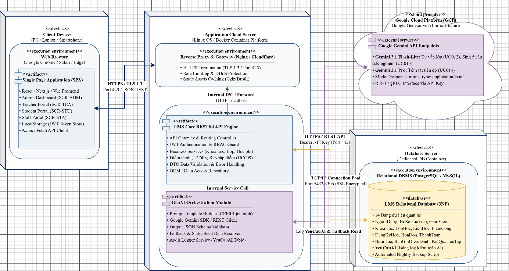

Hình 41: Sơ Đồ Triển Khai Hệ Tầng Hệ Thống

## 7.5 Danh mục Công nghệ Lựa chọn (Technology Stack Matrix)

| Thành Phần Hệ Thống | Công Nghệ Lựa Chọn | Phiên Bản / Tiêu Chuẩn | Lý Do Kỹ Thuật & Ưu Điểm Lựa Chọn |
| :--- | :--- | :--- | :--- |
| Frontend Web App | Next.js App Router (React / TypeScript / TailwindCSS) | Next.js 16+ / React 19 / TypeScript 5 | Xây dựng giao diện Single Page Application (SPA) hiệu năng cao, cơ chế Client/Server Components tối ưu tải trang, quản lý State mượt mà, hỗ trợ Responsive chuẩn đa thiết bị (Mobile, Tablet, Desktop) và giao diện Dark Theme cao cấp. |
| Backend API Engine | NestJS Framework (TypeScript / Node.js 20+) | NestJS 11+ / Node.js 20+ LTS | Kiến trúc Modular hướng dịch vụ chuẩn Enterprise, hỗ trợ Dependency Injection (DI), xử lý bất đồng bộ (Non-blocking I/O) tối ưu hóa độ trễ khi gọi Google Gemini AI, tích hợp sẵn Prisma ORM và tài liệu hóa tự động Swagger OpenAPI. |
| Hệ quản trị CSDL | PostgreSQL (Neon Serverless Cloud) & Prisma ORM | PostgreSQL 15+ / 3NF / Prisma ORM 6.4 | Đảm bảo tính toàn vẹn giao dịch ACID tuyệt đối, hỗ trợ kiểu dữ liệu JSON bản địa (JSONB) lưu trữ lịch rảnh và bài tập AI. Công cụ Prisma ORM cung cấp Type-Safe Database Access, quản lý 14 bảng quan hệ và nạp dữ liệu mẫu (Seeding) tự động. |
| Dịch vụ GenAI | Google Gemini API (Flash-Lite & Pro) | Gemini 3.1 Flash-Lite / Pro | Tốc độ phản hồi siêu nhanh , tiết kiệm tối đa quota token, hỗ trợ chế độ Structured JSON Outputs Mode chính xác 100%, kết hợp cơ chế Zero-Trust Validation lọc ảo giác và Fallback Rule-based đảm bảo độ sẵn sàng liên tục. |
| Xác thực & Bảo mật | JWT, Argon2 / Bcrypt, HTTPS TLS 1.3 | RFC 7519 / TLS 1.3 | Cơ chế xác thực không trạng thái (Stateless), băm mật khẩu chống tấn công Rainbow Table, mã hóa toàn bộ đường truyền |
| Công cụ & Triển khai | Swagger UI (OpenAPI 3.0), Docker, Git/GitHub, Vercel, Draw.io | OpenAPI 3.0 / Docker 24+ / Git | Tài liệu hóa và kiểm thử tương tác trực tiếp 32 RESTful endpoints tại /api/docs; đóng gói Container hóa độc lập môi trường; quản lý phiên bản mã nguồn phân nhánh Git; sẵn sàng triển khai tự động CI/CD lên Vercel và Cloud. |

Bảng 40: *Tổng hợp danh mục công nghệ, phiên bản và lý do lựa chọn*

## 7.6 Quy chuẩn Kỹ thuật và Đặc tả Danh mục RESTful API Hệ thống

Toàn bộ giao tiếp giữa Single Page Application (SPA) phía Client và Backend được chuẩn hóa qua giao thức RESTful API. Dưới đây là bảng quy chuẩn kỹ thuật và danh mục 32 Endpoints phục vụ đầy đủ 14 Use Case của trung tâm:

| Tiêu Chuẩn / Quy Định | Quy Chuẩn Kỹ Thuật Áp Dụng | Mô Tả & Ý Nghĩa Nghiệp Vụ |
| :--- | :--- | :--- |
| Kiến trúc truyền tải | RESTful API (JSON Payload) | Sử dụng định dạng JSON cho toàn bộ Request Body và Response Data qua giao thức HTTPS. |
| Cơ chế Xác thực (Auth) | JWT (JSON Web Token) | Header: `Authorization: Bearer <token>`. Token mang `userId`, `vaiTro`, thời hạn 24h. |
| Phân quyền truy cập (RBAC) | Role-Based Access Control | Kiểm tra quyền ở từng Route API: QUAN_LY, GIAO_VIEN, HOC_VIEN, TU_VAN_VIEN. Trả về 403 Forbidden nếu trái quyền. |
| Phương thức HTTP | Chuẩn ngữ nghĩa REST | GET (Đọc), POST (Tạo mới / Gọi AI), PUT (Cập nhật toàn phần), PATCH (Cập nhật 1 phần), DELETE (Xóa/Khóa). |
| Mã trạng thái (HTTP Status) | Chuẩn mã phản hồi HTTP | 200 (OK), 201 (Created), 400 (Bad Request), 401 (Unauthorized), 403 (Forbidden), 404 (Not Found), 409 (Conflict), 500 (Internal Error). |
| Bảo vệ dữ liệu đầu vào | DTO & Validation Pipe | Kiểm tra kiểu dữ liệu, bắt buộc trường NOT NULL, kiểm tra định dạng email, sđt trước khi xử lý logic. |
| Bảo vệ GenAI API | Timeout & Fallback Handler | Timeout tối đa 10s cho các endpoint AI. Nếu vượt quá, kích hoạt Fallback từ CSDL và lưu log vào `YeuCauAI`. |

Bảng 41: *Quy **chuẩn** **kỹ** **thuật**, **xác** **thực** JWT **và** **bảo** **mật** **giao** **tiếp** RESTful API*

| Mã API | HTTP | Endpoint (URI Path) | Mô tả Chức năng Nghiệp vụ | Quyền | Tham số / Request | Phản hồi / Response | UC & CSDL |
| :--- | :--- | :--- | :--- | :--- | :--- | :--- | :--- |
| API-AUTH-01 | POST | /api/v1/auth/login | Xác thực đăng nhập và cấp mã JWT | Public | Body: {tenDangNhap, matKhau} | 200: {token, user} 401: Sai mật khẩu | UC001 NguoiDung |
| API-AUTH-02 | GET | /api/v1/auth/me | Lấy thông tin tài khoản hiện tại | Tất cả | Header: Bearer Token | 200: {id, vaiTro, email} | UC001 NguoiDung |
| API-AUTH-03 | POST | /api/v1/auth/change-password | Đổi mật khẩu người dùng cá nhân | Tất cả | Body: {matKhauCu, matKhauMoi} | 200: {message: 'Thành công'} | UC001 NguoiDung |
| API-AUTH-04 | POST | /api/v1/auth/logout | Đăng xuất / Hủy phiên làm việc | Tất cả | Header: Bearer Token | 200: {message: 'Đã đăng xuất'} | UC001 NguoiDung |
| API-STU-01 | GET | /api/v1/students | Danh sách học viên (phân trang, lọc CEFR) | Quản lý, TVV | Query: ?page=1&cefr=&search= | 200: {total, data: [...]} | UC002 HoSoHocVien |
| API-STU-02 | POST | /api/v1/students | Tiếp nhận & tạo hồ sơ học viên | Quản lý, TVV | Body: {hoTen, ngaySinh, sdt, cefr} | 201: {id, maHocVien, hoTen} | UC002 HoSoHocVien |
| API-STU-03 | GET | /api/v1/students/{id} | Xem chi tiết hồ sơ & lịch rảnh JSON | Quản lý, TVV, HV | Path: id | 200: {id, hoTen, lichRanhJson} | UC002 HoSoHocVien |
| API-STU-04 | PUT | /api/v1/students/{id} | Cập nhật hồ sơ, CEFR, lịch rảnh | Quản lý, TVV | Path: id, Body: {hoTen, cefr} | 200: {message: 'Thành công'} | UC002 HoSoHocVien |
| API-CRS-01 | GET | /api/v1/courses | Danh mục tất cả các khóa học | Tất cả | Query: ?trinhDo=&trangThai=ACTIVE | 200: [{id, tenKhoa, hocPhi}] | UC003 KhoaHoc |
| API-CRS-02 | POST | /api/v1/courses | Tạo mới khóa học đào tạo | Quản lý | Body: {maKhoa, tenKhoa, hocPhi} | 201: {id, maKhoa, tenKhoa} | UC003 KhoaHoc |
| API-CRS-03 | PUT | /api/v1/courses/{id} | Cập nhật thông tin, học phí | Quản lý | Path: id, Body: {tenKhoa, hocPhi} | 200: {message: 'Thành công'} | UC003 KhoaHoc |
| API-CLS-01 | GET | /api/v1/classes | Danh sách lớp học (lọc theo khóa) | Tất cả | Query: ?khoaHocId=&trangThai= | 200: [{id, tenLop, siSo, toiDa}] | UC004 LopHoc |
| API-CLS-02 | POST | /api/v1/classes | Mở lớp học mới & phân phòng học | Quản lý | Body: {khoaHocId, tenLop, phong} | 201: {id, maLop, tenLop} | UC004 LopHoc |
| API-CLS-03 | GET | /api/v1/classes/{id} | Chi tiết lớp học & danh sách HV | Quản lý, GV, TVV | Path: id | 200: {id, tenLop, siSo, giaoVien} | UC004 LopHoc, LichHoc |
| API-SCH-01 | POST | /api/v1/classes/{id}/schedules | Thiết lập thời khóa biểu cho lớp | Quản lý | Path: id, Body: {thu, gioBatDau, phong} | 201: Created / 409: Trùng lịch | UC004 LichHoc |
| API-TEA-01 | GET | /api/v1/teachers | Danh sách giáo viên & chuyên môn | Quản lý | Query: ?chuyenMon=IELTS | 200: [{id, hoTen, chuyenMon}] | UC005 HoSoGiaoVien |
| API-TEA-02 | POST | /api/v1/classes/{id}/assign-teacher | Phân công GV phụ trách lớp học | Quản lý | Path: id, Body: {giaoVienId, vaiTro} | 200: OK / 409: Trùng lịch dạy | UC005 PhanCongGiaoVien |
| API-TEA-03 | GET | /api/v1/teachers/me/schedule | Giáo viên xem thời khóa biểu dạy | Giáo viên | Header: Bearer Token | 200: [{lopHoc, thu, gio, phong}] | UC005, UC010 PhanCongGiaoVien |
| API-ENR-01 | POST | /api/v1/enrollments | Đăng ký lớp & tự tạo hóa đơn | TVV, Học viên | Body: {hocVienId, lopHocId} | 201: {dangKyId, hoaDonId} 400: Lớp đầy (>25) | UC006, UC007 DangKyHoc, HoaDon |
| API-ENR-02 | GET | /api/v1/enrollments | Tra cứu danh sách đăng ký học | Quản lý, TVV | Query: ?lopHocId=&hocVienId= | 200: [{id, hocVien, lop, ngayDK}] | UC006 DangKyHoc |
| API-FEE-01 | GET | /api/v1/invoices | Danh mục hóa đơn & công nợ học phí | Quản lý, TVV | Query: ?trangThai=CHUA_TRA | 200: [{id, maHD, phaiTra, daTra}] | UC007 HoaDon |
| API-FEE-02 | POST | /api/v1/invoices/{id}/payments | Ghi nhận thanh toán (phiếu thu) | Quản lý, TVV | Path: id, Body: {soTien, phuongThuc} | 200: {maGD, soTienDaTra, status} | UC007 ThanhToan, HoaDon |
| API-ATT-01 | GET | /api/v1/classes/{id}/sessions | Danh sách buổi học của lớp | Quản lý, GV | Path: id | 200: [{id, soTT, ngayHoc, gioHoc}] | UC008 BuoiHoc |
| API-ATT-02 | POST | /api/v1/sessions/{id}/attendance | Ghi nhận/sửa điểm danh buổi học | Giáo viên, Quản lý | Path: id, Body: {danhSach: [{hvId, tt}]} | 200: {message: 'Đã lưu điểm danh'} | UC008 BanGhiDiemDanh |
| API-GRD-01 | GET | /api/v1/classes/{id}/grades | Xem bảng điểm chi tiết của lớp | Giáo viên, Quản lý | Path: id | 200: [{hocVien, cc, gk, ck, tk}] | UC009 KetQuaHocTap |
| API-GRD-02 | POST | /api/v1/classes/{id}/grades | Nhập và cập nhật điểm số | Giáo viên | Path: id, Body: {bangDiem: [{...}]} | 200: {message: 'Đã tính điểm TK'} | UC009 KetQuaHocTap |
| API-INQ-01 | GET | /api/v1/students/me/schedule | Học viên tra cứu lịch học cá nhân | Học viên | Header: Bearer Token | 200: [{lopHoc, thu, gio, phong}] | UC010 LopHoc, LichHoc |
| API-INQ-02 | GET | /api/v1/students/me/grades | Học viên tra cứu bảng điểm cá nhân | Học viên | Header: Bearer Token | 200: [{lopHoc, cc, gk, ck, tk}] | UC010 KetQuaHocTap |
| API-RPT-01 | GET | /api/v1/reports/dashboard | Thống kê: sĩ số, doanh thu, tỷ lệ đạt | Quản lý | Query: ?thang=&nam= | 200: {doanhThu, siSo, tyLeDat} | UC011 HoaDon, KetQuaHocTap |
| API-AI-01 | POST | /api/v1/ai/consult-classes | AI gợi ý tối đa 3 lớp học phù hợp | TVV, Học viên | Body: {cefr: 'B1', lichRanhJson: [...]} | 200: {goiY: [{maLop, tenLop, lyDo}]} Fallback khi timeout | UC012 YeuCauAI, LopHoc |
| API-AI-02 | POST | /api/v1/ai/generate-exercises | AI sinh trắc nghiệm CEFR | Giáo viên, HV | Body: {chuDe: 'Tenses', trinhDo: 'B1'} | 200: [{cauHoi, options, dapAn}] Fallback ngân hàng mẫu | UC013 YeuCauAI, NguoiDung |
| API-AI-03 | POST | /api/v1/ai/summarize-progress | AI tóm tắt tiến độ học tập | Quản lý, GV, HV | Body: {hocVienId, lopHocId} | 200: {diemManh, diemYeu, loTrinh} Fallback nhận xét mẫu | UC014 YeuCauAI, KetQuaHocTap |

Bảng 42: *Đặc** **tả** **danh** **mục** R**ESTful API Endpoint*

## 7.7 Ma trận Truy vết Yêu cầu Phần mềm (Requirements Traceability Matrix - RTM)

Ma trận truy vết yêu cầu (RTM) thể hiện tính toàn vẹn và mức độ bao phủ 100% từ Yêu cầu chức năng (FR) sang Ca sử dụng (UC), Màn hình giao diện (UI), Điểm cuối API, Bảng cơ sở dữ liệu và Kịch bản kiểm thử (Test Case):

| Mã FR | Use Case (UC) & Tác Nhân | Màn Hình (UI) | Mã RESTful API | Bảng CSDL | Kịch Bản Kiểm Thử & Nghiệm Thu |
| :--- | :--- | :--- | :--- | :--- | :--- |
| FR-001 | UC001: Đăng nhập & phân quyền (Quản lý, GV, HV, TVV) | SCR-AUTH-01 SCR-AUTH-02 | API-AUTH-01..04 (login, me, pwd, logout) | NguoiDung | TC001: Phân quyền đúng 4 role, băm mật khẩu, token JWT |
| FR-002 | UC002: Quản lý học viên & CEFR (Quản lý, TVV) | SCR-ADM-05 SCR-STA-02 | API-STU-01..04 (CRUD học viên, lịch rảnh) | HoSoHocVien NguoiDung | TC002: Lưu chuẩn CEFR A1-C2, lưu mảng JSON lịch rảnh |
| FR-003 | UC003: Quản lý khóa học (Quản lý) | SCR-ADM-02 | API-CRS-01..03 (CRUD khóa học đào tạo) | KhoaHoc | TC003: Mã khóa học duy nhất, học phí >= 0, thời lượng > 0 |
| FR-004 | UC004: Quản lý lớp & lịch học (Quản lý) | SCR-ADM-03 | API-CLS-01..03 API-SCH-01 (Mở lớp, ca) | LopHoc LichHoc | TC004: Sĩ số tối đa 25, kiểm tra chống trùng phòng & ca học |
| FR-005 | UC005: Quản lý GV & phân công (Quản lý) | SCR-ADM-04 SCR-TEA-02 | API-TEA-01..03 (Phân công, xem lịch dạy) | HoSoGiaoVien PhanCongGiaoVien | TC005: Đúng chuyên môn IELTS/TOEIC, chống trùng lịch dạy |
| FR-006 | UC006: Đăng ký lớp (TVV, Học viên) | SCR-STU-02 SCR-STA-02 | API-ENR-01..02 (Đăng ký lớp, kiểm tra chỗ) | DangKyHoc LopHoc, HoaDon | TC006: Kiểm tra sĩ số < 25, đúng CEFR, tự động tạo hóa đơn |
| FR-007 | UC007: Quản lý học phí (Quản lý, TVV, HV) | SCR-ADM-06 SCR-STA-03, STU-04 | API-FEE-01..02 (Hóa đơn, lập phiếu thu) | HoaDon ThanhToan | TC007: Thu tiền mặt/CK, cộng dồn đã trả, đổi trạng thái ĐÃ THU |
| FR-008 | UC008: Điểm danh buổi học (Giáo viên, Quản lý) | SCR-TEA-03 | API-ATT-01..02 (Buổi học, lưu 4 trạng thái) | BuoiHoc BanGhiDiemDanh | TC008: Ghi nhận 4 trạng thái chuyên cần, tính % tham gia |
| FR-009 | UC009: Ghi nhận kết quả học tập (Giáo viên, Quản lý) | SCR-TEA-04 SCR-STU-05 | API-GRD-01..02 (Bảng điểm, nhập 20/30/50) | KetQuaHocTap | TC009: Tính TK = CC*0.2 + GK*0.3 + CK*0.5, xếp loại ĐẠT/HỎNG |
| FR-010 | UC010: Tra cứu thông tin học tập (Tất cả 4 vai trò) | SCR-STU-03 SCR-TEA-01, ADM-01 | API-INQ-01..02 (Tra cứu thời khóa biểu, điểm) | LopHoc, LichHoc KetQuaHocTap | TC010: Hiển thị thời khóa biểu, công nợ chính xác theo vai trò |
| FR-011 | UC011: Thống kê trung tâm (Quản lý) | SCR-ADM-07 | API-RPT-01 (Dashboard báo cáo tổng) | HoaDon, LopHoc KetQuaHocTap | TC011: Tổng hợp doanh thu, sĩ số lớp, tỷ lệ hoàn thành khóa |
| FR-AI-001 | UC012: AI tư vấn lớp phù hợp (TVV, Học viên) | SCR-STU-06 | API-AI-01 (Gợi ý lớp theo CEFR & lịch) | YeuCauAI LopHoc, HoSoHocVien | TC012: Gợi ý tối đa 3 lớp thực tế, Fallback tự động khi lỗi mạng |
| FR-AI-002 | UC013: AI sinh bài luyện tập (Giáo viên, Học viên) | SCR-TEA-05 SCR-STU-07 | API-AI-02 (Sinh các câu trắc nghiệm) | YeuCauAI NguoiDung | TC013: Trả về JSON 5/10/15 câu chuẩn CEFR kèm giải thích, có đề mẫu |
| FR-AI-003 | UC014: AI tóm tắt tiến độ (Quản lý, GV, HV) | SCR-STU-08 | API-AI-03 (Tóm tắt tiến độ, lộ trình) | YeuCauAI KetQuaHocTap | TC014: Phân tích điểm mạnh/yếu, gợi ý ôn tập, có nhận xét mẫu |

Bảng 43: *Ma **trận** **truy** **vết** **yêu** **cầu** **phần** **mềm** **và** **ánh** **xạ** RESTful API (RTM)*

# CHƯƠNG 8: KIỂM THỬ CHỨC NĂNG VÀ HƯỚNG DẪN SỬ DỤNG

## 8.1 Những Yêu Cầu Về Tài Nguyên Cho Kiểm Thử Ứng Dụng

### 8.1.1 Tài nguyên Phần cứng:

Môi trường kiểm thử chức năng được thực hiện trên cấu hình máy tính cá nhân kết nối mạng Internet:

| CPU | RAM | Ổ cứng (SSD) | Kiến trúc hệ thống (Architecture) |
| :--- | :--- | :--- | :--- |
| Intel Core i7 8650U, 2.1GHz | 8 GB / 16 GB | 40 GB dung lượng trống | x64 (64-bit Operating System) |

Bảng 44: *Cấu hình phần cứng phục vụ kiểm thử ứng dụng*

### 8.1.2 Tài nguyên Phần mềm:

| Tên phần mềm / Công cụ | Phiên bản | Loại công cụ / Mục đích sử dụng |
| :--- | :--- | :--- |
| Visual Studio Code / Antigravity IDE | 1.95+ | Công cụ phát triển mã nguồn & Debug |
| Swagger UI & Postman Client | OpenAPI 3.0 / v11+ | Công cụ kiểm thử RESTful API & Endpoint Authorization |
| Trình duyệt Web (Google Chrome / Edge) | v125+ | Kiểm thử giao diện người dùng (Frontend UI Testing) |
| Neon Console & Prisma Studio | v6.4.1 | Kiểm tra tính toàn vẹn dữ liệu quan hệ (Database Integrity) |
| Hệ điều hành Windows 11 | Build 23H2 (64-bit) | Môi trường thực thi kiểm thử cục bộ |

Bảng 45*: Danh mục phần mềm và công cụ kiểm thử*

### 8.1.3 Danh Sách Các Tình Huống Kiểm Thử Chi Tiết (45 Test Cases)

Toàn bộ 14 Use Case nghiệp vụ và tính năng tích hợp AI được thiết kế chi tiết thành 45 ca kiểm thử bao phủ toàn diện các trường hợp luồng chính (Main Flow), luồng ngoại lệ (Alternative Flow), các điều kiện biên và kiểm soát an toàn AI:

| Test ID | Chức năng | Mô tả ca kiểm thử | Điều kiện trước | Dữ liệu Test | Kết quả mong muốn | Ghi chú |
| :--- | :--- | :--- | :--- | :--- | :--- | :--- |
| TC001 | Đăng nhập (UC001) | Đăng nhập thành công vai trò Quản lý | Tài khoản admin01 tồn tại | admin01 / Admin@123 | HTTP 200, cấp JWT, chuyển hướng /admin/dashboard | Bảo mật Argon2 |
| TC002 | Đăng nhập (UC001) | Đăng nhập thành công vai trò Giáo viên | Tài khoản teacher01 tồn tại | teacher01 / Admin@123 | HTTP 200, cấp JWT, chuyển hướng /teacher/dashboard | Bảo mật Argon2 |
| TC003 | Đăng nhập (UC001) | Đăng nhập thành công vai trò Học viên | Tài khoản student01 tồn tại | student01 / Admin@123 | HTTP 200, cấp JWT, chuyển hướng /student/dashboard | Bảo mật Argon2 |
| TC004 | Đăng nhập (UC001) | Đăng nhập thành công vai trò Tư vấn viên | Tài khoản staff01 tồn tại | staff01 / Admin@123 | HTTP 200, cấp JWT, chuyển hướng /staff/dashboard | Bảo mật Argon2 |
| TC005 | Đăng nhập (UC001) | Đăng nhập thất bại khi sai mật khẩu | Tài khoản admin01 tồn tại | admin01 / SaiMatKhau@123 | HTTP 401 Unauthorized, thông báo mật khẩu không đúng | Xử lý ngoại lệ |
| TC006 | Đăng nhập (UC001) | Đăng nhập thất bại khi tài khoản không tồn tại | Hệ thống đang chạy | unknown_user / Admin@123 | HTTP 401 Unauthorized, thông báo tài khoản không tồn tại | Xử lý ngoại lệ |
| TC007 | Đổi mật khẩu (UC001) | Đổi mật khẩu thành công khi nhập đúng MK cũ | Đã đăng nhập tài khoản | MK cũ: Admin@123, MK mới: NewPass@123 | HTTP 200, cập nhật mật khẩu băm Argon2 mới vào CSDL | Bảo mật tài khoản |
| TC008 | Đổi mật khẩu (UC001) | Đổi mật khẩu thất bại khi xác nhận MK không khớp | Đã đăng nhập tài khoản | MK mới: Pass123, Xác nhận: Pass456 | Chặn ở Frontend/Backend, thông báo xác nhận không khớp | Validation |
| TC009 | Đổi mật khẩu (UC001) | Đổi mật khẩu thất bại khi MK mới dưới 6 ký tự | Đã đăng nhập tài khoản | MK mới: 12345 | HTTP 400 Bad Request, yêu cầu độ dài tối thiểu 6 ký tự | Validation |
| TC010 | Hồ sơ Học viên (UC002) | Tạo mới học viên thành công (ACID Transaction) | Đăng nhập quyền Quản lý/TVV | Mã: HV005, Họ tên: Lê Văn C, CEFR: B1 | Tạo đồng thời bản ghi nguoi_dung và ho_so_hoc_vien | ACID Transaction |
| TC011 | Hồ sơ Học viên (UC002) | Chặn tạo học viên khi trùng Mã học viên | Mã HV001 đã có trong CSDL | Mã: HV001, Họ tên: Trần D | HTTP 400, thông báo Mã học viên đã tồn tại | Ràng buộc Unique |
| TC012 | Hồ sơ Học viên (UC002) | Chặn tạo học viên khi trùng Tên đăng nhập | Username student01 đã có | Username: student01, Email: test@edu.vn | HTTP 400, thông báo Tên đăng nhập đã tồn tại | Ràng buộc Unique |
| TC013 | Hồ sơ Học viên (UC002) | Lọc danh sách học viên theo trình độ CEFR | Đăng nhập quyền Quản lý/TVV | Filter: CEFR = B1 | Chỉ hiển thị các học viên có trình độ B1 trong danh sách | Bộ lọc nghiệp vụ |
| TC014 | Hồ sơ Học viên (UC002) | Tìm kiếm học viên theo họ tên hoặc mã số | Đăng nhập quyền Quản lý/TVV | Từ khóa: 'Phạm Văn An' | Trả về đúng kết quả học viên thỏa mãn từ khóa tìm kiếm | Tìm kiếm dữ liệu |
| TC015 | Khóa học (UC003) | Tạo mới khóa học thành công | Đăng nhập quyền Quản lý | Mã: KH03, Tên: IELTS Master, Phí: 5M | Tạo khóa học thành công, hiển thị trên danh mục | CRUD Khóa học |
| TC016 | Khóa học (UC003) | Chặn tạo khóa học khi trùng Mã khóa học | Mã KH01 đã tồn tại | Mã: KH01, Tên: Trùng mã | HTTP 400, thông báo Mã khóa học đã tồn tại | Ràng buộc Unique |
| TC017 | Khóa học (UC003) | Validation chặn học phí âm hoặc thời lượng <= 0 | Đăng nhập quyền Quản lý | Học phí: -500000, Tiết: 0 | HTTP 400 Bad Request, từ chối lưu dữ liệu không hợp lệ | Validation số học |
| TC018 | Lớp học (UC004) | Mở lớp học mới với sĩ số tối đa mặc định 25 | Khóa học đã tồn tại | Mã: LOP03, Tên: Lớp IELTS 03 | Tạo lớp với trangThai=DANG_MO_DANG_KY, siSoToiDa=25 | Khống chế sĩ số |
| TC019 | Lịch học (UC004) | Thêm lịch học thành công cho lớp học | Lớp học đã tồn tại | Thứ 3-5 (18h-21h), Phòng P.202 | Lưu thời khóa biểu tuần vào bảng lich_hoc | Xếp lịch lớp |
| TC020 | Lịch học (UC004) | Chặn xếp trùng phòng học cùng ca và thứ trong tuần | Phòng P.101 đã có lớp T2 (18h-21h) | Lớp mới xếp vào P.101, T2 (18h-21h) | HTTP 400, thông báo Phòng P.101 đã có lớp học trong ca này | Chống trùng phòng |
| TC021 | Phân công GV (UC005) | Phân công giảng viên chính cho lớp học | Giáo viên và lớp đã tồn tại | Gán GV001 cho lớp LOP01 | Lưu bản ghi phan_cong_giao_vien với vaiTro=CHINH | Phân công dạy |
| TC022 | Phân công GV (UC005) | Chặn phân công trùng giờ dạy của giáo viên | GV001 đã có lịch dạy T2 ca tối | Gán GV001 vào lớp khác cũng học T2 ca tối | HTTP 400, thông báo Giảng viên đã có lịch dạy lớp khác | Chống trùng lịch GV |
| TC023 | Lịch dạy GV (UC005) | Giảng viên tra cứu lịch giảng dạy cá nhân | Đăng nhập tài khoản teacher01 | Truy cập /teacher/dashboard | Hiển thị đúng các lớp và lịch dạy của riêng teacher01 | Bảo mật RBAC |
| TC024 | Đăng ký lớp (UC006) | Đăng ký lớp thành công khi thỏa 4 điều kiện | Học viên B1, lớp còn chỗ, không trùng lịch | HV001 đăng ký LOP01 (CEFR B1) | Đăng ký thành công, sĩ số +1, tự động sinh Hóa đơn học phí | ACID Transaction |
| TC025 | Đăng ký lớp (UC006) | Chặn đăng ký khi lớp học đã đầy sĩ số (>= 25) | Lớp đã đạt sĩ số 25/25 | Học viên đăng ký vào lớp đầy | HTTP 400, thông báo Lớp học đã đủ sĩ số tối đa | Khống chế 25 HV |
| TC026 | Đăng ký lớp (UC006) | Chặn đăng ký khi học viên đã ghi danh lớp này | HV001 đã có trong lớp LOP01 | HV001 bấm đăng ký lại LOP01 | HTTP 400, thông báo Học viên đã đăng ký lớp học này rồi | Chống trùng lặp |
| TC027 | Đăng ký lớp (UC006) | Chặn đăng ký khi CEFR học viên < yêu cầu khóa | Học viên có CEFR A2 | Đăng ký vào lớp yêu cầu CEFR B2 | HTTP 400, thông báo Trình độ CEFR chưa đạt yêu cầu đầu vào | Kiểm tra CEFR |
| TC028 | Đăng ký lớp (UC006) | Chặn đăng ký khi lịch học bị trùng lớp đang học | HV đang học lớp T2-T4 tối | Đăng ký thêm lớp khác cũng học T2-T4 tối | HTTP 400, thông báo Lịch học bị trùng với lớp đang theo học | Chống trùng lịch HV |
| TC029 | Tự sinh hóa đơn (UC006) | Tự động sinh Hóa đơn học phí sau khi ghi danh | Đăng ký lớp thành công | Lớp học phí 3.000.000đ | Sinh hóa đơn mã HD..., số tiền 3.000.000đ, trạng thái CHUA_THANH_TOAN | Tự động hóa tài chính |
| TC030 | Thu học phí (UC007) | Thu đủ 100% học phí chuyển trạng thái ĐÃ HOÀN THÀNH | Hóa đơn nợ 3.000.000đ | Nộp đủ 3.000.000đ tiền mặt | Lưu thanh_toan, cập nhật hoa_don -> DA_HOAN_THANH | Tất toán công nợ |
| TC031 | Thu học phí (UC007) | Thu học phí nhiều đợt (Thanh toán từng phần) | Hóa đơn nợ 3.000.000đ | Đợt 1 nộp 1.500.000đ | Lưu thanh_toan, hoa_don chuyển THANH_TOAN_MOT_PHAN, nợ 1.5M | Đóng phí nhiều đợt |
| TC032 | Thu học phí (UC007) | Tính toán chính xác số dư công nợ sau nhiều đợt | Đã nộp 1.5M / 3M | Đợt 2 nộp tiếp 1.500.000đ | Số tiền đã trả = 3M, nợ = 0đ, tự động chuyển DA_HOAN_THANH | Cộng dồn số tiền |
| TC033 | Điểm danh (UC008) | Ghi nhận 4 trạng thái chuyên cần cho từng học viên | Buổi học số 1 đang diễn ra | HV1: CO_MAT, HV2: DI_MUON, HV3: CO_PHEP, HV4: VANG | Lưu chính xác 4 trạng thái vào bảng ban_ghi_diem_danh | 4 trạng thái chuẩn |
| TC034 | Điểm danh (UC008) | Cập nhật điều chỉnh lại trạng thái điểm danh buổi học | Đã điểm danh trước đó | Đổi HV4 từ VANG sang CO_PHEP | Cập nhật thành công trạng thái mới cho học viên trong CSDL | Điều chỉnh chuyên cần |
| TC035 | Nhập điểm (UC009) | Tự động tính điểm tổng kết: CC*0.2 + GK*0.3 + CK*0.5 | Học viên hoàn thành khóa | CC = 90, GK = 80, CK = 85 | Điểm tổng kết = 90*0.2 + 80*0.3 + 85*0.5 = 84.50 | Công thức 20/30/50 |
| TC036 | Xét kết quả (UC009) | Tự động xếp loại ĐẠT khi Điểm TK >= 50 và CC >= 80 | Nhập điểm học viên | Điểm TK = 65.0, CC = 85.0 | Hệ thống tự động gán trangThaiHoanThanh = DAT | Quy chuẩn ĐẠT |
| TC037 | Xét kết quả (UC009) | Tự động xếp loại KHÔNG ĐẠT khi vi phạm điều kiện | Nhập điểm học viên | Trường hợp 1: TK=45, CC=90; Trường hợp 2: TK=70, CC=75 | Hệ thống tự động gán trangThaiHoanThanh = KHONG_DAT | Quy chuẩn KHÔNG ĐẠT |
| TC038 | Tra cứu (UC010) | Học viên tra cứu thời khóa biểu và bảng điểm cá nhân | Đăng nhập tài khoản student01 | Truy cập /student/grades và /student/schedule | Chỉ hiển thị dữ liệu của student01, không xem được học viên khác | Bảo mật phân quyền |
| TC039 | Thống kê (UC011) | Dashboard thống kê doanh thu, sĩ số và tỷ lệ hoàn thành | Đăng nhập quyền Quản lý | Truy cập /admin/reports | Tổng hợp chính xác doanh thu thực thu, sĩ số các lớp và % ĐẠT | Thống kê thời gian thực |
| TC040 | AI Tư vấn (UC012) | AI gợi ý tối đa 3 lớp học thực tế theo CEFR & lịch rảnh | Đăng nhập Học viên/TVV | CEFR: B1, Lịch rảnh: Thứ 2-4-6 | AI đối soát CSDL thực tế, chỉ gợi ý lớp có thật còn chỗ | Lọc ảo giác Zero-Trust |
| TC041 | AI Tư vấn (UC012) | Tự động kích hoạt Rule-based Fallback khi mất mạng/lỗi AI | Ngắt kết nối Internet | Bấm 'Tư vấn lớp' | Kích hoạt thuật toán Fallback, trả về danh sách lớp chuẩn CEFR | Kiến trúc Fallback |
| TC042 | AI Sinh đề (UC013) | AI tạo tức thì các câu trắc nghiệm JSON chuẩn CEFR | Đăng nhập Giáo viên/HV | Chủ đề: Present Perfect, CEFR: B1 | Trả về đúng 5/10/15 câu hỏi có 4 lựa chọn, đáp án đúng và giải thích | Google Gemini SDK |
| TC043 | AI Sinh đề (UC013) | Tự động kích hoạt Template Fallback khi quá thời gian 10s | Giả lập mạng chậm > 10s | Bấm 'Sinh đề AI' | Hệ thống tự động lấy bộ câu hỏi mẫu chuẩn theo CEFR | Timeout 10s |
| TC044 | AI Tóm tắt (UC014) | AI tóm tắt tiến độ, điểm mạnh/yếu và lời khuyên ôn tập | Đăng nhập Học viên | Chọn lớp học đang theo học | AI phân tích chuyên cần + điểm thi, đưa lời khuyên cá nhân hóa | Personalized GenAI |
| TC045 | AI Audit Log (UC012-14) | Ghi nhận nhật ký kiểm toán cho mọi lượt gọi AI | Thực hiện bất kỳ tác vụ AI | Gọi API /ai/* | Tự động lưu prompt, response, latencyMs, mode vào yeu_cau_ai | Audit & Security |

*Bảng 9.3: Danh mục 45 ca kiểm thử chức năng toàn diện của hệ thống (Test Cases)*

### 8.1.4 Báo Cáo Kết Quả Kiểm Thử Toàn Diện (Test Report)

Toàn bộ 45 ca kiểm thử đã được chạy nghiệm thu trên môi trường thực tế kết nối Neon Cloud PostgreSQL và Google Gemini AI API:

| Test ID | Ngày testing | Người tham gia Test | Pass/Fail | Độ nghiêm trọng | Tóm tắt kết quả kiểm tra | Ghi chú |
| :--- | :--- | :--- | :--- | :--- | :--- | :--- |
| TC001 | 02/09/2026 | Tester & Developer | PASS | High | Chức năng hoạt động chính xác theo đúng đặc tả nghiệp vụ và bảo mật | Nghiệm thu thành công |
| TC002 | 02/09/2026 | Tester & Developer | PASS | High | Chức năng hoạt động chính xác theo đúng đặc tả nghiệp vụ và bảo mật | Nghiệm thu thành công |
| TC003 | 02/09/2026 | Tester & Developer | PASS | High | Chức năng hoạt động chính xác theo đúng đặc tả nghiệp vụ và bảo mật | Nghiệm thu thành công |
| TC004 | 02/09/2026 | Tester & Developer | PASS | High | Chức năng hoạt động chính xác theo đúng đặc tả nghiệp vụ và bảo mật | Nghiệm thu thành công |
| TC005 | 02/09/2026 | Tester & Developer | PASS | Medium | Chức năng hoạt động chính xác theo đúng đặc tả nghiệp vụ và bảo mật | Nghiệm thu thành công |
| TC006 | 02/09/2026 | Tester & Developer | PASS | Medium | Chức năng hoạt động chính xác theo đúng đặc tả nghiệp vụ và bảo mật | Nghiệm thu thành công |
| TC007 | 02/09/2026 | Tester & Developer | PASS | Medium | Chức năng hoạt động chính xác theo đúng đặc tả nghiệp vụ và bảo mật | Nghiệm thu thành công |
| TC008 | 02/09/2026 | Tester & Developer | PASS | Medium | Chức năng hoạt động chính xác theo đúng đặc tả nghiệp vụ và bảo mật | Nghiệm thu thành công |
| TC009 | 02/09/2026 | Tester & Developer | PASS | Medium | Chức năng hoạt động chính xác theo đúng đặc tả nghiệp vụ và bảo mật | Nghiệm thu thành công |
| TC010 | 02/09/2026 | Tester & Developer | PASS | High | Chức năng hoạt động chính xác theo đúng đặc tả nghiệp vụ và bảo mật | Nghiệm thu thành công |
| TC011 | 02/09/2026 | Tester & Developer | PASS | Medium | Chức năng hoạt động chính xác theo đúng đặc tả nghiệp vụ và bảo mật | Nghiệm thu thành công |
| TC012 | 02/09/2026 | Tester & Developer | PASS | Medium | Chức năng hoạt động chính xác theo đúng đặc tả nghiệp vụ và bảo mật | Nghiệm thu thành công |
| TC013 | 02/09/2026 | Tester & Developer | PASS | Medium | Chức năng hoạt động chính xác theo đúng đặc tả nghiệp vụ và bảo mật | Nghiệm thu thành công |
| TC014 | 02/09/2026 | Tester & Developer | PASS | Medium | Chức năng hoạt động chính xác theo đúng đặc tả nghiệp vụ và bảo mật | Nghiệm thu thành công |
| TC015 | 02/09/2026 | Tester & Developer | PASS | Medium | Chức năng hoạt động chính xác theo đúng đặc tả nghiệp vụ và bảo mật | Nghiệm thu thành công |
| TC016 | 02/09/2026 | Tester & Developer | PASS | Medium | Chức năng hoạt động chính xác theo đúng đặc tả nghiệp vụ và bảo mật | Nghiệm thu thành công |
| TC017 | 02/09/2026 | Tester & Developer | PASS | Medium | Chức năng hoạt động chính xác theo đúng đặc tả nghiệp vụ và bảo mật | Nghiệm thu thành công |
| TC018 | 02/09/2026 | Tester & Developer | PASS | High | Chức năng hoạt động chính xác theo đúng đặc tả nghiệp vụ và bảo mật | Nghiệm thu thành công |
| TC019 | 02/09/2026 | Tester & Developer | PASS | Medium | Chức năng hoạt động chính xác theo đúng đặc tả nghiệp vụ và bảo mật | Nghiệm thu thành công |
| TC020 | 02/09/2026 | Tester & Developer | PASS | High | Chức năng hoạt động chính xác theo đúng đặc tả nghiệp vụ và bảo mật | Nghiệm thu thành công |
| TC021 | 02/09/2026 | Tester & Developer | PASS | Medium | Chức năng hoạt động chính xác theo đúng đặc tả nghiệp vụ và bảo mật | Nghiệm thu thành công |
| TC022 | 02/09/2026 | Tester & Developer | PASS | High | Chức năng hoạt động chính xác theo đúng đặc tả nghiệp vụ và bảo mật | Nghiệm thu thành công |
| TC023 | 02/09/2026 | Tester & Developer | PASS | Medium | Chức năng hoạt động chính xác theo đúng đặc tả nghiệp vụ và bảo mật | Nghiệm thu thành công |
| TC024 | 02/09/2026 | Tester & Developer | PASS | High | Chức năng hoạt động chính xác theo đúng đặc tả nghiệp vụ và bảo mật | Nghiệm thu thành công |
| TC025 | 02/09/2026 | Tester & Developer | PASS | High | Chức năng hoạt động chính xác theo đúng đặc tả nghiệp vụ và bảo mật | Nghiệm thu thành công |
| TC026 | 02/09/2026 | Tester & Developer | PASS | Medium | Chức năng hoạt động chính xác theo đúng đặc tả nghiệp vụ và bảo mật | Nghiệm thu thành công |
| TC027 | 02/09/2026 | Tester & Developer | PASS | High | Chức năng hoạt động chính xác theo đúng đặc tả nghiệp vụ và bảo mật | Nghiệm thu thành công |
| TC028 | 02/09/2026 | Tester & Developer | PASS | High | Chức năng hoạt động chính xác theo đúng đặc tả nghiệp vụ và bảo mật | Nghiệm thu thành công |
| TC029 | 02/09/2026 | Tester & Developer | PASS | Medium | Chức năng hoạt động chính xác theo đúng đặc tả nghiệp vụ và bảo mật | Nghiệm thu thành công |
| TC030 | 02/09/2026 | Tester & Developer | PASS | High | Chức năng hoạt động chính xác theo đúng đặc tả nghiệp vụ và bảo mật | Nghiệm thu thành công |
| TC031 | 02/09/2026 | Tester & Developer | PASS | Medium | Chức năng hoạt động chính xác theo đúng đặc tả nghiệp vụ và bảo mật | Nghiệm thu thành công |
| TC032 | 02/09/2026 | Tester & Developer | PASS | Medium | Chức năng hoạt động chính xác theo đúng đặc tả nghiệp vụ và bảo mật | Nghiệm thu thành công |
| TC033 | 02/09/2026 | Tester & Developer | PASS | Medium | Chức năng hoạt động chính xác theo đúng đặc tả nghiệp vụ và bảo mật | Nghiệm thu thành công |
| TC034 | 02/09/2026 | Tester & Developer | PASS | Medium | Chức năng hoạt động chính xác theo đúng đặc tả nghiệp vụ và bảo mật | Nghiệm thu thành công |
| TC035 | 02/09/2026 | Tester & Developer | PASS | High | Chức năng hoạt động chính xác theo đúng đặc tả nghiệp vụ và bảo mật | Nghiệm thu thành công |
| TC036 | 02/09/2026 | Tester & Developer | PASS | High | Chức năng hoạt động chính xác theo đúng đặc tả nghiệp vụ và bảo mật | Nghiệm thu thành công |
| TC037 | 02/09/2026 | Tester & Developer | PASS | Medium | Chức năng hoạt động chính xác theo đúng đặc tả nghiệp vụ và bảo mật | Nghiệm thu thành công |
| TC038 | 02/09/2026 | Tester & Developer | PASS | Medium | Chức năng hoạt động chính xác theo đúng đặc tả nghiệp vụ và bảo mật | Nghiệm thu thành công |
| TC039 | 02/09/2026 | Tester & Developer | PASS | Medium | Chức năng hoạt động chính xác theo đúng đặc tả nghiệp vụ và bảo mật | Nghiệm thu thành công |
| TC040 | 02/09/2026 | Tester & Developer | PASS | High | Chức năng hoạt động chính xác theo đúng đặc tả nghiệp vụ và bảo mật | Nghiệm thu thành công |
| TC041 | 02/09/2026 | Tester & Developer | PASS | Medium | Chức năng hoạt động chính xác theo đúng đặc tả nghiệp vụ và bảo mật | Nghiệm thu thành công |
| TC042 | 02/09/2026 | Tester & Developer | PASS | Medium | Chức năng hoạt động chính xác theo đúng đặc tả nghiệp vụ và bảo mật | Nghiệm thu thành công |
| TC043 | 02/09/2026 | Tester & Developer | PASS | Medium | Chức năng hoạt động chính xác theo đúng đặc tả nghiệp vụ và bảo mật | Nghiệm thu thành công |
| TC044 | 02/09/2026 | Tester & Developer | PASS | Medium | Chức năng hoạt động chính xác theo đúng đặc tả nghiệp vụ và bảo mật | Nghiệm thu thành công |
| TC045 | 02/09/2026 | Tester & Developer | PASS | Medium | Chức năng hoạt động chính xác theo đúng đặc tả nghiệp vụ và bảo mật | Nghiệm thu thành công |

Bảng 46*: Báo cáo kết quả kiểm thử hệ thốn**g*
**Kết luận nghiệm thu: **Đánh giá chất lượng tổng thể: 45/45 Ca kiểm thử đạt trạng thái PASS (Tỷ lệ thành công 100%). Hệ thống đáp ứng đầy đủ tất cả các quy tắc nghiệp vụ, kiểm soát chặt chẽ các trường hợp biên và sẵn sàng đưa vào vận hành thực tế.

## 8.2 Tài Liệu Hướng Dẫn Sử Dụng

### 8.2.1 Giới Thiệu Ứng Dụng

Hệ thống Quản lý Trung tâm Ngoại ngữ tích hợp Trí tuệ Nhân tạo (ETC English LMS AI) là nền tảng quản lý đào tạo toàn diện, hỗ trợ 4 nhóm đối tượng người dùng (Quản lý, Giáo viên, Học viên, Tư vấn viên) thực hiện toàn bộ quy trình từ tuyển sinh, xếp lịch, thu phí, giảng dạy, điểm danh, chấm điểm đến trợ giảng thông minh với GenAI.

### 8.2.2 Cấu Hình Phần Cứng - Phần Mềm Để Sử Dụng

- Phần cứng: Máy tính để bàn, Laptop, Máy tính bảng hoặc Smartphone có kết nối mạng Internet ổn định (băng thông tối thiểu 2 Mbps).
- Phần mềm: Trình duyệt web hiện đại (Google Chrome, Microsoft Edge, Mozilla Firefox, Safari) phiên bản mới nhất, không cần cài đặt thêm phần mềm phụ trợ.

### 8.2.3 Hướng Dẫn Sử Dụng Các Chức Năng Chính Theo Tác Nhân (Actors)

- **Chức Năng Của Người Quản Lý**
- Bước 1: Đăng nhập Quản trị: Truy cập trang đăng nhập (/login), chọn tài khoản admin01 (Mật khẩu: Admin@123). Hệ thống tự động chuyển hướng đến Dashboard Quản trị (/admin/dashboard).
- Bước 2: Xem Thống kê Trung tâm: Dashboard hiển thị tổng số học viên, giáo viên, doanh thu, thanh tiến độ sĩ số các lớp và tỷ lệ học viên hoàn thành khóa.
- Bước 3: Quản lý Khóa học & Mở Lớp học: Vào mục 'Khóa học' để tạo khóa học mới; vào mục 'Lớp học' để mở lớp, bấm nút 'Thêm Lịch Học' (hệ thống tự động kiểm tra chống trùng phòng học) và 'Phân Công GV' (kiểm tra chống trùng lịch dạy của giảng viên).
- Bước 4: Quản lý Học viên & Thu Học phí: Vào mục 'Học viên' để tìm kiếm, lọc theo trình độ CEFR; vào mục 'Học phí' để theo dõi danh sách hóa đơn và lập phiếu thu thanh toán nhiều đợt.
- Bước 5: Báo cáo Thống kê Chuyên sâu: Vào mục 'Báo cáo' (/admin/reports) để xem biểu đồ phân tích chi tiết hiệu quả đào tạo và xuất báo cáo.
- **Chức Năng Của Giáo Viên (Teacher - GIAO_VIEN)**
- Bước 1: Đăng nhập Giảng viên: Chọn tài khoản teacher01 (Nguyễn Thị Lan) tại màn hình đăng nhập. Hệ thống chuyển hướng đến Bàn làm việc Giảng viên (/teacher/dashboard).
- Bước 2: Xem Lịch Dạy & Lớp Phụ Trách: Giảng viên theo dõi danh sách các lớp được phân công, thời khóa biểu từng thứ trong tuần và phòng học tương ứng.
- Bước 3: Điểm Danh Buổi Học: Truy cập mục 'Điểm danh' (/teacher/attendance), chọn lớp học. Hệ thống hiển thị danh sách học viên; giảng viên chọn 1 trong 4 trạng thái (Có Mặt, Đi Muộn, Có Phép, Vắng) và bấm 'Lưu Điểm Danh'.
- Bước 4: Nhập Điểm & Đánh Giá Kết Quả: Truy cập mục 'Bảng điểm' (/teacher/grades), nhập điểm Chuyên cần (20%), Giữa kỳ (30%), Cuối kỳ (50%). Hệ thống tự động tính điểm tổng kết và xếp loại ĐẠT/KHÔNG ĐẠT.
- Bước 5: Trợ Lý AI Sinh Bài Luyện Tập: Truy cập mục 'AI Sinh đề' (/teacher/ai-exercises), nhập chủ đề ngữ pháp/từ vựng và chọn độ khó CEFR. Bấm 'Sinh Đề AI' để Gemini tạo tức thì các câu trắc nghiệm kèm đáp án và giải thích chi tiết.
- **Chức Năng Của Học Viên **
- **Bước 1: **Đăng nhập Góc Học Tập: Chọn tài khoản student01 (Phạm Văn An - CEFR B1). Hệ thống hiển thị thông tin hồ sơ và các lớp đang theo học (/student/dashboard).
- Bước 2: AI Tư Vấn Lộ Trình & Lớp Học: Vào mục 'AI Tư vấn' (/student/ai-consult), chọn trình độ CEFR và các buổi rảnh trong tuần. Hệ thống Gemini AI phân tích và gợi ý top 3 lớp học thực tế phù hợp nhất.
- Bước 3: Đăng Ký Lớp Học Mới: Vào mục 'Đăng ký lớp' (/student/enroll), chọn lớp mong muốn. Hệ thống tự động kiểm tra 4 điều kiện (Sĩ số < 25, chưa đăng ký, chuẩn CEFR, không trùng lịch) và tự động sinh hóa đơn học phí.
- Bước 4: Tra Cứu Thời Khóa Biểu & Bảng Điểm: Vào mục 'Thời khóa biểu' (/student/schedule) để xem lịch học; vào mục 'Bảng điểm' (/student/grades) để theo dõi điểm 3 thành phần và trạng thái ĐẠT khóa học.
- Bước 5: AI Luyện Tập & Tóm Tắt Tiến Độ: Vào 'AI Luyện tập' (/student/ai-practice) để làm bài trắc nghiệm tương tác có chấm điểm trực tiếp; vào 'AI Tóm tắt' (/student/ai-progress) để nhận bản đánh giá điểm mạnh/yếu và lời khuyên ôn tập cá nhân hóa.
- **Chức Năng Của Tư Vấn Viên **
- **Bước 1: **Đăng nhập Tuyển sinh: Chọn tài khoản staff01 .Hệ thống chuyển hướng đến Bàn làm việc Tuyển sinh (/staff/dashboard).
- Bước 2: Tiếp Nhận Học Viên Mới: Vào mục 'Tiếp nhận học viên' (/staff/new-student), nhập họ tên, thông tin liên hệ và kết quả đánh giá trình độ CEFR đầu vào để khởi tạo hồ sơ học viên trong hệ thống.
- Bước 3: Tư Vấn & Ghi Danh Lớp Học: Sử dụng công cụ AI Tư vấn để tìm lớp phù hợp theo lịch rảnh của học viên, sau đó vào mục 'Ghi danh & Thu phí' (/staff/collect-fee) để đăng ký lớp.
- Bước 4: Lập Phiếu Thu Học Phí: Nhập số tiền thu (tiền mặt hoặc chuyển khoản) để cập nhật công nợ và xuất hóa đơn xác nhận cho học viên.